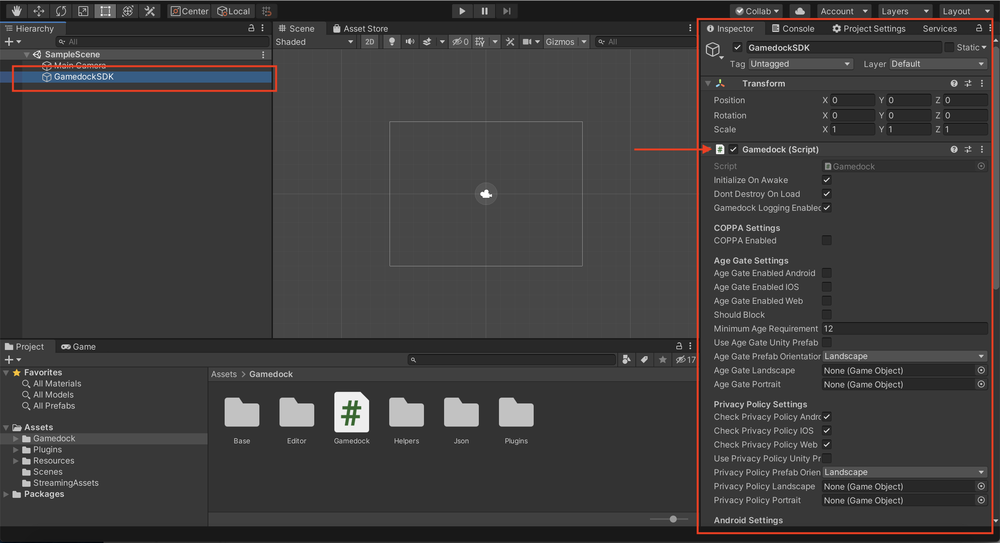
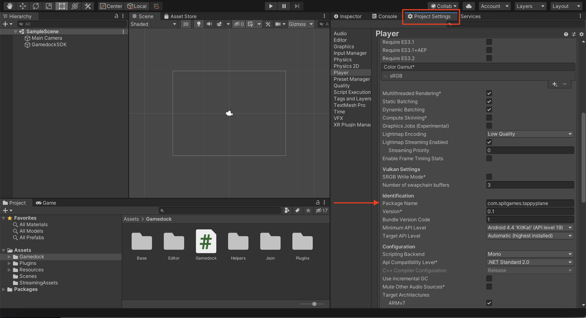
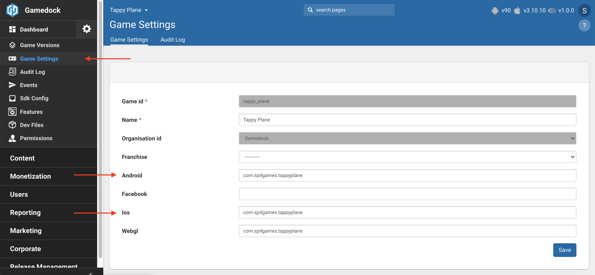
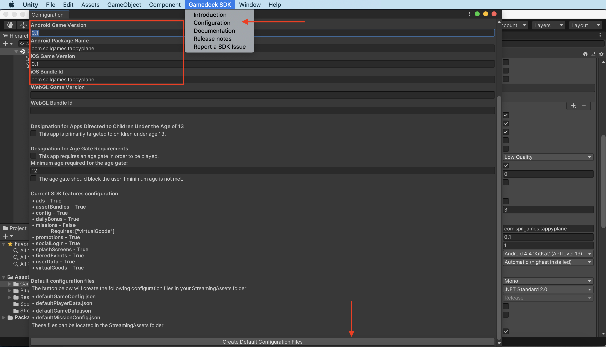

# Adding the Gamedock SDK

> [!NOTE]
> As the Gamedock SDK grows and expands, new SDK versions with additional features will be made available. These new versions can update or improve your game. However, previous versions will still be available for legacy games. It is recommended that you update your games to the latest SDK.

In order to add the SDK follow the steps below depending on the platform/game engine of your game.

<!-- tabs:start -->

#### ** Unity **

> [!WARNING]
> The minimum recommended Unity version in order for the SDK to work properly is **2018.3.+ or higher**.

> [!WARNING]
> Xcode 11 is required in order to build for iOS.

### Download and Import the Gamedock Unity package into your project

You can find the latest version of the Unity plugin here: [https://github.com/azerion/gamedock-sdk/releases](https://github.com/azerion/gamedock-sdk/releases)

Unpack the downloaded archive, and inside you will find the native library folders and a Unity package. You can ignore the folder for now and just import the Unity package.

### Using the Gamedock Unity SDK

In order to start using the SDK follow the steps below:

<!-- panels:start -->

<!-- div:left-panel -->
1. Attach the script named **“Gamedock.cs”** to a new GameObject in your startup scene, and name that GameObject **"GamedockSDK"**.

<!-- div:right-panel -->

<!-- div:left-panel -->
2. Make sure to set the **Bundle identifier (iOS)** and **Package Name (Android)** of your game in the **Unity Project Settings** and make sure that matches the **Gamedock Console** configured one.

<!-- div:right-panel -->
 

<!-- div:left-panel -->
3. Go to the **Gamedock SDK Menu** in the top bar of Unity and select **Configuration**. Make sure the fields are configured correctly and press the **‘Create default configuration files’** button to retrieve the latest configurations for your game. This step should be repeated before every build delivered to make sure that the latest offline configs are included in the build. If the retrieval fails in any way, check the **Editor Console** for more information.

<!-- div:right-panel -->

<!-- panels:end -->

4. **The Gamedock SDK is now ready to use!** Most Gamedock SDK features will be configured automatically when the SDK initializes, see the specific feature sections to see which integration parts still have to be implemented. Please make sure to also follow the next section **‘GDPR & Privacy Policy’** to make your game GDPR compliant.

> [!DANGER]
> If you have issues with missing Prefab scripts please download the following folder and replace it in "Assets/Gamedock/Editor/" : [Prefab missing script fix](https://splashscreens.cdn.spilcloud.com/files/1574351079_Prefabs.zip)

### Initializing the Gamedock Unity SDK

By default, the Gamedock SDK will automatically initialize on Awake(). You can disable that functionality on the "GamedockSDK" object and initialize the SDK at a later stage. Initializing the SDK can be done using the following code:

~~~csharp
Gamedock.MonoInstance.Initialize();
~~~

You can also subscribe to the event that notifies the initial initialization point completion. Keep in mind that this does not signify that all the SDK modules are ready yet, and for individual functionalities you should still look at each features' callbacks. In order to register for the callback use the following code:

~~~csharp
Gamedock.Instance.InitializationCallbacks.OnInitializationCompleted -= OnInitializationCompleted;
Gamedock.Instance.InitializationCallbacks.OnInitializationCompleted += OnInitializationCompleted;
~~~

#### ** AIR **

### Download and Import the AIR ANE's into your project

You can find the latest version of the AIR plugin here: url to be added

Unpack the downloaded archive, inside you'll find 9 ANE's that you can import into your projects:

#### For iOS & Android
- Gamedock-x.x.x.ANE: The main Gamedock ANE, required for all platforms. For iOS, there is one additional ANE containing all dependencies, for Android, there are a number of ANE's that can be added as modules. 

#### For iOS
- GamedockSDKiOSDependencies-x.x.x.ANE: Required, contains all dependencies for the Gamedock SDK for iOS.
- com.distriqt.Core.ANE: Prevents crashes on iOS devices caused by dependencies using compiler flags that AIR doesn't recognise. Always include this for iOS.

#### For Android:
- GamedockAdjust-x.x.x.ANE: Optional, used for Adjust tracking and deeplinking.
- GamedockAdMob-x.x.x.ANE: Optional, used for Advertising (interstitials, rewarded videos, banners).
- GamedockChartboost-x.x.x.ANE: Optional, used for interstitials (will be deprecated soon and included in AdMob).
- GamedockFirebase-x.x.x.ANE: Optional, used Firebase event tracking, deeplinks and push notifications (Android).
- GamedockGPG-x.x.x.ANE: Optional, contains Google Play Games, used for achievements and leaderboards.
- GamedockGPS-x.x.x.ANE: Required, contains Google Play Services, used by Gamedock, Admob, Firebase and GPG.
- GamedockSDKGoogleAppId-x.x.x.ANE: Optional, contains only a strings.xml resource with an app id that is unique for each game. The id is required for Firebase (analytics, among others). This ANE is provided only if your app uses it, and is unique per app.
- GamedockResources-x.x.x.ANE: Optional, used to replace Gamedock assets (images) with game-specific assets, for instance for the logo's on the GDPR privacy policy menu.

### Using the Gamedock AIR SDK

1. Import the ANE's into your project via your prefered IDE and link them via your app.xml.
2. Make sure your game version and app identifier (f.e. com.yourcompany.yourgame) match those configured in the Gamedock Console, this way your game will receive the correct configurations/data.
3. For Android, be sure to add the correct ManifestAdditions, depending on the features you're using. See the Example app included with the Gamedock AIR download for examples, or see: url to be added.
4. Make sure you include the required .json files in the project root when packaging a build. These files should be provided to you by your Gamedock representative and are downloadable via the Gamedock Console.

These include:
- defaultGameConfig.json: Required, used for GameConfig and SDKConfig features.
- defaultGameData.json: optional, used for wallet/inventory features.
- defaultPlayerData.json used for GameState feature.
- defaultMissionConfig.json: optional, used for missions features.

The Gamedock SDK is now ready to use, most Gamedock SDK features will be configured automatically when the SDK initializes, see the specific feature sections to see which integration parts still have to be implemented. Please make sure to also follow the next section ‘GDPR & Privacy Policy’ to make your game GDPR compliant.

### Initializing the Gamedock AIR SDK

In your app's main entry-point, before making any other calls or initialising other libraries, do the following:
1. Check if Gamedock is supported for the current platform (mobile/pc etc).
2. Attach event handlers for any Gamedock events that your app requires.
3. Initialise Gamedock.

Example (including privacy policy / GDPR, Google Play Games and external id's for Android):
~~~actionscript
	public function Main()
	{
		// Initialise Gamedock and show Privacy Policy / GDPR popup.
		if (!Gamedock.isSupported())
		{
			trace("Gamedock is not supported on this platform."); // When not Android or iOS
			return;
		}
		
		// Attach event handlers for Gamedock features used by your app.
		
		// Such as ads
		Gamedock.GetInstance().addEventListener(GamedockEvents.AD_AVAILABLE, onAdAvailableEvent);
		Gamedock.GetInstance().addEventListener(GamedockEvents.AD_FINISHED, onAdFinishedEvent);
		Gamedock.GetInstance().addEventListener(GamedockEvents.AD_NOT_AVAILABLE, onAdNotAvailableEvent);
		Gamedock.GetInstance().addEventListener(GamedockEvents.AD_STARTED, onAdStartedEvent);
		
		// And GDPR / Privacy policy popup.
		Gamedock.GetInstance().addEventListener(GamedockEvents.AGE_GATE_STATUS, onAgeGateStatusEvent);
		Gamedock.GetInstance().addEventListener(GamedockEvents.PRIVACY_POLICY_STATUS, onPrivacyPolicyStatusEvent);
		
		// Disable automatic registering for Push Notifications for iOS so users don't get a pop-up.
		Gamedock.GetInstance().DisableAutomaticRegisterForPushNotificationsiOS();
		
		// Initialise Gamedock with the prefered privacy policy / GDPR settings. 
		// After the user passes the privacy policy / GDPR menu, Gamedock will start requesting/processing data and firing events.
		Gamedock.GetInstance().Init(true, true, true, 16, false);
		// If you'd like to send external id's with any ad requests, add them via the externalIds parameter (see also: "User identification"):
		// Gamedock.GetInstance().Init(true, true, true, 16, false, "{\"MyExternalPartner\":\"MyExternalId\"}");
	}

	private function onPrivacyPolicyStatusEvent(evt:PrivacyPolicyStatusEvent) : void
	{
		// If the user accepted the policy, initialise other libraries, such as Google Play Games.
		if(evt.accepted)
		{
			if (GamedockGPG.isSupported())
			{
				// Initialise Google Play Games and log in the user.
				trace("Starting Gamedock Google Play Games");
				GamedockGPG.create(false, false, null);
				GamedockGPG.games.signIn();
			} else {
				trace("Google Play Games is not supported on this platform (not Android!)");
			}
		}
	}
~~~

* Be sure to also check the example project included with the Gamedock AIR SDK download, as it provides examples for most features.

### Publishing an app with the Gamedock AIR SDK

- When publishing your app, you'll likely want to replace any Azerion branding (logo's, background images etc) with your own. For AIR, you'll need to have a Windows device with WinRar (or similar) in order to replace the assets contained in  GamedockResources.x.x.x.ANE. If you don't have a Windows device, ask your Gamedock representative to create a custom ANE for you via Slack. 

- For iOS, make sure that the InfoAdditions and Entitlements match those in the provisioning profile, or you may have trouble publishing/uploading to the App Store. You can check what's defined in your provisioning profile via console/terminal commands (see also: https://stackoverflow.com/questions/11834650/ios-look-inside-provisioning-profile).

- For iOS, when using push notifications, make sure that the "aps-environment" entitlement is set to the correct environment (development/production).

#### ** Cordova **

### Download and Import the SDK Cordova package into your project

You can include the latest Cordova package by running the following commands into your main project folder:
~~~javascript
//Add the project from the registry
cordova plugin add @gamedock/cordova-sdk

//If you have not yet create a build for your platform run
cordova platform add android
cordova build android

cordova platform add ios
cordova build ios

//Make a new build of your game
cordova build android
cordova build ios
~~~

This plugin expects that npm is installed on your machine. If you have not done that yet, please refer to this documentation [https://docs.npmjs.com/](https://docs.npmjs.com/)

> [!WARNING]
> If you need to refresh the local json files, simply remove the plugin and re-add it again. It is recommended that when you do that, to also remove the android and ios platforms first so that there are no duplicates.

### Initializing the Gamedock Cordova SDK

In order to initialise the SDK call the following function (make sure this call is done before any other SDK call and preferably before any other network calls):
~~~javascript
var withAgeGate = false;
var ageGateOptions = {
    shouldBlock: true, 
    requiredAge: 12
};
var withPrivacyPolicy = true;
var environment = "PRODUCTION";
var externalIds = [];

gamedockSDK.initialise(withAgeGate, ageGateOptions, withPrivacyPolicy, environment, []);
~~~

You can also subscribe to the event that notifies the initial initialization point completion. Keep in mind that this does not signify that all the SDK modules are ready yet, and for individual functionalities you should still look at each features' callbacks. In order to register for the callback use the following code:

~~~javascript
gamedockSDK.on('InitializationCompleted', () => {
    console.log('SDK Initialization Completed');
});
~~~

<!-- tabs:end -->

> [!TIP]
> As a reminder, in order to use the Android Firebase implementation from Gamedock make sure you have the following dependencies in your Gradle file:

~~~java
implementation 'com.google.firebase:firebase-analytics:17.4.1' /* Gamedock Firebase */
implementation 'com.google.firebase:firebase-crashlytics:17.0.0' /* Gamedock Firebase */
implementation 'com.google.firebase:firebase-crashlytics-ndk:17.0.0' /* Gamedock Firebase */
implementation 'com.google.firebase:firebase-messaging:20.1.7' /* Gamedock Firebase */
implementation 'com.google.firebase:firebase-dynamic-links:19.1.0' /* Gamedock Firebase */
implementation 'com.google.firebase:firebase-config:19.1.4' /* Gamedock Firebase */
~~~
