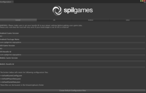

# Adding the Gamedock SDK

> As the Gamedock SDK grows and expands, new SDK versions with additional features will be made available. These new versions can update or improve your game. However, previous versions will still be available for legacy games. It is recommended that you update your games to the latest SDK.

## Download and Import the Unity package into your project

You can find the latest version of the Unity plugin here: [https://github.com/azerion/gamedock-sdk/releases](https://github.com/azerion/gamedock-sdk/releases)

Unpack the downloaded archive, inside you will find the native library folders and a Unity package. You can ignore the folder for now and just import the Unity package.

## Using the Gamedock SDK

1. Attach the script named “Gamedock.cs” to a new GameObject in your startup scene, and name that GameObject "GamedockSDK".
1. Make sure to check set the Bundle identifier (iOS) and Package Name (Android) of your game in the Unity PlayerSettings.
1. Go to the Gamedock SDK menu in the top bar of Unity and select Configuration, the following screen will appear:

Make sure the fields are configured correctly and press the ‘Create default configuration files’ button to retrieve the latest configurations for your game. This step should be repeated before every build delivered to make sure that the latest offline configs are included in the build.

The Gamedock SDK is now ready to use, most Gamedock SDK features will be configured automatically when the SDK initializes, see the specific feature sections to see which integration parts still have to be implemented. Please make sure to also follow the next section ‘GDPR & Privacy Policy’ to make your game GDPR compliant.