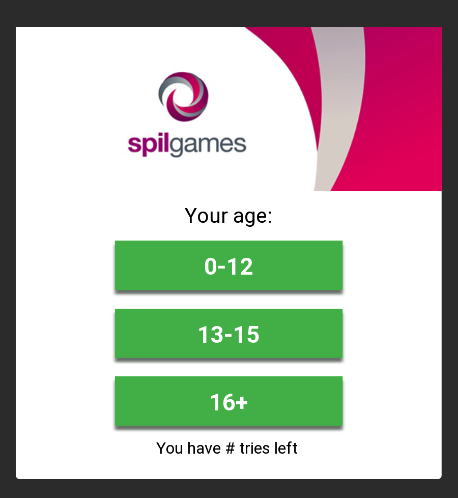
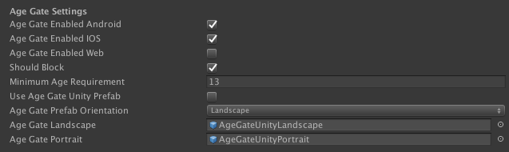

# Age Gate & COPPA

According to European law, games intended for minors are required to show an age gate at the start of the game before allowing players to continue. This functionality is provided by the Gamedock SDK in two flavours: a native popup with a configurable banner image, or a Unity prefab that is fully customizable as long as no elements or scripts are removed.
  

Games that comply with COPPA regulation cannot show any ads, age gate or privacy policy menu's. The GameDock SDK also provides an option to enable COPPA compliance, which ensures no age gate, privacy policy or ads are shown.

<!-- tabs:start -->

#### ** Unity **

### Enable or disable COPPA

COPPA compliance can be enabled/disabled via your "GameDockSDK" object or through the GameDock SDK configuration menu. If enabled, this settings will prevent any privacy policy or agegate menu from being shown, and will disallow any ads (reward videos/interstitials/banners) being displayed. Only enable this if your account manager explicitly states that your game must be COPPA compliant. 

### Enable or disable the age gate popup

The age gate popup can be enabled using the "GamedockSDK" object or through the Gamedock SDK Configuration menu. If enabled, the age gate will always appear first time the user opens the game **before** the GDPR/Privacy Policy popup (unless COPPA is enabled). In order to configure the age gate popup with, you can edit it in the "GamedockSDK" object. The following options are available:

The SDK gives the possibility for blocking the user from continuing to the game if the minimum age requirement is not met. You also can select to either use the native popup or the Unity prefab. 

**If you use the Unity prefab, make sure to drag the prefab from the Assets/Resources/Gamedock/AgeGate folder on to the GamedockSDK object.**

### Handling age gate callbacks

Regardless of which option you choose (native or prefab), the SDK provides feedback information for the choice that the user has made when presented with the age gate. In order to get that feedback, register the following callback:

~~~C#
//Callback informing the choice for the age gate
Gamedock.Instance.AgeGateCallbacks.OnAgeGateStatus -= OnAgeGateStatus(bool passed, string age, bool checkPrivacyPolicy);
Gamedock.Instance.AgeGateCallbacks.OnAgeGateStatus += OnAgeGateStatus(bool passed, string age, bool checkPrivacyPolicy);
~~~

The variables returned are the following:
 * *passed* Boolean - Informs the game if the age gate was passed based on the minimum age requirement.
 * *age* Number - Returns the age that was chosen by the user. Can be: **0-12, 13-15, 16+**.
 * *checkPrivacyPolicy* Boolean - Informs if the user should be exposed to GDPR compliancy. You are not required to do anything manual with the actual GDPR popup, though if the flag is false, you might want to hide the GDPR button in your Settings screen for example.

### Changing the header image

If you want to set your own custom header image instead of the Azerion logo, you can do so by overwriting the appropriate image file to the following location (if it does not exist, you will need to create it):

PROJECT_PATH/Assets/Plugins/Android/res/drawable/

The image files should have the name “privacy_policy_landscape_custom.png” or “privacy_policy_portrait_custom.png” depending on your orientation. The image size is 800px x 220px or 600px x 220px.

For iOS, the header image can be replaced at Gamedock.framework/PrivacyPolicyHeader.png.

For Unity 2017.1 and above you can use the supplied project found in the SDK bundle under NativeLibraries/Android/Resources. Build this project in Android Studio and make sure to replace the necessary images.

#### ** Android **

#### ** iOS **

#### ** AIR **

### Enable/disable the age gate popup or COPPA

The age gate popup can be enabled/configured via parameters when calling GameDock.GetInstance().Init():
* *showAgeGate* Boolean - If enabled, the age gate popup will always appear the first time the user opens the game **before** the GDPR/Privacy Policy popup. 
* *ageGateShouldBlock* Boolean - Gives the possibility for blocking the user from continuing to the game if the minimum age requirement is not met. 
* *ageGateMinimumAgeRequirement* Number - Minimum age in years for users to be able to pass the age gate popup.  
* *coppaEnabled* Boolean - If enabled, follows COPPA law for protection of minors and makes sure the game never shows a privacy policy menu, age gate menu or ads.

### Handling age gate callbacks

The SDK provides feedback information for the choice that the user has made when presented with the age gate. In order to get that feedback, register the following callback:

~~~C#
//Callback informing the choice for the age gate
GameDock.GetInstance().addEventListener(SDKEvents.AGE_GATE_STATUS, onAgeGateStatusEvent);

private function onAgeGateStatusEvent(evt:AgeGateStatusEvent) : void
{
	trace(evt.toString());
}
~~~

The variables returned are:
 * *passed* Boolean - Informs the game if the age gate was passed based on the minimum age requirement.
 * *age* Number - Returns the age that was chosen by the user. Can be: **0-12, 13-15, 16+**.
 * *checkPrivacyPolicy* Boolean - Informs if the user should be exposed to GDPR compliancy. You are not required to do anything manual with the actual GDPR popup, though if the flag is false, you might want to hide the GDPR button in your Settings screen for example.

### Changing the header image

If you want to set your own custom header image instead of the Azerion logo, you can do so by replacing the appropriate image files in the GameDockResources.ANE:

Android:
- GameDockResources.ane\META-INF\ANE\Android-ARM\sdk-resources-res\drawable\
- GameDockResources.ane\META-INF\ANE\Android-ARM64\sdk-resources-res\drawable\
- GameDockResources.ane\META-INF\ANE\Android-x86\sdk-resources-res\drawable\

iOS:
- GameDock.ane\META-INF\ANE\iPhone-ARM\
- GameDock.ane\META-INF\ANE\iPhone-x86\

For Android, the image files are named “privacy_policy_landscape_custom.png” and “privacy_policy_portrait_custom.png”, for iOS they are called "PrivacyPolicyHeader.png" and "PrivacyPolicyHeaderLandscape.png", each file is used for landscape/portrait resp. The image size is 800px x 220px or 600px x 220px.

<!-- tabs:end -->

### Changing the age gate popup text

Note that the text and translations of the popup are kept in the Gamedock SDK Game config feature, which should be by default integrated into your game. Note that in case you are working on an update you can fetch the new game config in Unity (we already updated the game config contents). Only in case of explicit requests by your account manager the default text and translations may be changed. Please don’t change this text on your own as this must be legally correct.