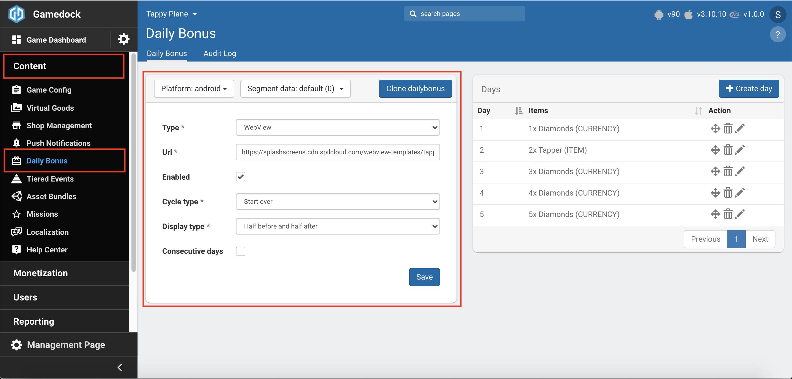

# Daily Bonus

* **[Understanding the Daily Bonus Screens Strategy](#understanding-the-daily-bonus-screens-strategy)**
* **[Configuration in Console](#configuration-in-console)**
* **[Controlling Daily Bonus Screens from the SDK](#controlling-daily-bonus-screens-from-the-sdk)**

---

The Gamedock framework offers the possibility of supporting both splash and bonus screens. Splash screens appear while a game is loading. They are a very useful means of engaging with the user community and can be used for a variety of reasons, including as an additional form of advertising, to restrict access to content such as pornography or gambling, and to grab the user’s attention through special offers. Typically, daily bonus screens are used to reward users each time they return to the game. Within the Gamedock framework, both screen types are implemented as HTML5 web pages that appear as pop-ups within the game. This has the advantage that changes can be made to them without the need to update the game itself.

### Understanding the Daily Bonus Screens Strategy

Within the Gamedock platform, splash and daily bonus screen support are implemented as follows:
1. The Game’s producer defines the splash screens required to be used within the game. This includes the platforms for which each screen is intended, the relevant game version, the event that triggers the screen, its URL, the period within which it is active. The daily bonus screens should also be defined, and include the items or currency the user should receive, and the number of times the user should see the screen. Note that if these screens are to be developed by a third party, Gamedock can provide a template for their creation.
1. Your Gamedock Account Manager will then coordinate with Gamedock LiveOps to ensure that the screens are set up on the Gamedock server.
1. Within the Gamedock SDK, developers can then specify when these screens should appear within the game.

### Configuration in Console

In order to setup the Daily Bonus feature in the console go through the following steps:

<!-- panels:start -->

<!-- div:left-panel -->
1. Enable the **Daily Bonus** feature in the features list.

<!-- div:right-panel -->

<!-- div:left-panel -->
2. Go to **Content->Daily Bonus** to access the feature.
3. Configure the following aspects about the **Daily Bonus** screen:
    * **Type**: Can be web view or asset bundle.
    * **URL/Asset bundle File**: Depending on the type, you will need to provide a link to the daily bonus web view template or to upload an asset bundle that has been built with daily bonus support. Contact a Gamedock representative for more information about this.
    * **Enabled**: If the daily bonus can be served in the game.
    * **Cycle type**: Specifies the behaviour of the daily bonus screen once the user has reached the last day. The screen can either repeat the last day or reset and start from day 1.
    * **Display type**: Specifies the behaviour of the daily bonus screen when displaying the days. The screen can either be centred with two days passed and two days to come, or show all days.
    * **Consecutive days**: Toggles if advancing the days requires the user to claim the rewards on consecutive days or not.

<!-- div:right-panel -->

<!-- div:left-panel -->
4. Add the days that the user can collect by clicking the **"Create Day"** button.
5. Configure the day by adding currencies and items that the user can collect.

<!-- div:right-panel -->

<!-- panels:end -->

6. With all the days configured you can request and display a daily bonus screen using the SDK.

### Controlling Daily Bonus Screens from the SDK

The reward received by users through the daily bonus screen can be handled in one of two ways. If the game implements the wallet and inventory control system provided by the Gamedock SDK, then it is handled automatically, and a callback is fired when the user’s wallet and inventory have been updated with the correct values. If the game does not use these mechanisms, then the DailyBonusReward callback will be fired returning a string list of rewards, and then the developer must implement the logic necessary for updating the game’s wallet and inventory.

Before requesting the daily bonus screen, you should implement the callback listener using the following code:

<!-- tabs:start -->

#### ** Unity **

~~~csharp
Gamedock.Instance.SplashScreenCallbacks.OnDailyBonusAvailable -= OnDailyBonusAvailable;
Gamedock.Instance.SplashScreenCallbacks.OnDailyBonusAvailable += OnDailyBonusAvailable;

Gamedock.Instance.SplashScreenCallbacks.OnDailyBonusNotAvailable -= OnDailyBonusNotAvailable;
Gamedock.Instance.SplashScreenCallbacks.OnDailyBonusNotAvailable += OnDailyBonusNotAvailable;
~~~

#### ** AIR **

~~~actionscript
Gamedock.GetInstance().addEventListener(SDKEvents.DAILY_BONUS_AVAILABLE, onDailyBonusAvailableEvent);
Gamedock.GetInstance().addEventListener(SDKEvents.DAILY_BONUS_NOT_AVAILABLE, onDailyBonusNotAvailableEvent);
~~~

#### ** Cordova **

> This feature is currently not supported on Cordova.

<!-- tabs:end -->

To request the daily bonus screen during the game, use the following code:

<!-- tabs:start -->

#### ** Unity **

~~~csharp
Gamedock.Instance.RequestDailyBonus();
~~~

#### ** AIR **

~~~actionscript
Gamedock.GetInstance().RequestDailyBonus();
~~~

#### ** Cordova **

> This feature is currently not supported on Cordova.

<!-- tabs:end -->

If the daily bonus screen is available call the following method to show it:

<!-- tabs:start -->

#### ** Unity **

~~~csharp
Gamedock.Instance.ShowDailyBonus();
~~~

#### ** AIR **

~~~actionscript
Gamedock.GetInstance().ShowDailyBonus();
~~~

#### ** Cordova **

> This feature is currently not supported on Cordova.

<!-- tabs:end -->

To listen to status updates of the daily bonus screen listen to the following events:

<!-- tabs:start -->

#### ** Unity **

~~~csharp
Gamedock.Instance.SplashScreenCallbacks.OnDailyBonusOpen -= OnDailyBonusOpen;
Gamedock.Instance.SplashScreenCallbacks.OnDailyBonusOpen += OnDailyBonusOpen;

Gamedock.Instance.SplashScreenCallbacks.OnDailyBonusClosed -= OnDailyBonusClosed;
Gamedock.Instance.SplashScreenCallbacks.OnDailyBonusClosed += OnDailyBonusClosed;

Gamedock.Instance.SplashScreenCallbacks.OnDailyBonusError -= OnDailyBonusError;
Gamedock.Instance.SplashScreenCallbacks.OnDailyBonusError += OnDailyBonusError;

//Called only if the daily bonus has external rewards
Gamedock.Instance.SplashScreenCallbacks.OnDailyBonusReward -= OnDailyBonusReward;
Gamedock.Instance.SplashScreenCallbacks.OnDailyBonusReward += OnDailyBonusReward;
~~~

#### ** AIR **

~~~actionscript
Gamedock.GetInstance().addEventListener(SDKEvents.DAILY_BONUS_OPEN, onDailyBonusOpenEvent);			
Gamedock.GetInstance().addEventListener(SDKEvents.DAILY_BONUS_CLOSED, onDailyBonusClosedEvent);
Gamedock.GetInstance().addEventListener(SDKEvents.DAILY_BONUS_ERROR, onDailyBonusErrorEvent);

//Called only if the daily bonus has external rewards
Gamedock.GetInstance().addEventListener(SDKEvents.DAILY_BONUS_REWARD, onDailyBonusRewardEvent);
~~~

#### ** Cordova **

> This feature is currently not supported on Cordova.

<!-- tabs:end -->

It’s also possible to create a daily bonus screen using Unity’s asset bundle system, for that the raw daily bonus config data can be used:

~~~csharp
DailyBonus config = Gamedock.Instance.GetDailyBonusConfig();
~~~
