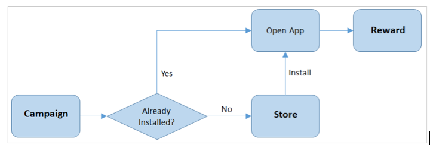

# Deep Linking

Deep linking (also known as dynamic linking) is the process of redirecting users to an app via a link. If the app is not yet installed a deep link guides the user through the installation process and then starts the app. Once the app is started, data from the link can also be used to automatically direct users to a specific part of an app. This eliminates the need for users to manually download and install an app and search for the content developers want them to see. A DeepLink works just like a normal hyperlink and can be clicked in a browser or other app, it is the mobile equivalent of hyperlinks on websites. If a user opens a dynamic link in a desktop browser, they can be taken to the relevant content on your website instead of a mobile app.

Game developers can use deep linking to drive up user engagement and acquisition. It helps determine effective campaigns and properly measure attributions. In addition, deep linking can also simplify and amplify referral tracking and the onboarding process.

> The Gamedock SDK support deeplinking via Firebase and Adjust SDK’s, which are included with the Gamedock SDK. Deeplinking may also have to be implemented via the Facebook SDK, which should be done by developers themselves in Unity. See the “Facebook SDK” section for more details. Your Gamedock contact person should inform you if/when deeplinks should be implemented and via which platform(s). For more information on Firebase deeplinking, see: [https://firebase.google.com/docs/dynamic-links](https://firebase.google.com/docs/dynamic-links).

## Prerequisites

The procedure to integrate deep linking into your game depends on whether you are developing for the Android or iOS platform.

### Android

Do the following:
1. Enable the two module using the “Gamedock SDK->Configuration->Android” window.
1. Add the following to your androidmanifest inside the application node: 
~~~XML
<intent-filter>
     <action android:name="android.intent.action.VIEW" />
     <category android:name="android.intent.category.DEFAULT" />
     <category android:name="android.intent.category.BROWSABLE" />
     <data android:host="<BASE_URL>" android:scheme="http" />
     <data android:host="<BASE_URL>" android:scheme="https" />
     <data android:scheme="<URL_SCHEME>" />
</intent-filter>
~~~

Base URL and URL scheme should be provided by Gamedock. A base url looks like this: “www.tappyplane.com”, a url scheme looks like this: “tappyplane”. 

> Ensure the host name is specified in your manifest file.

Obtain the required SHA-256 (and preferably the SHA-1) fingerprints from your Gamedock Games Account Manager. Confirm that the keys have been correctly configured in Google Firebase.

### iOS
Do the following:
1. Integrate the iOS GamedockSDK and build to XCode from Unity.
1. In XCode, enable the “Associated domains” capability in XCode and add the Firebase domain as provided by Gamedock. Associated domains use the following syntax “applinks:{FIREBASE_DOMAIN_NAME}.app.goo.gl” (old) or “applinks:{FIREBASE_DOMAIN_NAME}.page.link”, for instance: “applinks:pu68v.app.goo.gl” (old) or “applinks:tappyplane.page.link” (new). Add the Adjust domain as well (as provided by Gamedock, using the following syntax: “applinks:{ADJUST_DOMAIN_NAME}.adj.st”, for instance: “applinks:mbuj.adj.st”.
1. To support iOS < 9 devices also add two URL Types in the XCode info tab, the URL scheme should be the bundle identifier of the app. For example, for “com.spilgames.tappyplane” we add two URL Types: “Id: tappyplane URLscheme: tappyplane” and “Id: com.spilgames.tappyplane URLscheme: com.spilgames.tappyplane”.

##  Implementing the Reward-Claiming Logic

Deep links can have rewards added to them via the Gamedock Consoel, this adds a reward token to the link. When the app receives a deep link the Gamedock SDK notifies the developer that a reward token is available for claiming, the developer can then proceed to claim it and show a message for the user. When a user clicks a deep link (such as a Facebook campaign or an advertisement) within the Gamedock framework, the reward-claiming mechanism is shown in Figure 6.

Figure 6: Reward-Claiming Mechanism. If the app already exists, they are taken directly to it. Otherwise, they are directed to the appropriate store and, after installing it, the app is opened. In either case, the reward is then triggered. Within your game, use the following code to listen for the callbacks and claim the reward attached to the link. 

<!-- tabs:start -->

#### ** Unity **

~~~csharp
// Claiming a token
Gamedock.Instance.ClaimToken (token, rewardType);

//Callbacks for Rewards

//Called natively when a reward token was received
//Make sure to have this callback as early as possible in the game otherwise it will not be called
Gamedock.Instance.DeepLinkCallbacks.OnRewardTokenReceived -= OnRewardTokenReceived;
Gamedock.Instance.DeepLinkCallbacks.OnRewardTokenReceived += OnRewardTokenReceived;

//Called after the token has been received
//Only called if you use External as a reward type
Gamedock.Instance.DeepLinkCallbacks.OnRewardTokenClaimed -= OnRewardTokenClaimed;
Gamedock.Instance.DeepLinkCallbacks.OnRewardTokenClaimed += OnRewardTokenClaimed;

//Called if the claiming of the Token has failed
Gamedock.Instance.DeepLinkCallbacks.OnRewardTokenClaimFailed -= OnRewardTokenClaimFailed;
Gamedock.Instance.DeepLinkCallbacks.OnRewardTokenClaimFailed += OnRewardTokenClaimFailed;

void OnRewardTokenReceived (string token, List<RewardObject> reward, string rewardType)
{
  Debug.Log ("Received reward with token: " + token + "-- Rewards: " + JsonHelper.getJSONFromObject (reward) + "-- For Type: " + rewardType);
Gamedock.Instance.ClaimToken (token, rewardType);
}

void OnRewardTokenClaimed (List<RewardObject> reward, string rewardType)
{
  Debug.Log ("Claimed reward for: " + rewardType + "-- And reward: " + JsonHelper.getJSONFromObject (reward));
}

void OnRewardTokenClaimFailed (string rewardType, GamedockErrorMessage error)
{
  Debug.Log ("Error claiming reward for: " + rewardType + "-- With message: " + error.message);
}
~~~

#### ** AIR **

~~~actionscript
// Claiming a token
Gamedock.GetInstance().ClaimToken (token, rewardType);

//Callbacks for Rewards

//Called natively when a reward token was received
//Make sure to have this callback as early as possible in the game otherwise it will not be called
Gamedock.GetInstance().DeepLinkCallbacks.OnRewardTokenReceived -= OnRewardTokenReceived;
Gamedock.GetInstance().DeepLinkCallbacks.OnRewardTokenReceived += OnRewardTokenReceived;

//Called after the token has been received
//Only called if you use External as a reward type
Gamedock.GetInstance().DeepLinkCallbacks.OnRewardTokenClaimed -= OnRewardTokenClaimed;
Gamedock.GetInstance().DeepLinkCallbacks.OnRewardTokenClaimed += OnRewardTokenClaimed;

//Called if the claiming of the Token has failed
Gamedock.GetInstance().DeepLinkCallbacks.OnRewardTokenClaimFailed -= OnRewardTokenClaimFailed;
Gamedock.GetInstance().DeepLinkCallbacks.OnRewardTokenClaimFailed += OnRewardTokenClaimFailed;

void OnRewardTokenReceived (string token, List<RewardObject> reward, string rewardType)
{
  Debug.Log ("Received reward with token: " + token + "-- Rewards: " + JsonHelper.getJSONFromObject (reward) + "-- For Type: " + rewardType);
Gamedock.Instance.ClaimToken (token, rewardType);
}

void OnRewardTokenClaimed (List<RewardObject> reward, string rewardType)
{
  Debug.Log ("Claimed reward for: " + rewardType + "-- And reward: " + JsonHelper.getJSONFromObject (reward));
}

void OnRewardTokenClaimFailed (string rewardType, GamedockErrorMessage error)
{
  Debug.Log ("Error claiming reward for: " + rewardType + "-- With message: " + error.message);
}
~~~

#### ** Cordova **

> This feature is currently not supported on Cordova.

<!-- tabs:end -->

> This code can be used for all the Gamedock SDK features that use a reward-token mechanism.

## Passing data to your app via deep link

The Gamedock SDK offers the “deepLinkReceived” event (Gamedock.Instance.OnDeepLinkReceived) to notify developers that a deep link has been clicked, it also passes any data from the deep link to the app. The deepLinkReceived event has a “payload” parameter which is a JSONObject containing any data that was added when creating the deep link. This could for instance be “{ “redirectLocation” : “shop” }”. A developer could read this data and respond by redirecting the user to the in-game shop.

## Showing a splash screen when clicking a deep link

If a splash screen parameter was added when creating the DeepLink, for instance, “&splashscreen=splashScreen1”, then the Gamedock SDK will automatically request and show the splash screen (“splashScreen1” in this case). A splash screen campaign must be configured in the Console with a trigger for requestSplashScreen and value “splashScreen1” in this case.

## Setting up deep links via the Gamedock Console

Documentation for setting up deep links via the Console is currently only available for Gamedock employees. If you need help setting up a new deep link, please contact your Gamedock representative.

## Facebook SDK deep linking

Developers will have to integrate the Facebook SDK’s deeplinking features and pass any received deeplinks to the Gamedock SDK to be processed. This can be done as follows:

After initialising the Facebook SDK via FB.Init(OnFBInitComplete), in your OnFBInitComplete call you’ll have to call:

~~~csharp
FB.GetAppLink(DeepLinkCallback);
FB.Mobile.FetchDeferredAppLinkData(DeepLinkCallback);
~~~

In your DeepLinkCallback handler, you’ll have to fetch the deeplink, parse its parameters and pass them to the relevant Gamedock SDK / game methods.

<!-- tabs:start -->

#### ** Unity **

~~~csharp
private void AppStart()
{
  FB.Init(OnFBInitComplete);
}

private void OnFBInitComplete()
{
  FB.GetAppLink(DeepLinkCallback);
  FB.Mobile.FetchDeferredAppLinkData(DeepLinkCallback);
}

void DeepLinkCallback(IAppLinkResult result)
{
  Debug.Log("FB DeeplinkCallback: " + result);
  if(!String.IsNullOrEmpty(result.Url) || !String.IsNullOrEmpty(result.TargetUrl))
  {
    Dictionary<string, string> urlParams = GetParams (result.Url != null && !result.Url.Contains("?") ? result.Url.Replace("://", "://&") : !result.TargetUrl.Contains("?") ? result.TargetUrl.Replace("://", "://&") : result.TargetUrl); // Hack fix: Make sure the token parameter is detected.

    if (urlParams.ContainsKey("token"))
    {
      string rewardToken = urlParams["token"];
      if(!String.IsNullOrEmpty(rewardToken))
      {
        string rewardData = urlParams["reward"];
        if (!String.IsNullOrEmpty (rewardData))
        {
          Gamedock.Instance.ClaimToken(rewardToken, "deeplink");
        }
      }
    }
    if (urlParams.ContainsKey("splashscreen"))
    {
      string splashScreenName = urlParams["splashscreen"];
      if (!String.IsNullOrEmpty(splashScreenName))
      {
        Gamedock.Instance.RequestSplashScreen(splashScreenName);
      }
    }
    if (urlParams.ContainsKey("payload"))
    {
      string jsonPayload = urlParams["payload"];
      if (!String.IsNullOrEmpty(jsonPayload))
      {
        // Handle your payload here.
      }
    }
  }
}

static Dictionary<string, string> GetParams(string uri)
{
  MatchCollection matches = Regex.Matches(uri, @"[\?&](([^&=]+)=([^&=#]*))", RegexOptions.None);
  return matches.Cast<Match>().ToDictionary(
    m => Uri.UnescapeDataString(m.Groups[2].Value),
    m => Uri.UnescapeDataString(m.Groups[3].Value)
  );
}
~~~

#### ** AIR **

> This feature is not supported for AIR.

#### ** Cordova **

> This feature is currently not supported on Cordova.

<!-- tabs:end -->