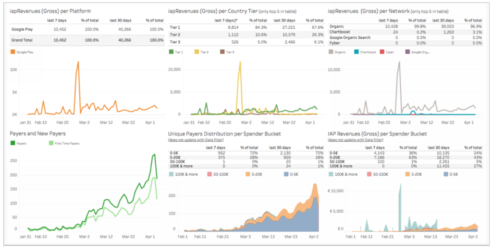
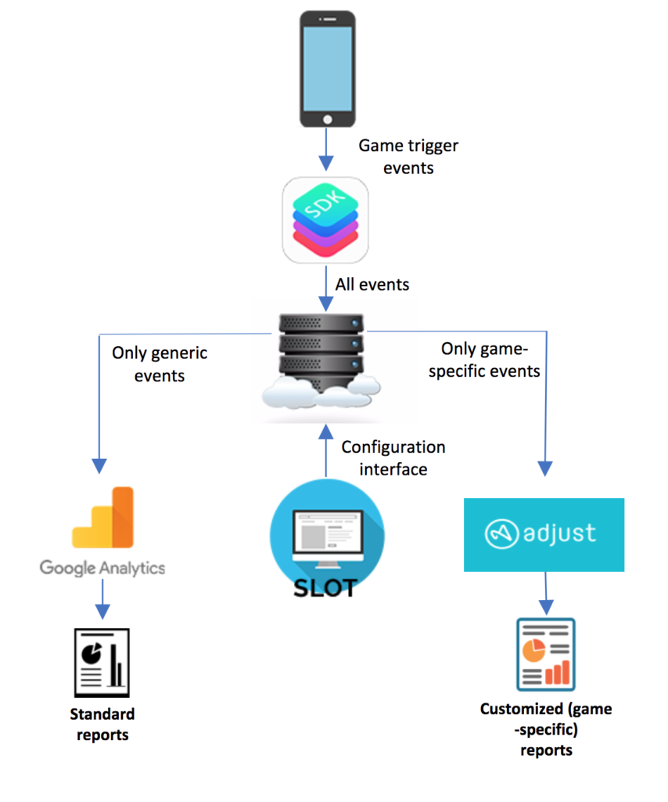

# Event Tracking

The Gamedock platform provides you with dedicated insight into how your users are experiencing your games. This is enabled through powerful event tracking.

Google Analytics (part of Google Firebase) is used to monitor default events. These are events that are expected in every game. A set of default events are provided in the Gamedock SDK and are discussed later in this chapter. While this provides insight into generic user behavior (such as the number of concurrent and unique users), it does not perform in-depth analysis. Moreover, it does not offer the possibility to create game-specific reports.

For this reason, event tracking is extended through the Gamedock's custom-built analytics solution. The Gamedock Event Tracker provides for deeper insight into the unique aspects of your game through highly customizable reports. Examples are shown in Figure 2.

Figure 2: Customized Usage Reports.

This is further augmented by the industry-standard Adjust attribution tool. Using this functionality, you can see from exactly where your users are coming. For example, when a user clicks on a Facebook campaign and installs your app. The operation of event tracking within the Gamedock platform is shown in Figure 3.

Figure 3: Event Tracking Within the Gamedock Platform.

To facilitate this insight, Gamedock needs to know the events that require tracking. This will differ depending on the nature and design of your game. All required event-tracking information should be discussed and agreed between the game’s designers and the Gamedock Account Manager. When finalized, they are delivered to the game’s developers in a Microsoft Excel spreadsheet.

> No changes or additions should be made to the specified event-tracking calls without prior discussion and approval from your Gamedock Account Manager.

## Event Tracking

Default events are events that are expected in every game and can be applied to most games. The Gamedock SDK contains a helper object for each of these. The standard structure of an event is the following: **GamedockTracking.{EventName}({RequiredParametersValues}).Add{OptionalParameters}({OptionalParametersValues}).Track();** Some example are described below:

~~~C#
//All tracking events have dedicated objects with required values constructors
//All optional parameters have dedicated methods
//Any optional parameter is added after the constructor of the event method using the .AddX method
//In order to send the event you must call .Track() at the end of the method invocation

//Only to be used if the game doesn't use the Wallet & Inventory features
GamedockTracking.WalletInventoryEvent(reason, location)
    .AddWallet(currencyList)
    .AddInventory(inventoryList)
    .AddReasonDetails(reasonDetails)
    .AddTransactionId(transactionId) //If IAP
    .Track();

//Example of a Level Start Event
//The structure of this example applies to all other type of events
GamedockTracking.LevelStart(level)
    .AddDifficulty(difficulty)
    .AddScore(score)
    ... <- Any other optional parameters that might be required. Each parameter has a dedicated method
    .Track();
    
//Example of a IAP Purchased Event
//The structure of this example applies to all other type of events
GamedockTracking.IAPPurchased(skuId, transactionId)
    .AddReason(reason)
    .AddLocation(location)
    .AddToken(token) //Only needed for Android
    .Track();
~~~

Simply call the corresponding method at the required point in your game, and the SDK will send the event to the Gamedock backend. It is important that the expected parameters for your game are carefully checked. These must be correct for the successful completion of the QA process. Descriptions of all methods and parameters are included in the provided SDK code.

> When testing events, do not reset your iOS IDFA or Google advertising ID. This may cause the game to appear to have new users.

## Tracking In-app Purchases on Android

The tracking of in-app purchases is straightforward. Once you send an iapPurchasedEvent event, we alter the data with the price and currency values. To do this, we ask you to define the googleIAPKey setting in the Gamedock defaultGameConfig.json file. For more information, see “Implementing a Default Configuration File”.