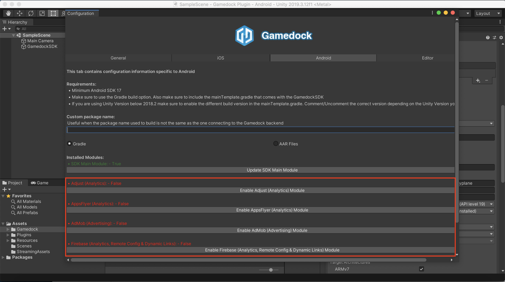
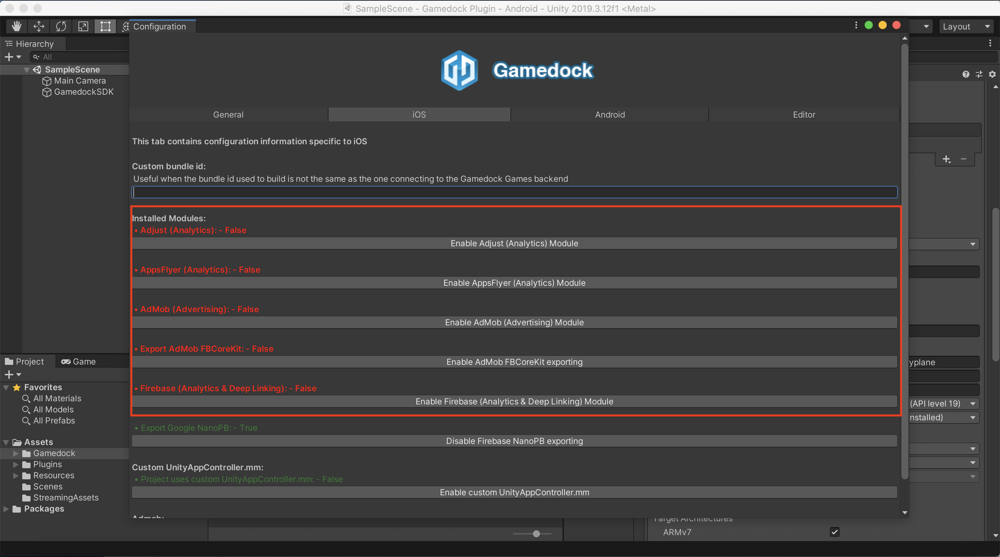
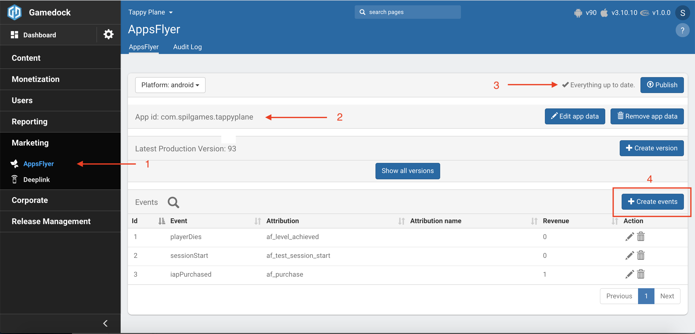

# External Analytics

> Besides the analytics provide by the Gamedock SDK, the SDK also includes additional external analytics tools that can be enabled when implementing the Gamedock SDK.

The following modules can be enabled for additional analytics:

* AppsFlyer
* Firebase
* Adjust

In order to enable the additional analytics modules do the following:

<!-- tabs:start -->

#### ** Unity **

The additional analytics module can be enabled through the Configuration window in the Unity Editor.

 

#### ** AIR **

#### ** Cordova **

By default the modules are automatically included when importing the Gamedock SDK Cordova Plugin.

<!-- tabs:end -->

No additional code implementation is required in order to track events in these specific external analytics providers.

### AppsFlyer and Adjust

In the case of AppsFlyer and Adjust the event tracking happens in two parts: the install tracking is done at the SDK level and the rest of the events are server-to-server based on the events tracked with Gamedock. In order to fully configure in the Gamedock Console AppsFlyer or Adjust so that server-to-server can happen, do the following:

<!-- tabs:start -->

#### ** AppsFlyer **

1. Access the AppsFlyer Gamedock Console page from here.
2. Create/Edit your AppsFlyer **appId**. The **appId** documentation for AppsFlyer can be found [here](https://support.appsflyer.com/hc/en-us/articles/207377436-Adding-a-new-app).
3. Make sure to Publish your changes (this includes also Step 4/any time you make changes to your AppsFlyer configuration).
4. Add your desired events that will be forwarded from AppsFlyer from the Gamedock Tracking.

#### ** Adjust **

Currently Adjust is disabled in the Gamedock Console. If you require to work with Adjust please contact one of the Gamedock Representatives.

<!-- tabs:end -->

### Firebase

In the case of Firebase, make sure to have all the proper keys setup in the SDK Config section of the Gamedock Console. If you have the Firebase module enabled, **all tracking done through the Gamedock SDK will also be forwarded to Firebase as well, keeping all the custom parameters that you tracked**.

Additional features that are included with the Gamedock Firebase module are:

* Crashlytics
* Remote Config
* Dynamic Linking
* Push Notifications (using the Gamedock Console)
