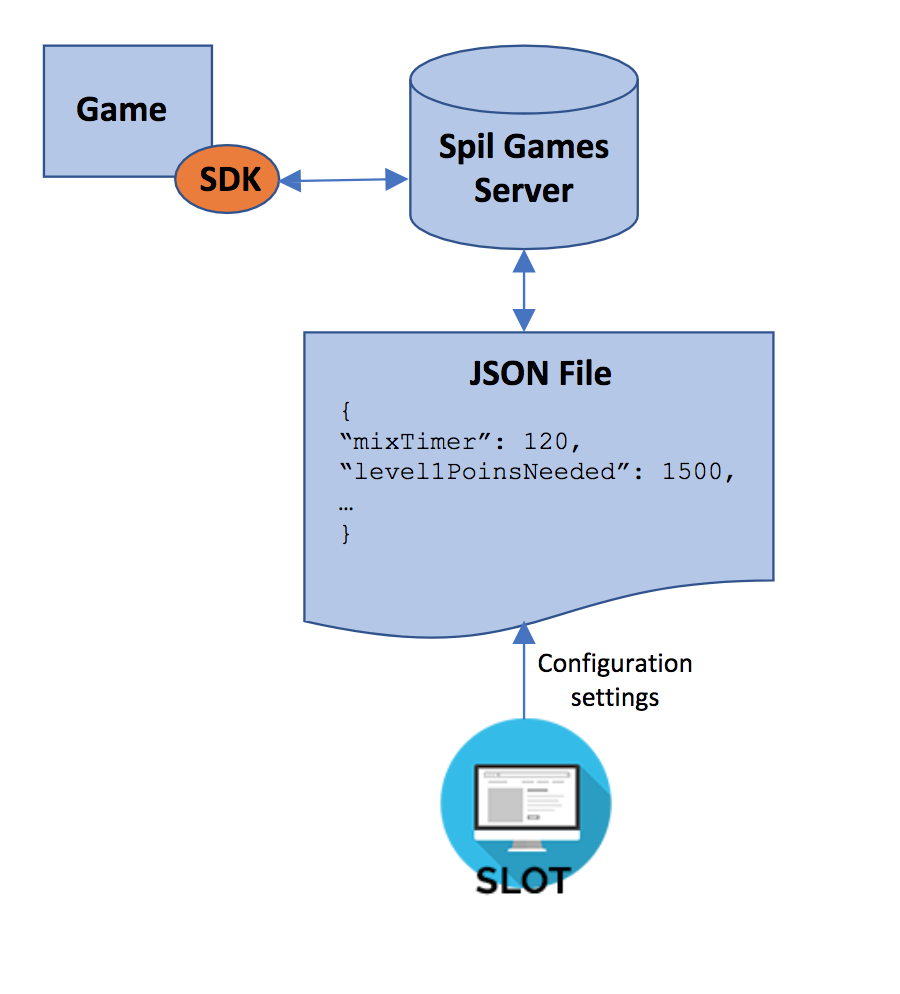

# Game Balancing

Balance is key to a successful game. In single-player games, it determines whether the challenge level is appropriate to the audience. If there are multiple strategies or paths within your game to victory, it controls whether following one strategy is better or worse than following another. Within games that have several similar objects (such as cards in a trading card game or weapons in a role-playing game), it regulates the objects themselves and, specifically, whether different objects have the same cost/benefit ratio.
The Gamedock platform makes use of configuration files to support the dynamic balancing of your games. These are JavaScript Object Notation (JSON) files that allow you to change all required parameters in a human-readable format without updating the published game.

The parameter configuration requirements are identified and agreed between the game’s designers and the Gamedock Account Manager. Once finalized, they are communicated to the game’s developers. A default JSON is provided as part of the Gamedock SDK. After publication, the configuration file is maintained by Gamedock LiveOps.

### Best Practice

We recommend the following:
* Balancing issues are best left until you have a good set of game core mechanics.
* Pricing should not be managed using the game configuration file. Generally, this is better managed through the shop features. For more information, see “Supporting Wallet, Shop and Inventory Control”.

## Understanding How It Work

Your game should start by it requesting the latest version of the configuration file. The Gamedock SDK will try to retrieve this from the Gamedock back-end server. If there is no network connection, the Gamedock SDK will fall back to its last known version. The configuration file and all its parameter values can be managed using SLOT (Gamedock Live Operations Tool). The procedure and requirements for this are described in the rest of this chapter.

## Requesting a Configuration File

The Gamedock SDK provides two methods for retrieving a game’s configuration file from the Gamedock server. You can retrieve the entire file using the following code:

### Parsing the JSON Configuration File

You can use the following methods for working with the Game Config:

~~~C#
//Method that returns the whole game config as defined in SLOT as a JSON string
Gamedock.Instance.GetConfigAll();

//Method that returns a first level node in the game config as a JSON string
Gamedock.Instance.GetConfigValue(string key);
~~~

The Gamedock SDK also includes methods for converting JSON strings to objects via the Gamedock.Unity.JSON.JSONHelper method.

> The configuration service should always return a value. However, if, for any reason, it does not, ensure that you check and handle a possible null return.

### Listening for Updates to the Configuration File

By default, game configuration calls will always return the last saved value. However, it is also possible to listen for configuration updates, which often happen in a background process, using the OnConfigUpdated event. After receiving the update, you can refresh the user interface and game state. Use the following code.

### Implementing a Default Configuration File

If there is no network connection, the Gamedock SDK will use a default configuration file. In addition, users might open the app for the first time and not have an Internet connection. For those situations, a default configuration file called **“defaultGameConfig.json”** needs to be added to your project’s root folder. The following is an example of a simple configuration file for the game Pixel Wizard.

## Using Firebase Remote Config

The Gamedock SDK offers the possibility to work with the Firebase Remote Config. For Android, you need to make sure that the Firebase module is included. For more information on how to set up the values in Firebase, check the following link:

[https://firebase.google.com/docs/remote-config/](https://firebase.google.com/docs/remote-config/)

In order to work with the Firebase Remote Config directly through the Gamedock SDK, use the following methods and callbacks:

~~~C#
//Geting the Firebase Remote Config Helper
FirebaseRemoteConfigHelper helper = Gamedock.Instance.GetFirebaseRemoteConfig();

//Set Default Values for the Remote Config
Dictionary<string, object> firebaseDefaults = new Dictionary<string, object>();
firebaseDefaults.Add("test", "test");

Gamedock.Instance.GetFirebaseRemoteConfig().SetDefaults(firebaseDefaults);

//Requesting the cloud remote config
Gamedock.Instance.GetFirebaseRemoteConfig().RequestRemoteConfig(long cacheExpirationTime);

//Getting the remote config values
bool value1 = Gamedock.Instance.GetFirebaseRemoteConfig().GetBoolean(key, namespaceValue = null);
double value2 = Gamedock.Instance.GetFirebaseRemoteConfig().GetDouble(key, namespaceValue = null);
long value3 = Gamedock.Instance.GetFirebaseRemoteConfig().GetLong(key, namespaceValue = null);
string value4 = Gamedock.Instance.GetFirebaseRemoteConfig().GetString(key, namespaceValue = null);
Dictionary<string, object> value5 = Gamedock.Instance.GetFirebaseRemoteConfig().GetDictionary(key, namespaceValue = null);

//Firebase Remote Config Callback
//Called when the Remote Config has been successfully updated from the cloud
Gamedock.Instance.ConfigCallbacks.OnFirebaseRemoteConfigUpdated -= OnFirebaseRemoteConfigUpdated;
Gamedock.Instance.ConfigCallbacks.OnFirebaseRemoteConfigUpdated += OnFirebaseRemoteConfigUpdated;
~~~