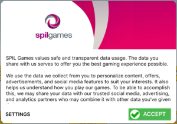
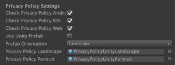
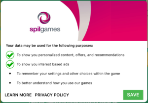
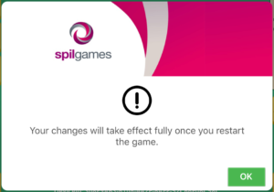

# GDPR & Privacy policy

Before we can use any feature of the Gamedock SDK the user needs to approve and give their consent for allowing us to track certain information about the user. This specified by the GDPR (General Data Protection Regulation). Both Google and Apple have their own interpretations of GDPR have set their own requirements of what we are allowed to track.

> IMPORTANT: It is not allowed to have any network calls before the user accepts the popup.

## Enable or disable the consent popup

GDPR implementation has a hard deadline for May 2018 for all apps to show a consent popup for certain data usage. Next to GDPR Google has set their date to 1 Feb 2018. Apple hasn’t communicated a hard deadline yet other than May, however, we want to take the same approach as for Google.
Meaning as of 1 Feb 2018. All games must have the checkmark and GDPR popup enabled unless explicitly asked by your account manager not to enable it. Please align closely with your account manager regards this matter. By default, the Gamedock SDK will use the default native template screens, in case you want to use custom Unity screens select ‘Use unity prefabs’ on the GamedockSDK GameObject, also make sure to specify the correct orientation. There are 2 default template prefabs provided by the Gamedock SDK, those can be found in the ‘Resources/Gamedock/PrivacyPolicy’ directory. The 2 prefabs both have to be added to the GamedockSDK gameobject in the privacy policy slots when selecting the ‘Use unity prefabs’ option.

The user should have an option to change their settings later on while playing the game. The game should offer a button for this which opens the GDPR settings screen, a default settings screen is provided by the Gamedock SDK and can be opened by calling:
	
~~~C#
Gamedock.Instance.ShowPrivacyPolicySettings();
~~~

The user has to restart the app after making changes to the GDPR settings before they take effect.

## Handling network calls and 3rd party SDK’s

By default, the Gamedock SDK handles all the network calls and 3rd party SDK’s within the Gamedock SDK. However, in case you do send network calls to your own server or load 3rd party SDK’s outside the Gamedock SDK it is important to know that this is only allowed after the user accepted the consent popup. When the user presses the accept button the following Gamedock SDK method is called for starting the SDK’s own network calls / 3rd party:

~~~C#
//Callback informing the status of the privacy policy (if it was accepted by the user)
Gamedock.Instance.PrivacyPolicyCallbacks.OnPrivacyPolicyStatus -= OnPrivacyPolicyStatus(bool accepted);
Gamedock.Instance.PrivacyPolicyCallbacks.OnPrivacyPolicyStatus += OnPrivacyPolicyStatus(bool accepted);
~~~

## Changing the header image

If you want to set your own custom header image instead of the Azerion logo, you can do so by overwriting the appropriate image file to the following location (if it does not exist, you will need to create it):

PROJECT_PATH/Assets/Plugins/Android/res/drawable/

The image files should have the name “privacy_policy_landscape_custom.png” or “privacy_policy_portrait_custom.png” depending on your orientation. The image size is 800px x 220px or 600px x 220px.

For iOS, the header image can be replaced at Gamedock.framework/PrivacyPolicyHeader.png.

For Unity 2017.1 and above you can use the supplied project found in the SDK bundle under NativeLibraries/Android/Resources. Build this project in Android Studio and make sure to replace the necessary images.

## Changing the consent popup text

Note that the text and translations of the popup are kept in the Gamedock SDK Game config feature, which should be by default integrated into your game. Note that in case you are working on an update you can fetch the new game config in Unity (we already updated the game config contents). Only in case of explicit requests by your account manager the default text and translations may be changed. Please don’t change this text on your own as this must be legally correct.