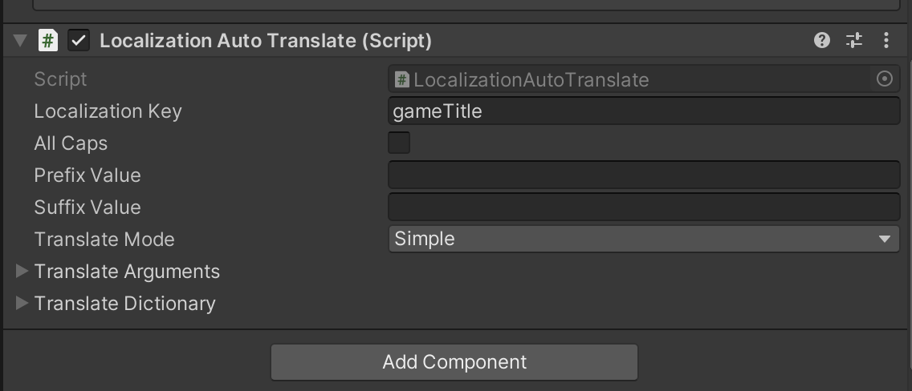
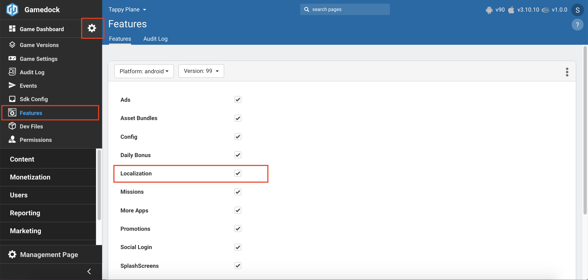
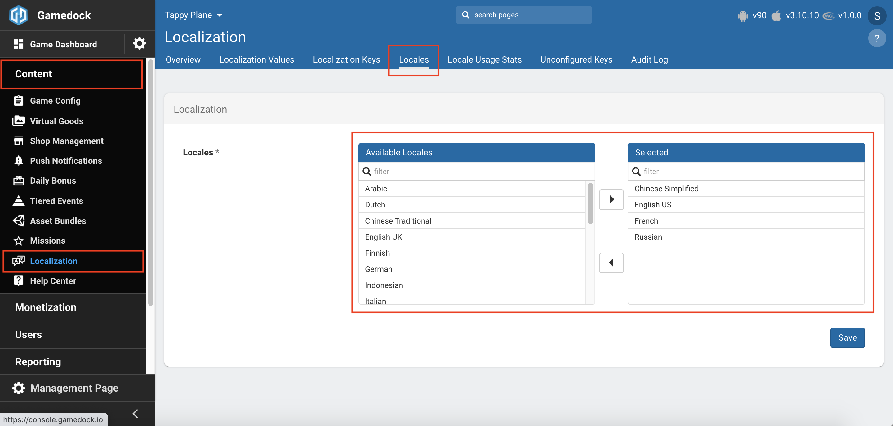
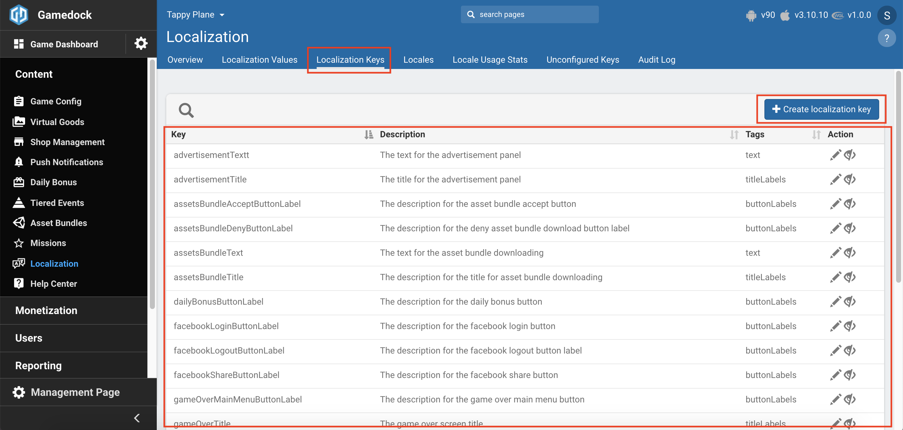
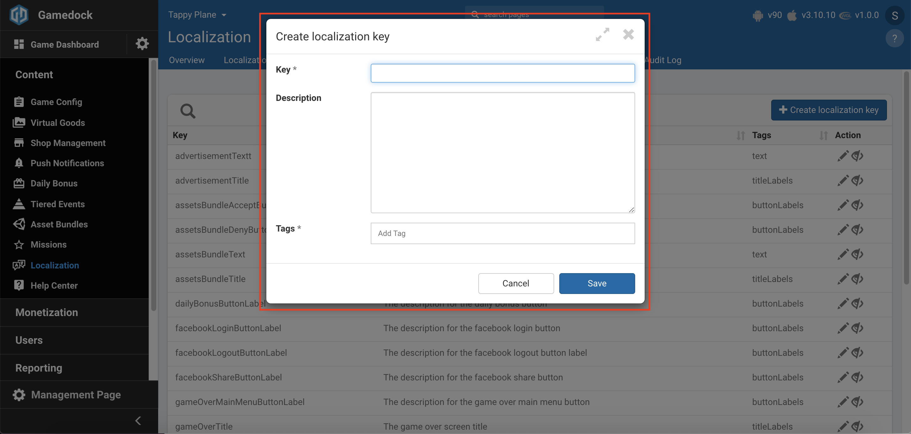
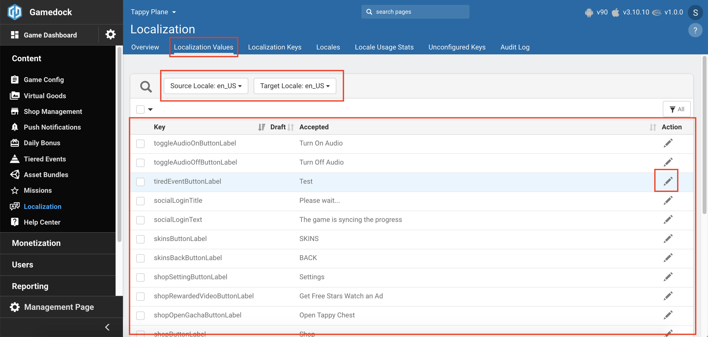
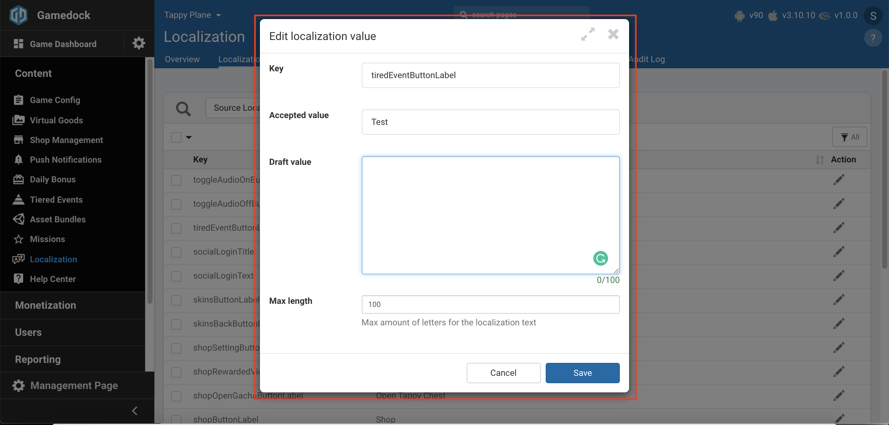
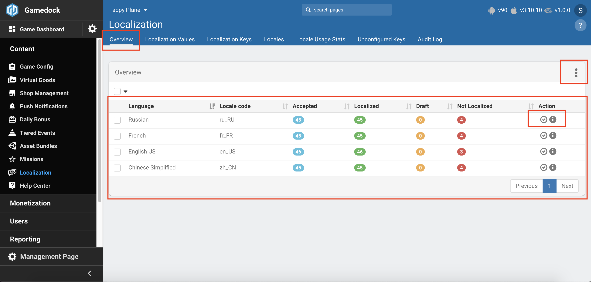
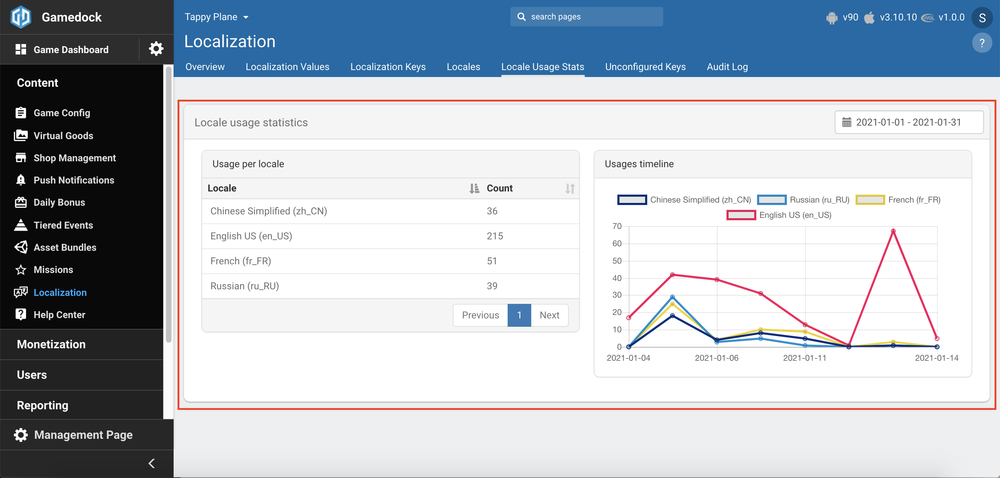
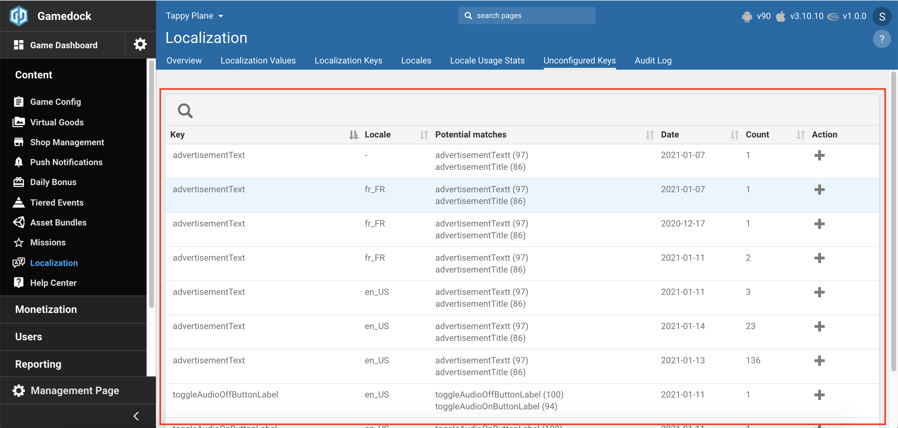

# Localization

Providing a wide range of languages for your game is essential. Gamedock provides a way to fully localize your game using the built-in localization feature. While using the feature take into account the following things:

* Currently the feature does not support first time offline startup of the game. What this means is that if the game is started first time without internet connection, the SDK will not have any localization information, even if the game would request for it until the first instance that the game has internet connection. Subsequent starts of the game while in offline will contain the last requested localization as well as the default one.
* The SDK will always store locally the requested localization as well as the default localization (English).

In order to implement the localization feature follow the steps below. It is recommended to start with the Console section before implementing it into your game.

<!-- tabs:start -->

#### ** Unity **

~~~csharp
//Request translation for specific locale
//If fallbackToDefaultLocale is true, when a key is not found in the localization it will first try to get it from the default locale (English). If it is not present in the default locale it will return the default value passed at retrieval.
//Use LocalizationHelper.Locales to easily pass a locale
Gamedock.Instance.RequestLocalization(string locale, bool fallbackToDefaultLocale);

//Callback if localization is available (contains also the locale in case the default locale is returned)
Gamedock.Instance.Localization.OnLocalizationAvailable -= OnLocalizationAvailable;
Gamedock.Instance.Localization.OnLocalizationAvailable += OnLocalizationAvailable;

//Callback if localization is not available
Gamedock.Instance.Localization.OnLocalizationNotAvailable -= OnLocalizationNotAvailable;
Gamedock.Instance.Localization.OnLocalizationNotAvailable += OnLocalizationNotAvailable;

//Callback if localization failed to be retrieved
Gamedock.Instance.Localization.OnLocalizationError -= OnLocalizationError;
Gamedock.Instance.Localization.OnLocalizationError += OnLocalizationError;

//Method used to retrieve a localization value
string localizationValue = Gamedock.Instance.GetLocalization(localizationKey, defaultValue);

//Method used to retrieve a localization value and replace all formatted arguments ({0}, {1}, etc.)
//Example: Hello {arg1}! Is your score {arg2}? -> Hello Timmy! Is your score 30?
string localizationValue = Gamedock.Instance.GetLocalization(localizationKey, defaultValue, arg1, arg2, arg3);

//Method used to retrieve a localization value and replace all the keys from the passed dictionary with the values supplied
//Example: "This value of the argument called someArg is %{someArg} and the value of anotherArg is %{anotherArg}. You can reuse arguments multiple times in your text, which is %{someArg}, %{anotherArg} and %{someArg}." -> "The value of the argument called someArg is awesome and the value of anotherArg is crazy. You can reuse arguments multiple times in your text, which is awesome, crazy and awesome."
string localizationValue = Gamedock.Instance.GetLocalization(localizationKey, defaultValue, argumentsDictionary);

//Helper Class for all supported locale codes
LocalizationHelper.Locales
~~~

Besides implementing the retrieval of a localization value manually, you can also attach an **AutoTranslate Component** script to any of your **UI.Text Components** in the **Unity Editor** that will automatically update the text once the localization is available. It will also update automatically if the locale changes during gameplay. The contents of the component are as follows:

* The localization key which is required in order to find the value for the localization text.
* If the localization text that has been retrieved should be formatted in all capital letters.
* If any additional text should be added either before or after the localization text.
* Selecting between the different translation modes:
    * **Simple:** The component just retrieves the localization value.
    * **ArgumentsList:** The component retrieves the localization value while also replacing all {x} values in the localization with the supplied arguments (in ascending order).
    * **Dictionary:** The component retrieves the localization value while replacing each provided key in the localization with it's value.

#### ** AIR **

~~~actionscript

~~~

#### ** Cordova **

~~~javascript
//Request translation for specific locale
//If fallbackToDefaultLocale is true, when a key is not found in the localization it will first try to get it from the default locale (English). If it is not present in the default locale it will return the default value passed at retrieval.
gamedockSDK.requestLocalization(locale: string, fallbackToDefaultLocale: boolean);

//Callback if localization is available (contains also the locale in case the default locale is returned)
gamedockSDK.on('LocalizationAvailable', (localizationAvailable) => {
    console.log('LocalizationAvailable with data: ', JSON.stringify(localizationAvailable));
});

//Callback if localization is not available
gamedockSDK.on('LocalizationNotAvailable', () => {
    
});

//Callback if localization failed to be retrieved
gamedockSDK.on('LocalizationError', () => {

});

//Method used to retrieve a localization value
var localizationValue = gamedockSDK.getLocalization(localizationKey, defaultValue);

//Method used to retrieve a localization value and replace all formatted arguments ({0}, {1}, etc.)
var localizationValue = gamedockSDK.getLocalization(localizationKey, defaultValue, arg1, arg2, arg3);

//Method used to retrieve a localization value and replace all the keys from the passed dictionary with the values supplied
var localizationValue = gamedockSDK.getLocalization(localizationKey, defaultValue, argumentsDictionary);
~~~

#### ** Console **

In order to configure the localization feature in the console go through the following steps:

1. Enable the feature in the features list.

2. In the Console, go to Content->Localization to access the feature.

3. Next go to the Locales page (within the Localization area) and add your desired locales that you want to use in your game.

4. After, go to the Localization Keys (within the Localization area) and create the keys you need in the game.

5. Go to the Localization Values (within the Localization area) and for each locale, add the translations for the keys you created in the step above. First add the draft values, and if your are fine with it, make sure to accept those values otherwise they will not be picked up when publishing.

6. Once you have populated all the key (and locales) with values, go to the Overview (within the Localization area) page and publish your locales.

7. You are ready now to use the localisation feature with the configured locales in your game.

8. If you make any new changes to the keys or the values, make sure to publish again.

> [!TIP]
> You can view the amount of times each locale has been requested and retrieved by the game in the Locale Usage Stats page (within the Localization area).
> 

> [!TIP]
> You can view all the unconfigured keys that your game request but have not been configured or translated yet in the Console in the Unconfigured page (within the Localization area).
> 

> [!TIP]
> If you have a template filled with locales, localization keys and values (in a CSV format) you can import that file in the Overview page (within the Localization area).

<!-- tabs:end -->

> [!WARNING]
> In order to use the advanced features using argument list and dictionary, make sure you have the following characters in your localization in order for the SDK to detect and replace the values:
> 
> **Arguments list:** {0}, {1} and so on for the arguments.
> 
> **Dictionary:** %{someKey}, %{someOtherKey} and so on for each place where you want the key to be replaced with the supplied value independent of the localization.

> [!DANGER]
> Localization configuration and files will not be downloaded automatically. You need to manually call "RequestLocalization" with your desired locale in order for the SDK to retrieve the information.

