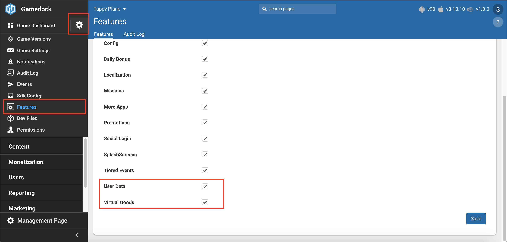

# In-App Purchase Packages

* **[Understanding the in-app Purchasing Strategy](#understanding-the-in-app-purchasing-strategy)**
* **[Configuration in Console](#configuration-in-console)**
* **[Retrieving IAP Packages Information](#retrieving-iap-packages-information)**

---

In-app purchases refer to items or points that a player can buy for use within a game to improve a character or enhance the playing experience. These, together with the use of smart ads (described in “Advertisement”) are the primary means by which games produce revenue for their makers. The Gamedock platform supports near real-time price changes and timed promotions.

### Understanding the In-App Purchasing Strategy

It is important to understand that within the Gamedock platform in-app purchases cannot be added on-the-fly or solely through the appropriate game’s store. The following strategy is used:

1. The game producer should define various price packages with your game store submission. For example, Starter Pack A for $0.99, Starter Pack B for $1.99, and so on. The contents of each package (for example, the number of coins that the user receives) should also be defined.
1. Your Gamedock Account Manager will then coordinate with Gamedock LiveOps to ensure that the promotions, and the packages associated with them, are set up on the Gamedock server. Typically, this includes any discounts that users should receive as part of the promotions, and the period during which specific promotions should be available.
1. Using the Gamedock SDK, developers can request information from the Console about the active promotions and packages to implement and manage the in-game shop.

### Configuration in Console

In order to setup the IAP Packages feature in the console go through the following steps:

<!-- panels:start -->

<!-- div:left-panel -->
1. Enable the **Virtual Goods** feature in the features list.

<!-- div:right-panel -->

<!-- div:left-panel -->
2. Go to **Content->Virtual Goods->Packages** to access the feature.
3. Click on the **"Add Package"** button in order to create and In-App Package configuration.

<!-- div:right-panel -->

<!-- div:left-panel -->
4. Configure the following attributes for the **Package**:
    * **Description**: A visual name used in the Console for visibility.
    * **Price**: A visual attribute used in the Console. The actual price for the Package needs to be retrieved in the game via your implemented IAP library (ex.: Unity IAP).
    * **Start & End Date**: Used for determining when a Package is returned to the game. If none is provide the Package will always be provided to the game.
    * **Entities**: Defines what the package should give to the user once he has bought it. The entities can be Currency, Item or Gacha.
    * **Store ids**: The corresponding ids of the IAP that is linked to the Package. You can retrieve these ids from the Play Store, App Store or other stores where you plan on delivering the game.

<!-- div:right-panel -->

<!-- panels:end -->

5. After a **Package** was created, you can edit it and add additional JSON properties that might help with configuring, displaying and in-game behaviour.
6. Once you have finished configuration of the **Package(s)** you are ready to use the via the SDK.

### Retrieving IAP Packages Information

The IAP Packages feature within the Gamedock SDK can automatically request IAP package information when the game starts. To retrieve this information, use the following code:

<!-- tabs:start -->

#### ** Unity **

~~~csharp
// The PackagesHelper class contains helper methods.
// It contains a list "Packages" which have all the information required.
Gamedock.Instance.Packages.Packages

// Request package by Store ID.
Package package = Gamedock.Instance.Packages.GetPackageByPackageId(string packageId);

// Request package by Console ID.
Package package = Gamedock.Instance.Packages.GetPackageById(string id);

// Check package has a promotion.
package.HasActivePromotion();

//Informs that the packages request has been successful
Gamedock.Instance.PackagesCallbacks.OnPackagesAvailable -= OnPackagesAvailable;
Gamedock.Instance.PackagesCallbacks.OnPackagesAvailable += OnPackagesAvailable;

//Informs that packages could not be retrieved from the server
Gamedock.Instance.PackagesCallbacks.OnPackagesNotAvailable -= OnPackagesNotAvailable;
Gamedock.Instance.PackagesCallbacks.OnPackagesNotAvailable += OnPackagesNotAvailable;
~~~

#### ** AIR **

~~~actionscript
// Retrieve Packages from the SDK (locally)
var helper:PackagesHelper = Gamedock.GetInstance().GetPackages();

// The PackagesHelper class contains helper methods.
// It contains a list "Packages" which have all the information required.
var Packages:Vector.<Package>;

// Request package by Store ID.
var package:Package = helper.GetPackageByPackageId(packageId:string);

// Request package by Console ID.
var package:Package = helper.GetPackageById(id:string);

// Check package has a promotion.
package.HasActivePromotion();

// Informs that the packages request has been successful
Gamedock.GetInstance().addEventListener(SDKEvents.PACKAGES_AVAILABLE, onPackagesAvailableEvent);
private function onPackagesAvailableEvent(evt:PackagesAvailableEvent) : void
{
	log(evt.toString());
}
	
// Informs that packages could not be retrieved from the server
Gamedock.GetInstance().addEventListener(SDKEvents.PACKAGES_NOT_AVAILABLE, onPackagesNotAvailableEvent);
private function onPackagesNotAvailableEvent(evt:PackagesNotAvailableEvent) : void
{
	log(evt.toString());
}
~~~

#### ** Cordova **

> This feature is currently not supported on Cordova.

<!-- tabs:end -->

### IAP Tools/Libraries

For Unity, the Unity IAP library is the standard library used by most of our developers. If you’d like to use a different IAP library then that’s fine, but please confirm this with your Gamedock representative.
