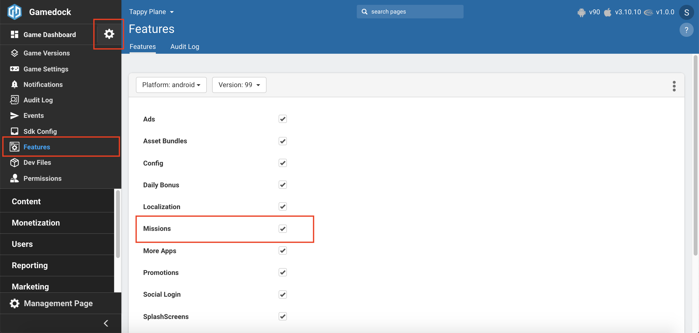
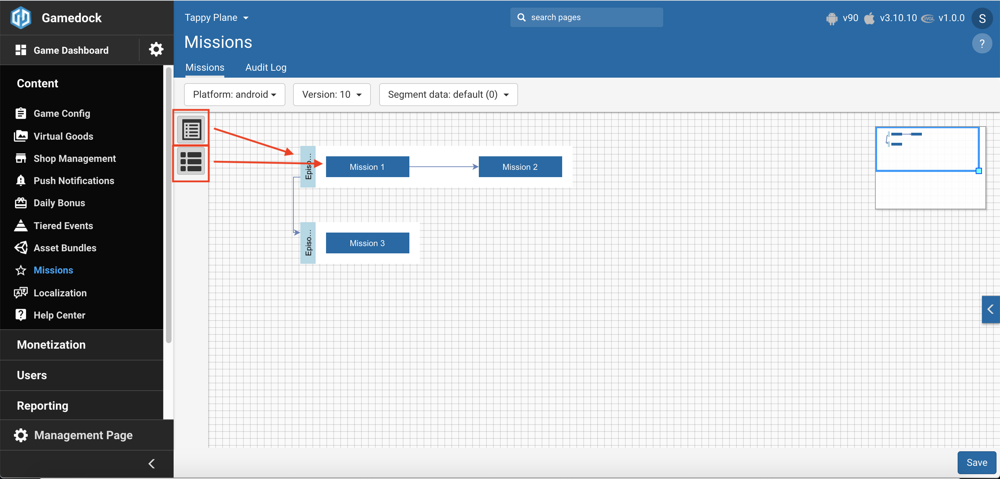

# Missions and Containers Feature

* **[Structure](#structure)**
* **[Configuration in Console](#configuration-in-console)**
* **[Implementation in the SDK](#implementation-in-the-sdk)**

---

The Missions and Containers feature allows you the possibility to create a configuration that adds or tweaks missions which are present in your game via the Gamedock Console. This configuration is retrieved from Console by the Gamedock SDK and made available for the game to be used. Also, besides the configuration, the Mission feature allows for the saving of user mission progress that can also be synchronized across multiple devices using the existing Cross-Device implementation (link to Sync feature).

The mission feature is setup as flexible as possible to fit the needs for almost any kind of game. The Gamedock SDK provides all configurations needed to create a generic mission system including missions and chapters/episodes (through containers). It does however not control the state and progress of the missions and containers because those are very game specific. Instead, the Gamedock SDK provides methods to easily retrieve and save the state and progress by the game developer.

The Missions and Containers feature consists of four components:
* Missions
* Containers which represents a collection of missions
* Mission Progress
* Container Progress

### Structure

The **Mission** component has the following attributes:

| Name                 | Definition                                                                                                                                                                                                            | Controlled by the SDK                                                                | Example                                                                                            |
|:---------------------|:----------------------------------------------------------------------------------------------------------------------------------------------------------------------------------------------------------------------|:-------------------------------------------------------------------------------------|:---------------------------------------------------------------------------------------------------|
| ContainerId          | The Id of the Container in which the Mission is located.                                                                                                                                                              | No (the checking has to be done by the developer).                                   |                                                                                                    |
| MissionPrerequisites | A list of MissionIds which point to Missions that need to be completed before the Mission can start.                                                                                                                  | No.                                                                                  | The player needs to complete “M1”, “M2” and “M3” before he can start this mission (“M4”).          |
| MissionUnlocks       | A list of MissionIds which indicate what Missions will be unlocked once the Mission has been Completed.                                                                                                               | No (the payment for the activation cost needs to be done manually by the developer). | Once “M4” has been completed, “M5” and “M6” are available.                                         |
| GamePrerequisites    | A free-form Dictionary/JSON which allows game specific prerequisites to be defined.                                                                                                                                   | No (the objectives need to be checked by the developer).                             | The player needs to have reached Level 5 and gained the Sword of Missions to unlock “M4”.          |
| GameUnlocks          | A free-form Dictionary/JSON which allows the definition of unlocks that happen in the game once the Mission is Completed.                                                                                             | Yes (if the developer calls the designated claim missions reward method).            | The player will be able to buy the Shield of Missions once the “M4” is completed.                  |
| ActivationCost       | A list of Currencies/Items that are required to be paid by the user in order to unlock the Mission. The value returned in the Type parameter of the MissionActivationCost can be CURRENCY, ITEM, GACHA.               | No (any value can be stored here).                                                   | The player needs to pay 1000 coins to unlock “M4”.                                                 |
| Objectives           | A list of Objective objects which describes what needs to be accomplished by the user in order to Complete the Mission.                                                                                               | No (the objectives need to be checked by the developer).                             | The player needs to collect 10 flowers and 5 boar pelts in order to complete “M4”.                 |
| Rewards              | A list of rewards that will be given if the Mission is Completed. This is used mainly for display purposes as a dedicated method is provided which handles automatically the claiming of Mission Rewards (see below). | Yes (if the developer calls the designated claim missions reward method).            | The player will receive 10 gems for completing “M4”.                                               |
| Properties           | A free-form Dictionary/JSON which allows any additional properties of a Mission that is outside the defined attributes’ scope                                                                                         | No (any value can be stored here).                                                   | The location of the “M4” mission is in Mission Town. The color of the “M4” mission marker is blue. |

The **Container** component represents a collection of missions. You can picture Containers as for example Episodes or Chapters. The component has the following attributes:

| Name                   | Definition                                                                                                                                                                                                                 | Controlled by the SDK                                                       | Example                                                                                          |
|:-----------------------|:---------------------------------------------------------------------------------------------------------------------------------------------------------------------------------------------------------------------------|:----------------------------------------------------------------------------|:-------------------------------------------------------------------------------------------------|
| ContainerPrerequisites | A list of ContainerIds which point to Containers that need to be completed before the Container can start (this check is not done automatically by the SDK).                                                               | No (the checking needs to be done manually by the developer).               | The player needs to complete container “Chapter1” in order to start this container (“Chapter2”). |
| ContainerUnlocks       | A list of ContainerIds which indicate what Containers will be unlocked once the Container has been Completed.                                                                                                              | No (the next container will not be automatically unlocked).                 | Once “Chapter2” has been completed, “Chapter3” and “Chapter4” are available.                     |
| Rewards                | A list of rewards that will be given if the Container is Completed. This is used mainly for display purposes as a dedicated method is provided which handles automatically the claiming of Containers Rewards (see below). | Yes (if the developer calls the designated claim containers reward method). | The player will receive 100 gems for completing “Chapter2”.                                      |
| Properties             | A free-form Dictionary/JSON which allows any additional properties of a Container that is outside the defined attributes’ scope.                                                                                           | No (any value can be stored here).                                          | The color of the “Chapter2” container description text is blue.                                  |

The **Mission Progress** component has the following attributes:

| Name          | Definition                                                                                                                                                                                                                                                                                                                                                                                                                                                                                                                                                                                                                                                                                                                                                                                                                                                                                                                                                                                                                                                                        | Controlled by the SDK                                           |
|:--------------|:----------------------------------------------------------------------------------------------------------------------------------------------------------------------------------------------------------------------------------------------------------------------------------------------------------------------------------------------------------------------------------------------------------------------------------------------------------------------------------------------------------------------------------------------------------------------------------------------------------------------------------------------------------------------------------------------------------------------------------------------------------------------------------------------------------------------------------------------------------------------------------------------------------------------------------------------------------------------------------------------------------------------------------------------------------------------------------|:----------------------------------------------------------------|
| MissionId     | Represent the id of the Mission to which the progress is related to.                                                                                                                                                                                                                                                                                                                                                                                                                                                                                                                                                                                                                                                                                                                                                                                                                                                                                                                                                                                                              | Yes.                                                            |
| Status        | The current status of the Mission. The Status needs to be manually changed by the developer (except in the cases of claiming mission rewards which the SDK can do and which would move the state from PENDING_COLLECTION to COMPLETED). The Status attribute can have one of the following values: <ul><li>INACTIVE – This is the initial state of a Mission.</li> <li>PENDING_ACTIVATION – All the requirements for the Mission have been met and the Mission is awaiting activation from the user/developer. In this step, you should check if any activation costs are required.</li> <li>IN_PROGRESS – The Mission is marked as in progress.</li> <li>PENDING_COLLECTION – This status is used when all the Objectives have been met for this Mission. At this point, you can/should call the ClaimMissionsReward method if any rewards need to be given for this Mission.</li> <li>COMPLETED – This Status marks that the Mission has been fully completed. Once this Status is set the Progress attribute will have its values completely removed.</li></ul> | No (the next container will not be automatically unlocked).     |
| Progress      | A free-form Dictionary/JSON which allows the storing of any Progress Data that might be relevant in order to complete the Mission. This field should be kept as minimal as possible. Do not save full game states here!                                                                                                                                                                                                                                                                                                                                                                                                                                                                                                                                                                                                                                                                                                                                                                                                                                                           | No (the progress needs to be updated manually by the developer. |
| LastCompleted | The value that is populated by the SDK once the Status of a Mission has been set to COMPLETED. This value is defined in milliseconds.                                                                                                                                                                                                                                                                                                                                                                                                                                                                                                                                                                                                                                                                                                                                                                                                                                                                                                                                             | Yes.                                                            |

The **Container Progress** component has the following attributes:

| Name          | Definition                                                                                                                                                                                                                                                                                                                                                                                                                                                                                                                                                                                                                         | Controlled by the SDK                                       |
|:--------------|:-----------------------------------------------------------------------------------------------------------------------------------------------------------------------------------------------------------------------------------------------------------------------------------------------------------------------------------------------------------------------------------------------------------------------------------------------------------------------------------------------------------------------------------------------------------------------------------------------------------------------------------|:------------------------------------------------------------|
| ContainerId   | Represent the id of the Container to which the progress is related to.                                                                                                                                                                                                                                                                                                                                                                                                                                                                                                                                                             | Yes.                                                        |
| Status        | The current status of the Container. The Status needs to be manually changed by the developer. The Status attribute can have one of the following values: <ul><li> INACTIVE – This is the initial state of a Container.</li> <li>IN_PROGRESS – The Container is marked as in progress.</li> <li>PENDING_COLLECTION – This status is used when all the Objectives have been met for this Container. At this point, you can/should call the ClaimContainersReward method if any rewards need to be given for this Mission.</li> <li>COMPLETED – This Status marks that the Container has been fully completed.</li></ul> | No (the next container will not be automatically unlocked). |
| LastCompleted | Value that is populated by the SDK once the Status of a Mission has been set to COMPLETED. This value is defined in milliseconds.                                                                                                                                                                                                                                                                                                                                                                                                                                                                                                  | Yes.                                                        |

### Configuration in Console

In order to setup the Missions and Containers feature in the console go through the following steps:

<!-- panels:start -->

<!-- div:left-panel -->
1. Enable the **Missions** feature in the features list.

<!-- div:right-panel -->

<!-- div:left-panel -->
2. Go to **Content->Missions** to access the feature.
3. Select your **Platform, Game Version and Segment**.

<!-- div:right-panel -->

<!-- div:left-panel -->
4. Drag from the Icons a **Container** and afterwards a **Mission** (make sure to drag it inside the container).

<!-- div:right-panel -->

<!-- div:left-panel -->
5. Select the **Container** in order to configure it.
6. Select the **Mission** in order to configure it.
7. You can link multiple missions by hovering over them in the graph and clicking on the linking icon.

<!-- div:right-panel -->

<!-- panels:end -->

8. Once you have finished editing the Missions and Containers, make sure to press the "Save" button in order for the game to start receiving the configuration.

### Implementation in the SDK

In order to work with the Mission and Containers components you need to use the following methods:

<!-- tabs:start -->

#### ** Unity **

~~~csharp
//Helper class for missions progress
Gamedock.Instance.MissionData (References to Gamedock.cs MissionData; is MissionDataHelper)

//Method used to update both a list of container progress and mission progress
Gamedock.Instance.MissionData.UpdateContainerAndMissionProgress(List<ContainerProgress> containerProgressList, List<MissionProgress> missionProgressList, string reason, string reasonDetails = null, string location = null, string transactionId = null);
 
//Method used to update a container progress
Gamedock.Instance.MissionData.UpdateContainerProgress(ContainerProgress containerProgressData, string reason, string reasonDetails = null, string location = null, string transactionId = null); 

//Method used to update multiple container progress objects
Gamedock.Instance.MissionData.UpdateContainerProgress(List<ContainerProgress> containerProgressList, string reason, string reasonDetails = null, string location = null, string transactionId = null);

//Method used to update a mission progress
Gamedock.Instance.MissionData.UpdateMissionProgress(MissionProgress missionProgressData, string reason, string reasonDetails = null, string location = null, string transactionId = null);

//Method used to update multiple mission progress objects
Gamedock.Instance.MissionData.UpdateMissionProgress(List<MissionProgress> missionProgressList, string reason, string reasonDetails = null, string location = null, string transactionId = null);
 
//Should be called if the STATUS = PENDING COLLECTION of a Mission or Container
//Method used to claim the reward of a container
//The mission progress status needs to be PENDING_COMPLETION
Gamedock.Instance.MissionData.ClaimContainersReward(ContainerProgress containerProgressData, string reason, string reasonDetails = null, string location = null, string transactionId = null);

//Method used to claim the reward of a list of containers
//The mission progress status needs to be PENDING_COMPLETION
Gamedock.Instance.MissionData.ClaimContainersReward(List<ContainerProgress> containerProgressList, string reason, string reasonDetails = null, string location = null, string transactionId = null);

//Method used to claim the reward of a mission
//The mission progress status needs to be PENDING_COMPLETION
Gamedock.Instance.MissionData.ClaimMissionsReward(MissionProgress missionProgressData, string reason, string reasonDetails = null, string location = null, string transactionId = null);

//Method used to claim the reward of a list of missions
//The mission progress status needs to be PENDING_COMPLETION
Gamedock.Instance.MissionData.ClaimMissionsReward(List<MissionProgress> missionProgressList, string reason, string reasonDetails = null, string location = null, string transactionId = null);

//Method used to get the full list of container progress or container progress that has a specific STATUS
Gamedock.Instance.MissionData.GetUserAllContainerProgress(Status containerStatus = Status.NULL);

//Method used to get the container progress based on the id
Gamedock.Instance.MissionData.GetContainerProgress(string containerId);

//Method used to get the full list of mission progress or mission progress that has a specific STATUS
Gamedock.Instance.MissionData.GetUserAllMissionProgress(Status missionStatus = Status.NULL);

//Method used to get the mission progress based on the id
Gamedock.Instance.MissionData.GetMissionProgress(string missionId);

//Missions Callbacks
//Called when the mission configuration is available
Gamedock.Instance.MissionsCallbacks.OnMissionConfigurationAvailable -= OnMissionConfigurationAvailable;
Gamedock.Instance.MissionsCallbacks.OnMissionConfigurationAvailable += OnMissionConfigurationAvailable;
 
//Called when the mission configuration is not available
Gamedock.Instance.MissionsCallbacks.OnMissionConfigurationNotAvailable -= OnMissionConfigurationNotAvailable;
Gamedock.Instance.MissionsCallbacks.OnMissionConfigurationNotAvailable += OnMissionConfigurationNotAvailable;
 
//Called when the mission configuration has an error
Gamedock.Instance.MissionsCallbacks.OnMissionConfigurationError -= OnMissionConfigurationError;
Gamedock.Instance.MissionsCallbacks.OnMissionConfigurationError += OnMissionConfigurationError;
 
//Called after the SDK has finished updating the mission data (progress)
Gamedock.Instance.UserDataCallbacks.OnMissionDataUpdated -= OnMissionDataUpdated;
Gamedock.Instance.UserDataCallbacks.OnMissionDataUpdated += OnMissionDataUpdated;
 
public void OnMissionDataUpdated(string reason, MissionDataUpdatedData updatedData) {
}
 
public class MissionDataUpdatedData {
    List<ContainerProgress> containerProgressList;
    List<MissionProgress> missionProgressList;
}
 
//Called if an error occurs with missions
Gamedock.Instance.UserDataCallbacks.OnUserDataError -= OnUserDataError;
Gamedock.Instance.UserDataCallbacks.OnUserDataError += OnUserDataError;
 
//The PlayerDataUpdated callback has two additional parameters added which get populated when the claim reward was done
List<string> claimedContainers;
List<string> claimedMissions;
~~~

> [!NOTE]
> Make sure when using the feature that you generate all the “Default Configuration Files” from the Gamedock SDK menu in order to create the **“defaultMissionConfig.json”** file.

In order to understand better how the feature flow should be implemented you will find an example below:

~~~csharp
// --- At the start of the first session it's best to initialize all containers and missions like this ---

List<ContainerProgress> updatedContainers = new List<ContainerProgress>();
List<MissionProgress> updatedMissions = new List<MissionProgress>();

List<MissionContainer> containers = Gamedock.Instance.MissionsConfiguration.GetContainersConfiguration();
foreach (MissionContainer container in containers)
{
    Status initialStatus = container.ContainerPrerequisites.Count > 0 ? MissionDataHelper.Status.INACTIVE : MissionDataHelper.Status.IN_PROGRESS;
    ContainerProgress containerProgress = new ContainerProgress(container.ContainerId, initialStatus, 0);
    updatedContainers.Add(containerProgress);

    List<Mission> missions = Gamedock.Instance.MissionsConfiguration.GetMissionsConfiguration(container.ContainerId);
    foreach (Mission mission in missions)
    {
        Status initialStatus = mission.ActivationCost.Count > 0 ? MissionDataHelper.Status.PENDING_ACTIVATION : MissionDataHelper.Status.IN_PROGRESS;
        MissionProgress missionProgress = new MissionProgress(mission.MissionId, initialStatus, new Dictionary<string, object>(), 0);
        updatedMissions.Add(missionProgress);
    }
}

Gamedock.Instance.MissionData.UpdateContainerAndMissionProgress(updatedContainers, updatedMissions, "InitializedMissionData");

// --- To create a visual listview which includes all containers including it's missions you could use something like this ---

List<MissionContainer> containers = Gamedock.Instance.MissionsConfiguration.GetContainersConfiguration();
foreach (MissionContainer container in containers)
{
    ContainerProgress containerProgress = Gamedock.Instance.MissionData.GetContainerProgress(container.ContainerId);

    // Add a cell for the container here using 'container' and 'containerProgress'

    List<Mission> missions = Gamedock.Instance.MissionsConfiguration.GetMissionsConfiguration(container.ContainerId);
    foreach (Mission mission in missions)
    {
        MissionProgress missionProgress = Gamedock.Instance.MissionData.GetMissionProgress(mission.MissionId);

        // Add a cell for the mission here using 'mission' and 'missionProgress'
    }
}

// --- To update the progress and status of an individual mission after collecting an item ---

MissionProgress missionProgress = Gamedock.Instance.MissionData.GetMissionProgress(mission.MissionId);
missionProgress.Progress["collectedAmount"] = 2;
missionProgress.Status = MissionDataHelper.Status.IN_PROGRESS;
Gamedock.MissionData.UpdateMissionProgress(updatedMission, "ItemCollected");

// --- To claim a reward for a mission and possible container completion use something like this ---

List<MissionProgress> updatedMissionsProgress = new List<MissionProgress>();
List<ContainerProgress> updatedContainersProgress = new List<ContainerProgress>();

// Claim mission rewards through the Gamedock SDK
Gamedock.Instance.MissionData.ClaimMissionsReward(missionProgress, "MissionClaimed", "MissionCompleted", "MissionsPanel");

// Update mission status
missionProgress.Status = MissionDataHelper.Status.COMPLETED;
updatedMissionsProgress.Add(missionProgress);

// Check if the container was completed
bool containerCompleted = true;
foreach (Mission missionToCheck in Gamedock.Instance.MissionsConfiguration.GetMissionsConfiguration(mission.ContainerId))
{
    MissionProgress missionToCheckProgress = Gamedock.Instance.MissionData.GetMissionProgress(missionToCheck.MissionId);
    if (missionToCheckProgress.Status != MissionDataHelper.Status.COMPLETED)
    {
        if (!missionToCheck.MissionId.Equals(missionProgress.MissionId))
        {
            containerCompleted = false;
        }
    }
} 

if (containerCompleted)
{
    ContainerProgress containerProgress = Gamedock.Instance.MissionData.GetContainerProgress(mission.ContainerId);
    containerProgress.Status = MissionDataHelper.Status.PENDING_COLLECTION;
    
    // Claim container rewards through the Gamedock SDK
    Gamedock.Instance.MissionData.ClaimContainersReward(containerProgress, "ContainerClaimed", "MissionCompleted", "MissionsPanel");

    // Complete current container
    containerProgress.Status = MissionDataHelper.Status.COMPLETED;
    updatedContainersProgress.Add(containerProgress);
}

Gamedock.Instance.MissionData.UpdateContainerAndMissionProgress(updatedContainersProgress, updatedMissionsProgress, "ClaimedMissionReward");
~~~

#### ** AIR **

> The missions feature is not supported for AIR.

#### ** Cordova **

> This feature is currently not supported on Cordova.

<!-- tabs:end -->