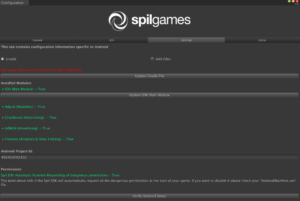

# Platform specific components

## Android

### Requirements

* Minimum Android SDK version needs to be 17
* Unity Build System needs to be Gradle
* Make sure to use the supplied “mainTemplate.gradle” file in order to overcome issues such as Multi-Dexing and for importing Google Play Services Automatically

For Android, you should enter your project ID as the value of the “ProjectId” field in Gamedock.cs. Ask your Gamedock contact to provide you with your project ID.

There are two modes in which you can use the Android Gamedock SDK. The older method, using the “.aar” file, and importing the SDK file automatically using the “mainTemplate.gradle” file. These setting can be configured, as well as which modules you want to use in the “Gamedock SDK->Configurations->Android” Unity window located in the top menu.

The modules are broken down into the following sections:

* Adjust (Analytics)
* Advertisement (Chartboost and AdMob)
* Firebase (Analytics, Remote Config & Deep Links)

> Besides the modules, there are also two manifest files which should be used only if you are using either the Unity Plugin “Prime31” or “Android Native”. You should especially look at the main activity name value.

### Google Play Services

When you use the supplied “mainTemplate.gradle” and the Gradle Build System, the Google Play Services and Google Play Games will be automatically imported and you don’t need any additional “.aar” files. If there are any conflict errors make sure to remove any redundant file and use the Gradle file system.

### Permissions

For Android version 6.0 and up, Google requires that with all your Android application, the permissions that they consider as dangerous (see: [https://developer.android.com/guide/topics/security/permissions.html](https://developer.android.com/guide/topics/security/permissions.html)) need to be asked at runtime. As of the Gamedock SDK version 2.7.0+, there are no dangerous permissions required anymore. In case you require have dangerous permissions, please discuss this first with your account manager. After agreement the following steps can be taken to implement a correct permission flow that will be approved by the Google review team.

In case dangerous permissions are set the Gamedock SDK will automatically request all the dangerous permissions at the start of the game. You can, however, disable that and implement the request at a later stage using this code:

~~~XML
<meta-data android:name="gamedock.permissions.DisableAutoRequest" android:value="true" />
~~~

You can manually request a permission using the following code:

~~~C#
//For the permission parameter you can use one of the values found in the GamedockAndroidUnityImplementation.Permissions class or use the official Android structure
//see: "https://developer.android.com/guide/topics/security/permissions.html" for more information
Gamedock.Instance.RequestDangerousPermission(permission, rationale, denyRationale);
~~~

### Adding Custom Permission Images

If you want to set your own custom notification icon, you can do so by adding the appropriate image file to the following location (if does not exist, you will need to
create it):

PROJECT_PATH/Assets/Plugins/Android/res/drawable/

The image files should have the names “permission_header_custom.png” and “permission_deny_header_custom.png”.

For Unity 2017.1 and above you can use the supplied project found in the SDK bundle under NativeLibraries/Android/Resources. Build this project in Android Studio and make sure to replace the necessary images.

### Using the Android Configuration window

Additional settings can be configured via the “Gamedock SDK -> Configuration -> Android” menu, the page looks like this:

It allows switching between using “.aar” files or the recommended Gradle build system. After selecting the build system it’s possible to add or remove modules, based on which features your game requires. The screen also shows useful information such as recommended updates.

## iOS

Extra components for iOS need to be added in Xcode after building from Unity.

## WebGL

WebGL is similar to Android with a few minor differences:

* A template for WebGL pages is included under “/assets/webgltemplates/gamedockdefaulttemplate”. This template can be customised or you can create your own, be careful not to break the javascript though.
* Some SDK components currently don’t work for WebGL: Adjust, AdMob, ChartBoost.
* A WebGL-specific ad provider for rewarded videos / interstitials will be added a.s.a.p. There is currently no ad provider for WebGL (SDK version 3.2.0).
* Google Play Games achievements and leaderboards do not work for WebGL, either remove achievements/leaderboards or re-implement them with a WebGL-/Facebook-specific library.

## Building and publishing

### iOS

For iOS there are no other steps to take, the Gamedock postprocessor script takes care of all the building and adding the Gamedock frameworks to the project.

#### Split-application binary for Android (APK + OBB files)

When a Unity app becomes large in filesize it may be a good idea to split the app up into multiple parts. This way the initial download and install of the app from the app store is quick and the app opens up to show a “downloading assets” screen. The app then downloads all the other assets before continuing.

Unity supports this feature via the “split-application binary” build option, which splits the app into an APK file and one or more OBB files (see: [here](https://docs.unity3d.com/Manual/android-OBBsupport.html)). By default the APK file contains only the starting scene of the Unity app and all of it’s required resources (including the “Plugins” folder).

There is a problem though, the “Streaming Assets” folder that contains the JSON files required by the Gamedock SDK is included in the OBB file, not the APK file. This means that when the app starts the Gamedock SDK tries to locate the JSON files in the APK but it won’t find them. This problem can be solved by copying the JSON files in the Unity project from “/Streaming Assets” to “/Plugins/Android/assets/”. The files are then copied to the APK file and the Gamedock SDK can initialize properly.

### WebGL

* For building to the Facebook target from Unity you’ll need to download the Facebook platform support tools via Unity.
* For publishing to Facebook the Facebook SDK needs to be included.
* For publishing to Facebook the Facebook SDK’s IAP features should be used.
* Asset bundles have to be published specifically for WebGL.
* On the GamedockSDK game object on the first scene be sure to configure the WebGL settings at the bottom. Also, drag a pre-fab into the privacy policy popup field, a default pre-fab “PrivacyPolicyUnityLandscape” is included.
* On the GamedockSDK game object on the first scene be sure to add the script “WebGLUnityJavaScriptInterface”.
* Be sure to disable exception logging/stack trace on the WebGL player settings panel in Unity when making a release build to optimize performance.
* Uploading and testing via Facebook can be done via the Unity UI and the Facebook dashboard. Please contact a Gamedock SDK team member if you don’t have the correct credentials or can’t access the Facebook dashboard for your game.
* Compared to mobile, WebGL is prone to memory issues, you’ll likely have to set your assets to the lowest possible quality and may have to optimize your scenes so the minimum number of assets are loaded at once.