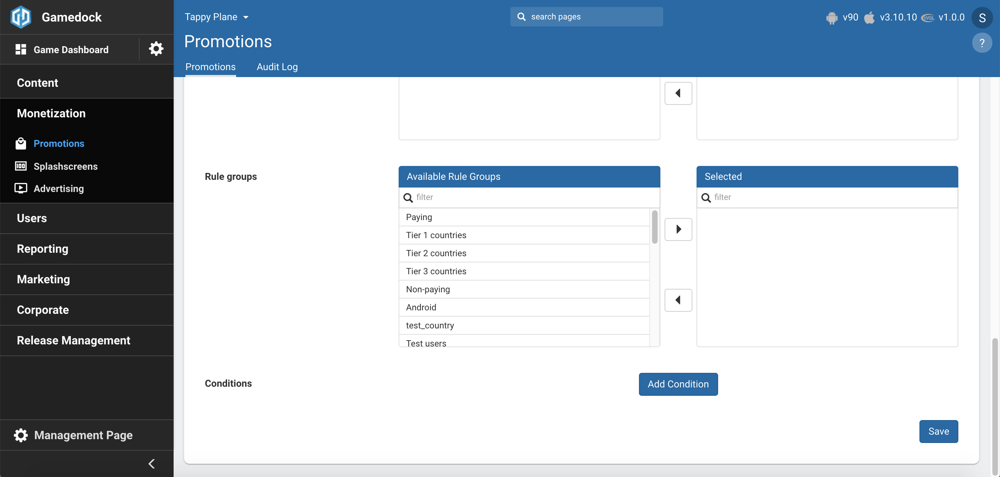

# Promotions

* **[Configuration in Console](#configuration-in-console)**
* **[Working with Promotions in the SDK](#working-with-promotions-in-the-sdk)**

---
The Promotions feature offers the possibility to award users with additional currencies and/or items for a limited amount of time or to reduce the prices for in-game bundles. The feature can be applied to **In-Game Bundles** and **IAP Packages**. The following options are available when configuring a promotion:
* Set a start date and an end date for the promotion.
* Award users with extra currencies, items and/or gacha boxes. This option is available for both Bundels and Packages.
* Reduce the price of a purchase. This option is **only** available to Bundles.
* Set a max amount of purchases.
* Show splash screen specific to the promotion.
* Configure promotion specific assets. These assets can be accessed through the PromotionsHelper class in the GameAssets List.

### Configuration in Console

In order to setup the Promotions feature in the console go through the following steps:

<!-- panels:start -->

<!-- div:left-panel -->
1. Enable the **Promotions** feature in the features list.

<!-- div:right-panel -->

<!-- div:left-panel -->
2. Go to **Monetization->Promotions** to access the feature.
3. Click on the **"Create promotion"** button in order to create a new Promotion for your game.

<!-- div:right-panel -->

<!-- div:left-panel -->
4. On the creation page, configure the following attributes for the **Promotion**:
    * **Name**: The name of the Promotion.
    * **Enabled**: Defines if the Promotion will be sent to the game.
    * **Label**: A short description by which the Promotion can be identified (not Localized).
    * **Start, End Date & Send At**: Used for determining when a Promotion is returned to the game. If none is provide the Promotion will always be provided to the game. Send At determines if the backend should consider UTC or the user's local time.
    * **Duration & Duration Unit**: Determines the amount of time the promotion will be available to the user. 
    * **Max purchases**: The amount of times the user can purchase the promotion before it becomes unavailable to him.
    * **Affected entities**: This field determines if the Promotion modifies a Bundle or Package in the game.
    * **Price override**: This field determines if the Promotion will override an existing price. This can only be used in conjunction with a Bundle affected entity.
    * **Extra entities**: This field specifies what additional goods the user will receive when purchasing the Promotion. The entities can be Currency, Item or Gacha.
    * **Platform**: Refers to the platform that the Promotion will be sent to. Here you can also configure the versions of the game that the Promotions will be sent.
    * **Segments, Rule Groups & Conditions**: Indicates to which users the Promotion will be sent to.

<!-- div:right-panel -->

<!-- panels:end -->

5. With the **Promotion** configured, you can now retrieved it from the SDK and use it to monetize more your game.

### Working with Promotions in the SDK

In order to work the Promotions feature in the game implement the following code:

<!-- tabs:start -->

#### ** Unity **

~~~csharp
//List of promotions
Gamedock.Instance.Promotions.Promotions

//Retrieves the promotion associated with the given bundle id
Promotion promotion = Gamedock.Instance.Promotions.GetBundlePromotion(bundleId);

//Retrieves the promotion associated with the given package id
Promotion promotion = Gamedock.Instance.Promotions.GetPackagePromotion(packageId);

//Checks if a promotion is present for the bundle with the given bundle id
bool hasBundlePromotion = Gamedock.Instance.Promotions.HasBundlePromotion(bundleId);

//Checks if a promotion is present for the IAP package with the given package id
bool hasPackagePromotion = Gamedock.Instance.Promotions.HasPackagePromotion(packageId);

//Checks if a promotion is active for the given Shop Tab
bool hasTabPromotion = Gamedock.Instance.Promotions.HasActiveTabPromotion(tab);

//Checks if a promotion is active for the given Shop Entry
bool hasEntryPromotion = Gamedock.Instance.Promotions.HasActiveEntryPromotion(entry);

//Informs that the promotions request has been successful
//This does not guarantee that there are any promotions in the list
Gamedock.Instance.PromotionsCallbacks.OnPromotionsAvailable -= OnPromotionsAvailable;
Gamedock.Instance.PromotionsCallbacks.OnPromotionsAvailable += OnPromotionsAvailable;

//Informs that promotions could not be retrieved from the server
Gamedock.Instance.PromotionsCallbacks.OnPromotionsNotAvailable -= OnPromotionsNotAvailable;
Gamedock.Instance.PromotionsCallbacks.OnPromotionsNotAvailable += OnPromotionsNotAvailable;

//Triggered each time a bundle/package is bought that has a promotion attached to it
//Returns the promotion id, the current amount bought for that promotion by the user and if the max amount has been reached
//The promotion visuals should be removed if maxAmountReached is true
Gamedock.Instance.PromotionsCallbacks.OnPromotionAmountBought -= OnPromotionAmountBought (promotionId, currentAmount, maxAmountReached);
Gamedock.Instance.PromotionsCallbacks.OnPromotionAmountBought += OnPromotionAmountBought (promotionId, currentAmount, maxAmountReached);

//Show a promotion specific splash screen
Gamedock.Instance.ShowPromotionScreen(promotionId);
~~~

> [!TIP]
> For Bundle purchases, the Promotion will be applied automatically if there is one. You do not need to add any extra information for the buying of the bundle.

A simple example is also given for applying promotion values to an IAP Package as these need to be applied manually:

~~~csharp
//Loop through all packages and find required package (productSKU)
for (int i = 0; i < Gamedock.Instance.Packages.Packages.Count; i++) {
  if (productSKU == Gamedock.Instance.Packages.Packages[i].PackageId) {
  
    int packageValue = int.Parse(Gamedock.Instance.Packages.Packages[i].Items[0].Value.Replace(".0", ""));
    
    //Check if package has promotion
    if (Gamedock.Instance.Packages.Packages[i].HasActivePromotion()) {
      //Apply extra entities from the promotion
      Promotion packagePromotion = Gamedock.Instance.Promotions.GetPackagePromotion(helper.Packages[i].PackageId);
      packageValue = packageValue + packagePromotion.ExtraEntities[0].Amount;
    }
    //Award users the full amount (normal + promotion)
    Gamedock.PlayerData.Wallet.Add (int.Parse (helper.Packages [i].Items [0].Id), packageValue, PlayerDataUpdateReasons.IAP, "Shop", transactionId);
  }
}
~~~

#### ** AIR **

~~~actionscript
// Returns a helper class that can be used to handle promotion operations
var promotionsHelper:PromotionsHelper = Gamedock.GetInstance().GetPromotions();
// List of promotions
var promotionList:Vector.<Promotion> = promotionHelper.Promotions;

// Retrieves the promotion associated with the given bundle id
var promotion:Promotion = promotionHelper.GetBundlePromotion(bundleId);

// Retrieves the promotion associated with the given package id
var promotion:Promotion = promotionHelper.GetPackagePromotion(packageId);

// Checks if a promotion is present for the bundle with the given bundle id
var hasBundlePromotion:Boolean = promotionHelper.HasBundlePromotion(bundleId);

// Checks if a promotion is present for the IAP package with the given package id
var hasPackagePromotion:Boolean = promotionHelper.HasPackagePromotion(packageId);

// Checks if a promotion is active for the given Shop Tab
var hasTabPromotion:Boolean = promotionHelper.HasActiveTabPromotion(tab);

// Checks if a promotion is active for the given Shop Entry
var hasEntryPromotion:Boolean = promotionHelper.HasActiveEntryPromotion(entry);

// Informs that the promotions request has been successful
// This does not guarantee that there are any promotions in the list
Gamedock.GetInstance().addEventListener(SDKEvents.PROMOTIONS_NOT_AVAILABLE, onPromotionsNotAvailableEvent);
private function onPromotionsAvailableEvent(evt:PromotionsAvailableEvent) : void
{
	log(evt.toString());
}

// Informs that promotions could not be retrieved from the server
Gamedock.GetInstance().addEventListener(SDKEvents.PROMOTION_AMOUNT_BOUGHT, onPromotionAmountBoughtEvent);
private function onPromotionsNotAvailableEvent(evt:PromotionsNotAvailableEvent) : void
{
	log(evt.toString());
}

// Triggered each time a bundle/package is bought that has a promotion attached to it
// Returns the promotion id, the current amount bought for that promotion by the user and if the max amount has been reached
// The promotion visuals should be removed if maxAmountReached is true
Gamedock.GetInstance().addEventListener(SDKEvents.PROMOTION_AMOUNT_BOUGHT, onPromotionAmountBoughtEvent);
private function onPromotionAmountBoughtEvent(evt:PromotionAmountBoughtEvent) : void
{
	log(evt.toString());
}

// Show a promotion specific splash screen
Gamedock.GetInstance().ShowPromotionScreen(promotionId);
~~~

> [!TIP]
> For Bundle purchases, the Promotion will be applied automatically if there is one. You do not need to add any extra information for the buying of the bundle.

A simple example is also given for applying promotion values to an IAP Package as these need to be applied manually:

~~~actionscript
// Retrieve the packages helper
var helper:PackagesHelper = Gamedock.GetInstance().GetPackages();

// Loop through all packages and find required package (productSKU)
for (var i:int = 0; i < helper.Packages.length; i++)
{
	if (productSKU == helper.Packages[i].PackageId)
	{
		var packageValue:int = parseInt(helper.Packages[0].Items[0].GetValue().replace(".0", ""));
		
		// Check if package has promotion
		if (helper.Packages[i].HasActivePromotion())
		{
			//Apply extra entities from the promotion
			var packagePromotion:Promotion = Gamedock.GetInstance().GetPromotions().GetPackagePromotion(helper.Packages[i].PackageId);
			packageValue = packageValue + packagePromotion.ExtraEntities[0].Amount;
		}
		// Award users the full amount (normal + promotion)
		Gamedock.GetInstance().PlayerData.Wallet.Add(parseInt(helper.Packages[i].Items[0].Id), packageValue, "IAP", "Shop", transactionId);
	}
}
~~~

#### ** Cordova **

> This feature is currently not supported on Cordova.

<!-- tabs:end -->