# Push Notifications

* **[Configuration in Console](#configuration-in-console)**
* **[Handling Push Notification Permission Requests](#handling-push-notification-permission-requests)**
* **[Adding Custom Notification Icons](#adding-custom-notification-icons)**
* **[iOS Capabilities & Entitlements](#ios-capabilities-amp-entitlements)**
* **[iOS Notification Service](#ios-notification-service)**

---

There are various reasons to use push notifications in your games, and they have numerous benefits in terms of engaging with customers and driving traffic. The use of push notifications can enhance the gaming experience for your users by adding another element to the game analysis, as well as helping you monetize your game. Push notifications allow developers to provide up-to-date and relevant information to users, encouraging engagement, sparking recognition, and increasing involvement. They are less interruptive than other forms of customer engagement and can be used effectively to bring in more traffic and add value to users by providing useful information. However, it is essential this information is relevant and interesting. Otherwise, push notifications can become intrusive and annoying, leading to negative perceptions about your game. If you want to send an image with the push notification these are the following sizes:
* Minimum – 512x256
* Balanced – 1024x512
* Maximum – 2048x1024

The Gamedock SDK (iOS) automatically ask users for their permission to receive push notifications. It can also send textual push notifications without you having to implement any additional logic.

### Configuration in Console

In order to setup the Push Notification feature in the console go through the following steps:

<!-- panels:start -->

<!-- div:left-panel -->
1. Go to **Content->Push Notifications** to access the feature.
2. The first step is to set up the secrets. The secrets can be found on the respective services (Firebase - Google, APNS - Apple).

<!-- div:right-panel -->
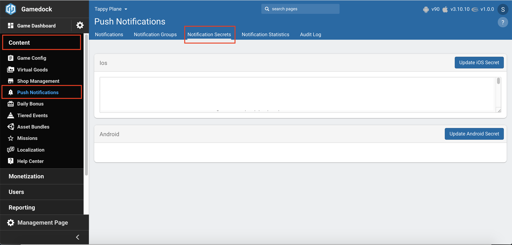

<!-- div:left-panel -->
3. If you want to be able to test the notifications you should then create a **“Notification Group”**, the notification groups is just a grouping mechanism that gives you the power to send a notification to that groups users.

<!-- div:right-panel -->
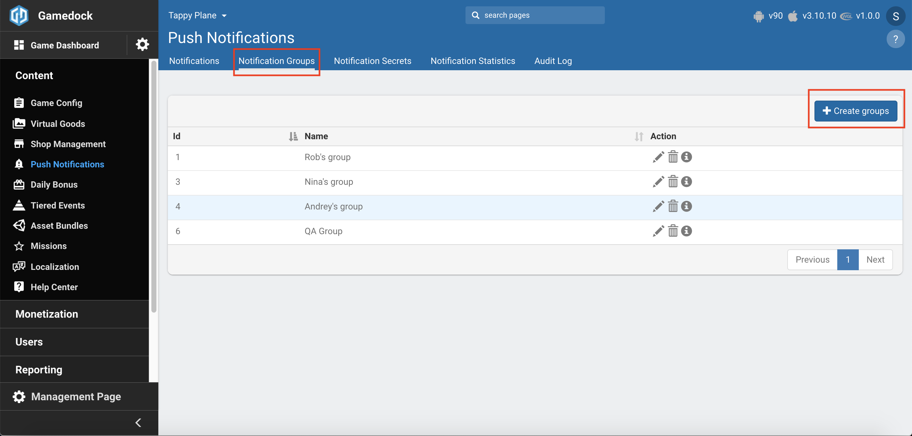

<!-- div:left-panel -->
4. Next is the **Notifications** listing, here you can see all the notifications by name and create new or edit/delete/activate/deactivate existing ones.
5. When creating a new Push Notification the following attributes can be modified:
    * **Name**: The name should be something detailed and meaningful that will help the users identify/search the specific push notification, it is not unique.
    * **Min/Max inactive days**: This defines the minimum and the maximum days of inactivity a user should have to receive the push notification. Ex.: you want to send to the users that are inactive for three to five days a notification that says "Don’t give up so easily!" and to the users that are from seven to fifteen days another that says “We miss you :(” - The reason that this is a range and not just a single number is that if it was a single number it would be either “exactly” or “above of” where in the first case the notifications would be sent to the user that match the inactivity at the moment the notification is sent, and in the second case it would send it to almost all inactive users, both of the cases defeat the purpose in both the examples that we gave above.
    * **Test group id**: If set, the notification will be sent only in the specific test group.
    * **Platforms**: For which platforms and version range should the notification be sent.
    * **Notification Data**: JSON data that will be sent along with the notification. This data can be read by the game.
    * **Messages**: Here you can add the content of the notification. You can set different content per locale.
    * The message form:
        * **Locale**: The target locale.
        * **Title**: The title of the notification.
        * **Body**: The body of the notification, on Android devices, if the body exceeds 35 characters, the notification will be expandable.
        * **Type**: We have three types of notifications Normal, Custom, and with image:
            * **Normal**: The default notification style 
            * **Custom**: Here you can set the background image and also the text color (black or white), make sure to choose a background-text color combination that would make enough contrast with the background for users to be able to read it. 
            * **With Image**: Show an image along with the notification, this is different from the custom, since in the custom option the image is a background.

<!-- div:right-panel -->
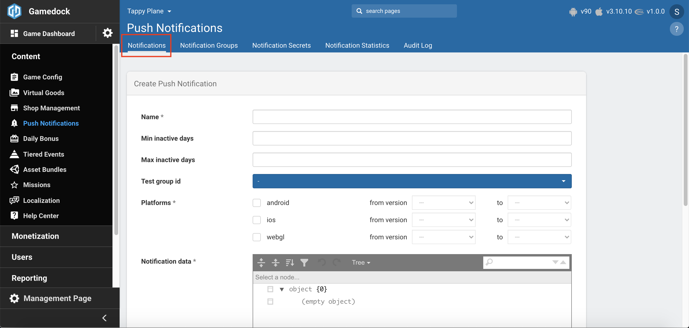

<!-- div:left-panel -->
6. You will need to also create a **Schedule**. There are two types of schedules, repeating and one-time in both cases you can add multiple schedules - but all of them of the same type - you can also enable/disable schedules individually.
    * **Repeating**: The repeating schedules are sent periodically depending on the frequency that is set to the schedule.
        * **Date Range**: The date range in which the notification schedule will be active. Here you can also set if the range is in users local time or UTC.
        * **Send time**: The time that you want to send the push notification to the user, you can set the time in fifteen minute intervals.
        * **Frequency**: You can set the frequency to Daily, Weekly - where you can also choose which days of the week, and Monthly - where you can choose which days of the month.
    * **One Time**: The one time schedules are sent to the user a single time at the defined time, here you can also define if it will be send on local or UTC time.

<!-- div:right-panel -->
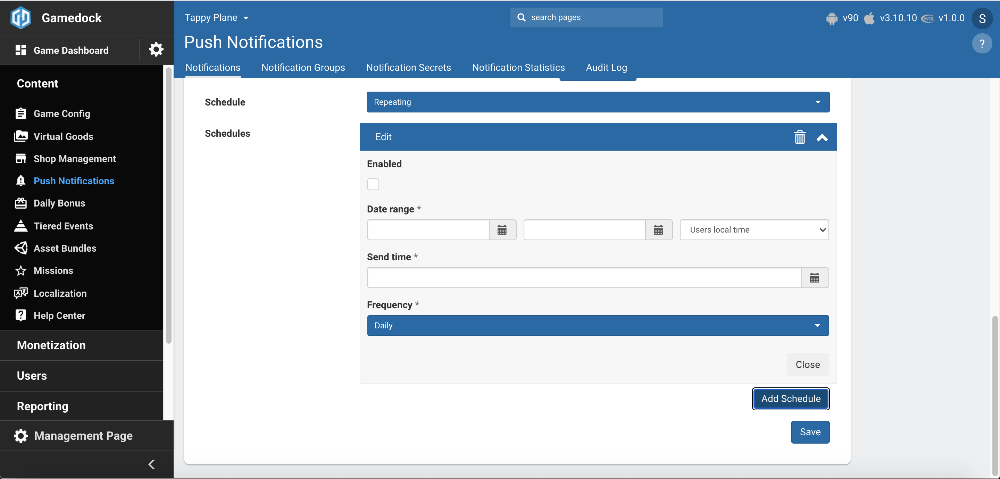

<!-- panels:end -->

7. Having all of this, you should be able to send push notifications to your game!

### Handling Push Notification Permission Requests

You can use the method described below to automatically block the Gamedock SDK from asking permission for push notifications. This is useful when your game has a logical time to ask for the push notifications. For example, when the player needs to harvest something in the game, and it is helpful that they are notified when the task has been completed.

<!-- tabs:start -->

#### ** Unity **

~~~csharp
// Disable asking automatically for Push notification permissions
DisableAutomaticRegisterForPushNotifications();

// Request push notification permission.
Gamedock.Instance.RegisterForPushNotifications();
~~~

#### ** AIR **

~~~actionscript
// Disable asking automatically for Push notification permissions
Gamedock.GetInstance().DisableAutomaticRegisterForPushNotificationsiOS();

// Request push notification permission.
Gamedock.GetInstance().RegisterForPushNotificationsiOS();
~~~

#### ** Cordova **

> This feature is currently not supported on Cordova.

<!-- tabs:end -->

### Adding Custom Notification Icons

If you want to set your own custom notification icon, you can do so by adding the appropriate image file to the following location (if it does not exist, you will need to create it): PROJECT_PATH/Assets/Plugins/Android/res/drawable/ The image file should have the name “notify_icon_small.png”. Important The image file must comply with the Android notification standards. These are described at the location [https://developer.android.com/guide/practices/ui_guidelines/icon_design_status_bar.html](https://developer.android.com/guide/practices/ui_guidelines/icon_design_status_bar.html).

### iOS capabilities & entitlements

Before submitting a build to QA please make sure in XCode to enable the Push Notifications capability:

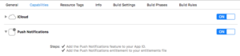

Also set the push notifications environment entitlement to ‘production’. XCode does not do this automatically for you, but it is required to be able to get a valid push token from iOS:

### iOS Notification Service

If you want to receive rich push notifications for iOS please follow the steps below:

<!-- panels:start -->

<!-- div:left-panel -->
1. Make sure the **Push Notifications** capability is present in the capabilities list.

<!-- div:right-panel -->
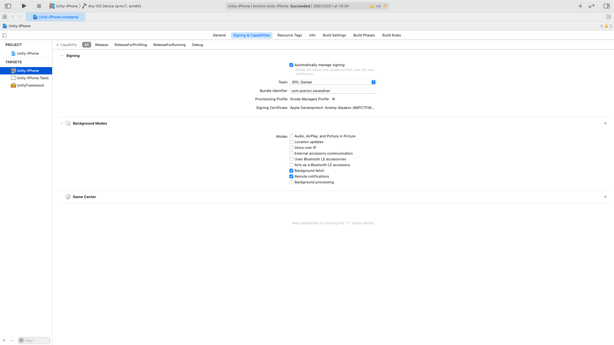

<!-- div:left-panel -->
2. Create a new target by clicking **File ▸ New ▸ Target…**. After, filter for the **Notification Service Extension** and click **Next**.

<!-- div:right-panel -->
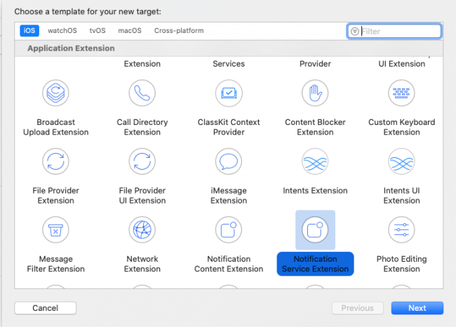

<!-- div:left-panel -->
3. Name the extension **Notification Service**.

<!-- div:right-panel -->
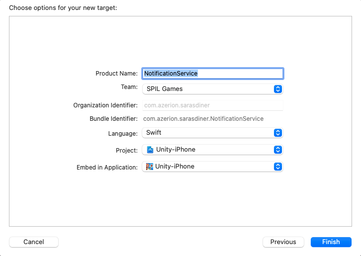

<!-- div:left-panel -->
4. Make sure you have the same minimum version in deployment info for main target as well as for push notification extension.

<!-- div:right-panel -->
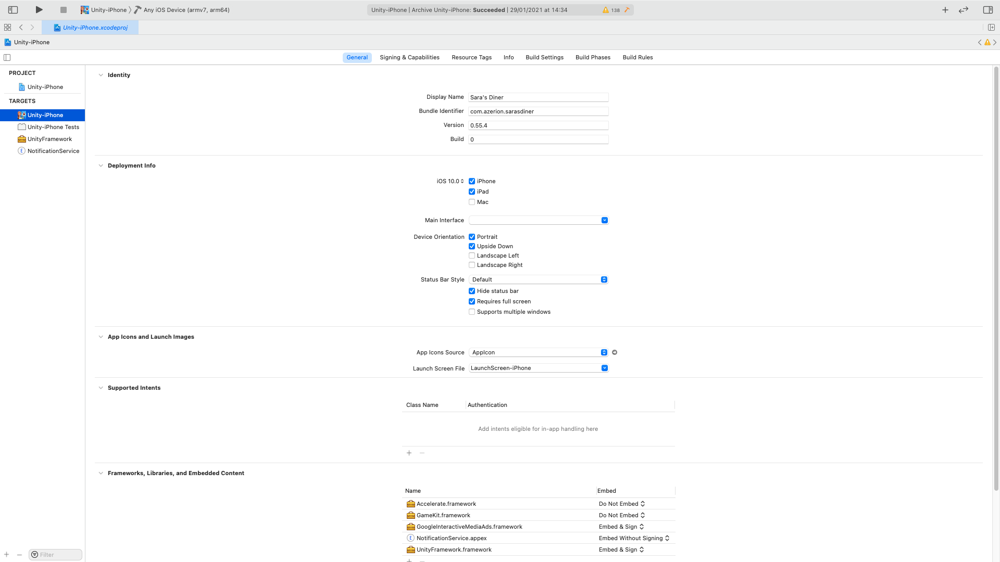
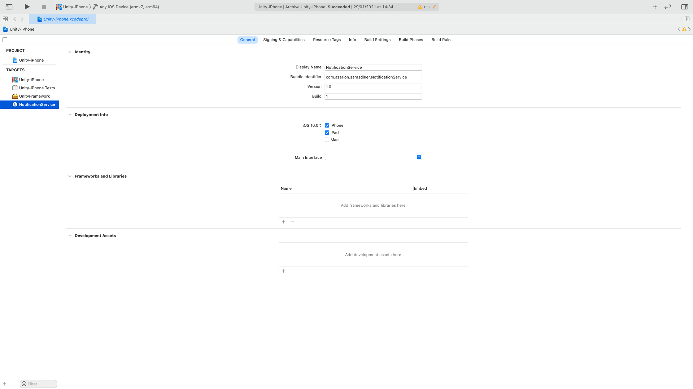

<!-- div:left-panel -->
5. Find the files in an extension folder.

<!-- div:right-panel -->
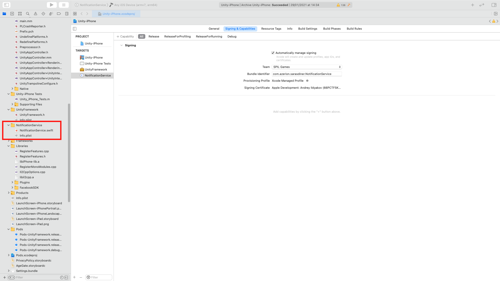

<!-- panels:end -->

6. Open NotificationService.swift file and replace it with the code below:

~~~swift
import UserNotifications

@available(iOS 10.0, *)
class NotificationService: UNNotificationServiceExtension {

    var contentHandler: ((UNNotificationContent) -> Void)?
    var bestAttemptContent: UNMutableNotificationContent?

    override func didReceive(_ request: UNNotificationRequest, withContentHandler contentHandler: @escaping (UNNotificationContent) -> Void) {
        self.contentHandler = contentHandler
        bestAttemptContent = (request.content.mutableCopy() as? UNMutableNotificationContent)
        print("HANDLE PUSH, didReceiveNotificationRequest")
        
        let userInfo = request.content.userInfo
        guard !userInfo.isEmpty else {contentComplete();return}
        guard let userInfoValue = userInfo["userInfo"] as? [AnyHashable : Any], let mediaUrl = userInfoValue["imageUrl"] as? String else {contentComplete();return}
        // load the attachment
        loadAttachmentForUrlString(urlString: mediaUrl, type: "jpg") { (attachment) in
                self.bestAttemptContent?.attachments = [attachment]
            self.contentComplete()
        }
    }
    
    override func serviceExtensionTimeWillExpire() {
        // Called just before the extension will be terminated by the system.
        // Use this as an opportunity to deliver your "best attempt" at modified content, otherwise the original push payload will be used.
        if let contentHandler = contentHandler, let bestAttemptContent =  bestAttemptContent {
            contentHandler(bestAttemptContent)
        }
    }

    func contentComplete() {
        guard let bestAttemptContent = bestAttemptContent else {return}
        self.contentHandler?(bestAttemptContent)
    }

    func fileExtensionForMediaType(type: String) -> String {
        var ext = type
        if type == "image" {
            ext = "jpg"
        }
        if type == "video" {
            ext = "mp4"
        }
        if type == "audio" {
            ext = "mp3"
        }
        return "."+ext
    }

    func loadAttachmentForUrlString(urlString: String, type: String, completionHandler:@escaping(UNNotificationAttachment)->()) {
        
        var attachment: UNNotificationAttachment?
        guard let attachmentURL = URL(string:urlString) else {return}
        let fileExt = fileExtensionForMediaType(type: type)
        
        
        let session = URLSession.init(configuration: .default)
        session.downloadTask(with: attachmentURL) { (temporaryFileLocation, response, error) in
            if let error = error {print("[NotificationService]",error.localizedDescription)} else
            {
                let fileManager = FileManager.default
                guard let temporaryFileLocation = temporaryFileLocation else {return}
                let localUrl = URL.init(fileURLWithPath: temporaryFileLocation.path+fileExt)
                do {
                try fileManager.moveItem(at: temporaryFileLocation, to: localUrl)
                    do {
                        try attachment = UNNotificationAttachment.init(identifier: "", url: localUrl, options: nil)
                        if let attachment = attachment {
                        completionHandler(attachment)
                        } else {
                            print("[NotificationService] Error")
                        }
                    } catch let error {
                        print("[NotificationService]",error.localizedDescription)
                    }
                } catch let error {
                    print("[NotificationService]",error.localizedDescription)
                }
            }
        }.resume()
    }
}
~~~

7. Now you are ready to receive push notifications with images.