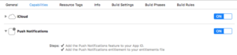
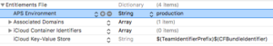

# Push Notifications

There are various reasons to use push notifications in your games, and they have numerous benefits in terms of engaging with customers and driving traffic. The use of push notifications can enhance the gaming experience for your users by adding another element to the game analysis, as well as helping you monetize your game. Push notifications allow developers to provide up-to-date and relevant information to users, encouraging engagement, sparking recognition, and increasing involvement. They are less interruptive than other forms of customer engagement and can be used effectively to bring in more traffic and add value to users by providing useful information. However, it is essential this information is relevant and interesting. Otherwise, push notifications can become intrusive and annoying, leading to negative perceptions about your game. If you want to send an image with the push notification these are the following sizes:
* Minimum – 512x256
* Balanced – 1024x512
* Maximum – 2048x1024

The Gamedock SDK (iOS) automatically ask users for their permission to receive push notifications. It can also send textual push notifications without you having to implement any additional logic.

## Handling Push Notification Permission Requests

You can use the method described below to automatically block the Gamedock SDK from asking permission for push notifications. This is useful when your game has a logical time to ask for the push notifications. For example, when the player needs to harvest something in the game, and it is helpful that they are notified when the task has been completed.

<!-- tabs:start -->

#### ** Unity **

~~~C#
// Disable asking automatically for Push notification permissions
DisableAutomaticRegisterForPushNotifications();

// Request push notification permission.
Gamedock.Instance.RegisterForPushNotifications();
~~~

#### ** Android **

#### ** iOS **

<!-- tabs:end -->

## Adding Custom Notification Icons

If you want to set your own custom notification icon, you can do so by adding the appropriate image file to the following location (if it does not exist, you will need to create it): PROJECT_PATH/Assets/Plugins/Android/res/drawable/ The image file should have the name “notify_icon_small.png”. Important The image file must comply with the Android notification standards. These are described at the location [https://developer.android.com/guide/practices/ui_guidelines/icon_design_status_bar.html](https://developer.android.com/guide/practices/ui_guidelines/icon_design_status_bar.html).

## iOS capabilities & entitlements

Before submitting a build to QA please make sure in XCode to enable the Push Notifications capability:

Also set the push notifications environment entitlement to ‘production’. XCode does not do this automatically for you, but it is required to be able to get a valid push token from iOS:

  