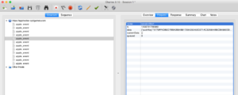

# Testing and debugging

### Guidelines for testing and debugging:

* Test on iOS/Android devices.
* Use device logging (Android Studio / XCode/Console) to look for error messages and exceptions.
* Use Crashlytics to find out more information on crashes and ANR’s. See: [https://get.fabric.io/](https://get.fabric.io/).
* Use the SLOT event dashboard’s live stream tab to debug your events implementation.
* Alternatively, use Charles to inspect your network traffic to make sure events are being sent properly. A Charles testing manual is included below.
* Use SLOT’s wallet/inventory/gamestate viewer to validate or debug implementations using items/currencies.
* If you have any questions, ask the Gamedock SDK team on Slack.
* Check Gamedock’s TestRail for a list of tests and test results, ask your Gamedock representative for access.
* For debugging on device, ask the Gamedock SDK team for the Gamedock SDK Sample App.This app allows you to unlock Gamedock SDK features on a device for logging/debugging.

We recommend you test your game in various simulators and devices. Especially performance is important to test on a real device.
If you don’t have a real device to test your game on, please contact your Gamedock account manager in advance to discuss assistance of a QA engineer to test various development builds. Once you have tested the game in the simulator and on devices, you can request a QA moment for your game. We will test your game on a range of devices that covers most of the user base.

## QA Checklist

Gamedock QA only tests your Gamedock SDK implementation. After each build delivery you will receive a detailed QA report via TestRail (ask your Gamedock representative for access). A QA Approval does not guarantee your app is free of issues, the developer is always end-responsible for the quality of their own app. Game-play testing is done via an external party and can be arranged by the game producer.

### Issues and fixes:

We ask you to verify that all reported issues are fixed before submitting a new build to QA.
Failing to fix issues but reporting them as “everything fixed” will be flagged to the Gamedock Account Manager.

### App Store (iOS) Guidelines:

The App Store guidelines are strict but straightforward. Every submitted build to the App Store requires to be reviewed by a member of the Apple Review Team and rejections/approval can differ depending on the member.
To ensure a near guarantee, carefully go through the following URL’s:

* [https://developer.apple.com/app-store/review/guidelines/](https://developer.apple.com/app-store/review/guidelines/)
* [https://developer.apple.com/library/ios/documentation/UserExperience/Conceptual/MobileHIG/](https://developer.apple.com/library/ios/documentation/UserExperience/Conceptual/MobileHIG/)
* [http://www.apple.com/legal/intellectual-property/guidelinesfor3rdparties.html](http://www.apple.com/legal/intellectual-property/guidelinesfor3rdparties.html)

## Testing with Charles

Charles is a tool to inspect network calls and discover the data being transferred. Charles can be used to validate a Gamedock SDK implementation to make sure that events are being sent to the Gamedock back-end properly.
* Download and install Charles: [https://www.charlesproxy.com/](https://www.charlesproxy.com/)
* In order to see the https traffic we need install a Charles ssl certificate. Go to the safari browser on your iPhone and visit the page:  [http://www.charlesproxy.com/getssl](http://www.charlesproxy.com/getssl). Follow the steps to install the charles ssl certificate.
    Validate if the install went correct by going to the iphone settings -> General -> Profiles -> Charles proxy. You should see a screen like below:
    
    

* Connect your phone with Charles. Make sure you are on a wifi network. Click the wifi network in the top menu bar holding the ALT key to see your IP address.

    
    
    Open the WIFI settings app on you iPhone. Make sure you are connected to the same WIFI hotspot.
    1. Press the info icon to see the details.
    1. Scroll to the bottom and the “HTTP proxy” setting to manual
    1. Type in your IP Address you just looked up on your Mac in the “server” field.
    1. Type in 8888 in the “Port” field.

    
    
    Now return to the settings screen so the settings are saved.

* After opening Charles on your mac and opening your game on the iPhone you should get a popup. Press allow.

    > By default Charles should start recording the traffic. Otherwise simply press the record button.
    
    
    
    You should see all traffic from your WIFI network. Note that this now includes traffic from both your iPhone and Mac.
    
    Enable the ssl proxy by right clicking a https:// domain:
    
    
    
    You should now be able to validate the requests and their responses. You can use this for example to validate all Gamedock tracking events and all its properties.
    
    