# Wallet, Inventory & Shop

* **[Understanding the Object Structures](#understanding-the-object-structures)**
* **[Configuration in the Console](#configuration-in-the-console)**
* **[Implementation in the SDK](#implementation-in-the-sdk)**

---

> [!NOTE]
> A wallet holds a user’s balance of the currencies (such as coins and diamonds) used within a game. An in-game shop is a facility that allows users to buy items, or bundles of items, with their game currency. For example, within a game, users might be able to buy a sword with 100 coins. Once bought, items are added to a user’s personal inventory.

### Understanding the Object Structures

This section describes the structure of the objects used within the Gamedock SDK to manage wallet, shop, and inventory functionality.

The requirements for the items shown in Table 5 must be defined by the Game’s producer. Once finalized, the Gamedock Account Manager will coordinate with Gamedock LiveOps to have them set up and managed within the Gamedock Console. Note that changes to any of these objects can only be made via the Gamedock Console, and not the Gamedock SDK.

Table 5: Console-Managed Objects

| Item         | Description                                                                                                                                                                                                                                                                                                                                                       |
|:-------------|:------------------------------------------------------------------------------------------------------------------------------------------------------------------------------------------------------------------------------------------------------------------------------------------------------------------------------------------------------------------|
| Currencies   | The currencies used in the game. For example, coins and diamonds. Each currency has an ID, a name, and a type (0 = Premium and 1 = Non-Premium).                                                                                                                                                                                                                  |
| Items        | The items used in the game. For example, a sword. Each Item has an ID, a name, and a type (0 = Consumable, 1 = Booster, and 2 = Permanent). Images, including a display name and a description, can also be defined for items. Also item properties can be added to an item.                                                                                      |
| Unique Items | Same as Items but they are non-stackable. A unique id is assigned to each Unique Item as well as it having Unique Properties that the game can modify.                                                                                                                                                                                                            |
| Gacha        | The gacha items used in the game. This collection contains a list of possible items that the user can get when trying to open the gacha each having it’s own weight. It acts in the same way as an item.                                                                                                                                                          |
| Bundles      | The bundles present in the game. A bundle is a collection of items. Each bundle has an ID, a name, a list of the items that will be gained by the player when they buy the bundle, and a list of one or more prices that relate to the currencies required for users to buy it. Imagines, including a display and a description, can also be defined for bundles. |
| Shop         | The tabs that the define the shop layout. Each tab contains a name, a position, and a list of entries. Each entry has a label that is displayed in the shop, a position, and one of more bundle IDs.                                                                                                                                                              |
| Promotions   | The promotions associated with the shop. Each promotion contains one or more bundle IDs which points to the received bundles, an amount value which represents the number of bundles in the promotion, an updated prices list, a discount label, and a start and end date. Items and bundles are described above.                                                 |

The objects shown in Table 6 are managed by the developer through the Gamedock SDK. Note that, in special cases, Gamedock Customer Support can also implement changes to a user’s wallet.

Table 6: SDK-Managed Objects.

| Item      | Description                                                                                                                                                                                                                                                                                      |
|:----------|:-------------------------------------------------------------------------------------------------------------------------------------------------------------------------------------------------------------------------------------------------------------------------------------------------|
| Wallet    | Contains information about the user’s balance. It contains a list of currencies (that match the currencies defined in Table 1), a current balance, a delta, the game version being used, and a logic field which is either CLIENT or SERVER (currently, only CLIENT logic is fully implemented). |
| Inventory | Contains information about the current Items possessed by the user. It has the same structure as the Wallet object.                                                                                                                                                                              |

### Configuration in the Console

#### Wallet & Inventory

In order to setup the Wallet & Inventory feature in the console go through the following steps:

<!-- panels:start -->

<!-- div:left-panel -->
1. Enable the **Virtual Goods** feature in the features list.

<!-- div:right-panel -->
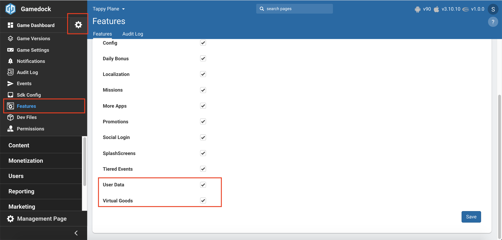

<!-- div:left-panel -->
2. Go to **Content->Virtual Goods** to access the feature.

<!-- div:right-panel -->
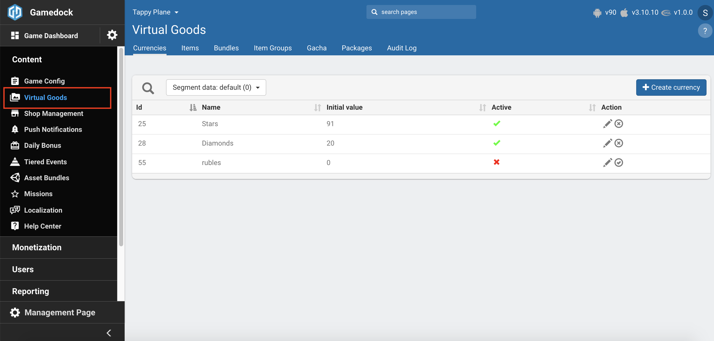

<!-- div:left-panel -->
3. Creating a **Currency** you can configure the following attributes:
    * **Name:** The name for the Currency. It can also be used to retrieve it in the SDK.
    * **Initial Value:** The value with which the SDK will initialize when the game will start first time. This step is done automatically.
    * **Type:** It specifies if the Currency can be acquired with real-world money or not.

<!-- div:right-panel -->
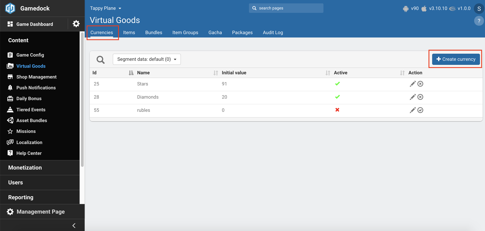
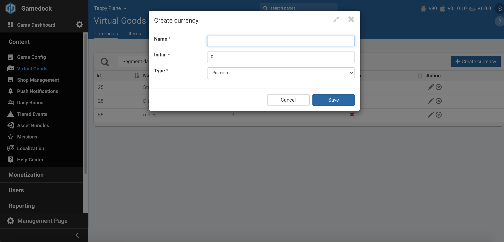

<!-- div:left-panel -->
4. Creating an **Item** you can configure the following attributes:
    * **Name:** The name for the Item. It can also be used to retrieve it in the SDK.
    * **Item Group:** Only used for Console display and managing purposes.
    * **Price & Currency:** Specifies the cost and the Currency associated with the cost if the Item would be purchased.
    * **Type:** Specifies if the Item is a consumable, booster or permanent. This is used for analytics purposes.
    * **Initial Value:** The value with which the SDK will initialize when the game will start first time. This step is done automatically.
    * **Is Unique:** Tells if this item will be a Unique Item or not.
5. You can edit the **Item** to add any additional **JSON properties**.
6. When creating an **Item**, a **Bundle** will automatically be created for this Item as well. This Bundle cannot be edited.

<!-- div:right-panel -->
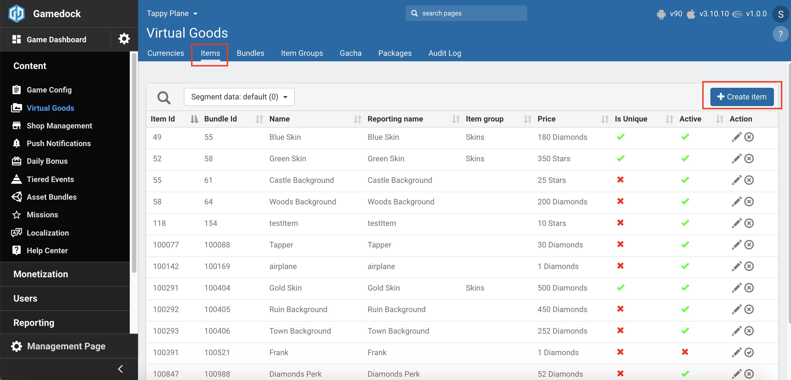
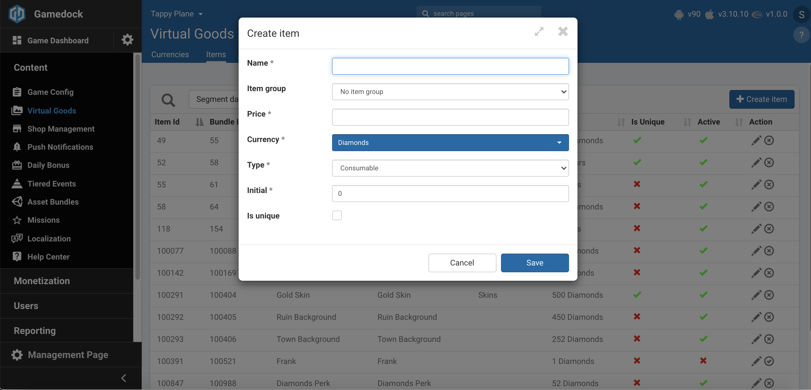

<!-- div:left-panel -->
7. Creating a **Gacha** you can configure the following attributes:
    * **Name:** The name for the Gacha. It can also be used to retrieve it in the SDK.
    * **Price & Currency:** Specifies the cost and the Currency associated with the cost if the Gacha would be purchased.
    * **Initial Value:** The value with which the SDK will initialize when the game will start first time. This step is done automatically.
    * **Allow duplicates:** Specifies if the Gacha should allow giving out duplicates or not. If not, the SDK will check if the user already has the received Item for the Gacha or not.
    * Edit the Gacha in order to add Entities to it that will be rolled when the Gacha is opened. The weight determines the probability that the item will be received.
8. You can edit the **Gacha** to add any additional **JSON properties**.
9. When creating a **Gacha**, a **Bundle** will automatically be created for this Gacha as well. This Bundle cannot be edited.

<!-- div:right-panel -->
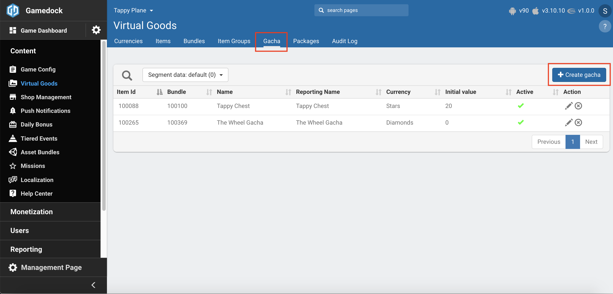
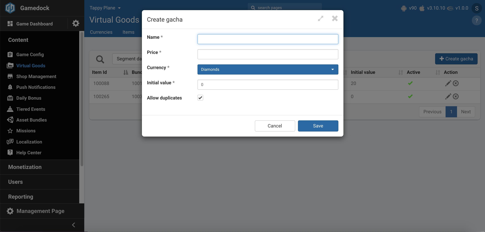
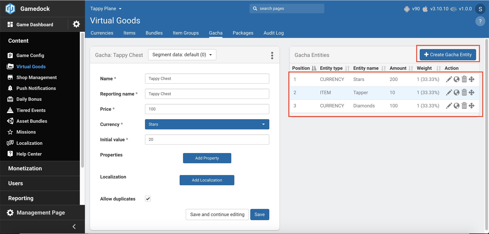

<!-- div:left-panel -->
10. Creating a **Bundle** you can configure the following attributes:
    * **Name:** The name for the Bundle. It can also be used to retrieve it in the SDK.
    * **Price & Currency:** Specifies the cost and the Currency associated with the cost if the Bundle would be purchased.
    * Edit the Bundle in order to add Entities to it that will be given to the user when the Bundle is bought.
11. You can edit the **Bundle** to add any additional **JSON properties**.

<!-- div:right-panel -->
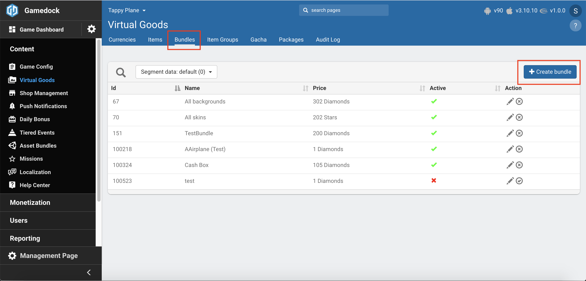
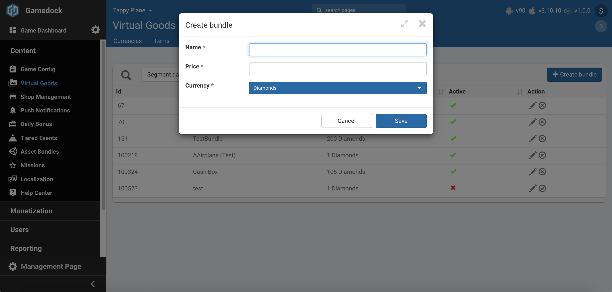
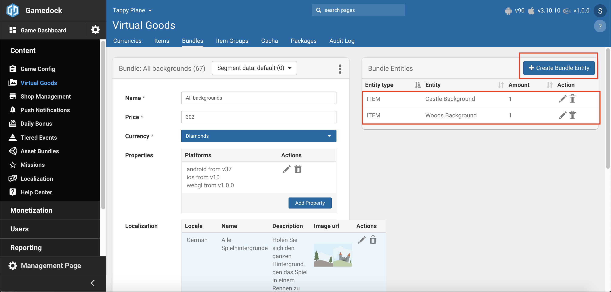

<!-- panels:end -->

12. Once you have configured all your **Currencies, Items, Gachas and Bundles** you can retrieve them in your game via the SDK. This will also allow the possibility to do operations with the **Wallet & Inventory**.

#### Shop

In order to setup the Shop feature in the console go through the following steps:

<!-- panels:start -->

<!-- div:left-panel -->
1. Enable the **Virtual Goods** and **User Data** features in the features list.

<!-- div:right-panel -->

<!-- div:left-panel -->
2. Go to **Content->Shop Management** to access the feature.

<!-- div:right-panel -->
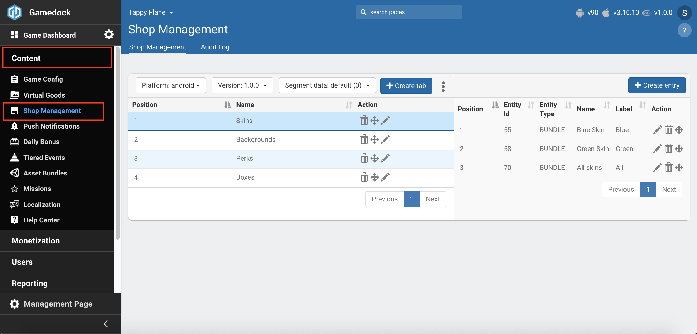

<!-- div:left-panel -->
3. Select your **Platform, Game Version and Segment**, then click on the **"Create tab"**. Provide a name to the **Tab**, and if needed add any additional JSON properties.

<!-- div:right-panel -->
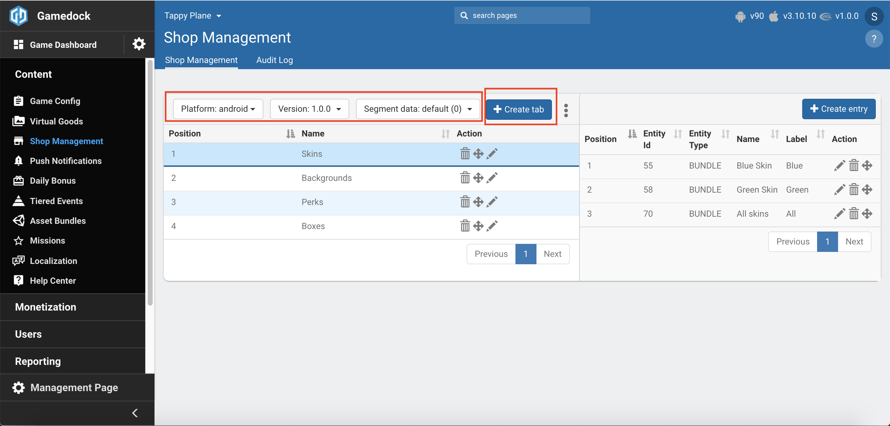

<!-- div:left-panel -->
4. Select the newly created Tab, and the click on the **"Create entry"**. You can configure either a **Bundle** or a **Package** for your Shop **Entry**, and if needed add any additional JSON properties.

<!-- div:right-panel -->

<!-- panels:end -->

5. Both **Tabs** and **Entries** can be re-arranged as need in order to be displayed in the correct order in the game.
6. You can now retrieve the **Shop** configuration in your game and display it.

### Implementation in the SDK

If there is no network connection, then the SDK will use the latest known defaults. In exceptional cases, people will open the app for the first time and don’t have an Internet connection.

<!-- tabs:start -->

#### ** Unity **

The Gamedock Unity classes “GamedockGameDataHelper.cs” and “PlayerDataHelper.cs” contain all methods for the wallet, in-game shop and inventory features. These classes are instantiated on “Awake()” in the “Gamedock.cs” file and automatically retrieve the data from the Gamedock SDK, so you can start using the methods immediately. See below code snippets to use the wallet, in-game shop and inventory features:

Retrieving the various Game Data lists containing Currencies, Items, Bundles and Shop.
~~~csharp
//List of currencies configured in the Gamedock Console
List<Currency> Currencies = Gamedock.Instance.GameData.Currencies;

//List of items configured in the Gamedock Console
List<Item> Items = Gamedock.Instance.GameData.Items;

//List of bundles configured in the Gamedock Console and that are used in the Shop
List<Bundle> Bundles = Gamedock.Instance.GameData.Bundles;

//Shop object that defines the configuration
//For Shop Entries, the type can be BUNDLE or PACKAGE
//Shop stickers can be found on each Shop Entry under the ImageEntries list
//Each image entry contains an URL to download the sticker image
Shop Shop = Gamedock.Instance.GameData.Shop;

~~~

Helper methods for retrieving specific entries in the Game Data lists (ID represents the id generated in the Console, NAME represents the name given by you to the specific entity when it was created).
~~~csharp
//Getting a Currency 
Currency currency = Gamedock.Instance.GameData.GetCurrency(ID);
Currency currency = Gamedock.Instance.GameData.GetCurrency(NAME);

//Getting an Item 
Item item = Gamedock.Instance.GameData.GetItem(ID);
Item item = Gamedock.Instance.GameData.GetItem(NAME);

//Getting a Gacha 
Item gacha = Gamedock.Instance.GameData.GetGacha(ID);
Item gacha = Gamedock.Instance.GameData.GetGacha(NAME);

//Getting a Bundle 
Bundle bundle = Gamedock.Instance.GameData.GetBundle(ID);
Bundle bundle = Gamedock.Instance.GameData.GetBundle(NAME);
~~~

Retrieve the Wallet or the Inventory object containing all the information that the user has.
~~~csharp
//Retrieving the Wallet
Wallet Wallet = Gamedock.Instance.PlayerData.Wallet;

//Retrieving the Inventory
Inventory Inventory = Gamedock.Instance.PlayerData.Inventory;
~~~

Helper methods for doing operations with the Wallet and the Inventory.
~~~csharp
///Wallet Operations

//You can create a custom callback if you don't want to use the global one for Player Data operations
UserDataCallbackAction UserDataCallbackAction = new UserDataCallbackAction(
    playerDataUpdate => {}, //Fired once the operation was successful. The "playerDataUpdate" object contains all the new information
    userDataError => {} // Fired if an error occurred during the operation
);

//Adding Currency to the User's Wallet
Gamedock.Instance.PlayerData.Wallet.Add(Currency ID, Amount, Reason, Location, ReasonDetails = null, TransactionId = null, UserDataCallbackAction = null);

//Subtracting Currency to the User's Wallet
Gamedock.Instance.PlayerData.Wallet.Subtract(Currency ID, Amount, Reason, Location, ReasonDetails = null, TransactionId = null, UserDataCallbackAction = null);

//Method to set a currency limit
Gamedock.Instance.SetCurrencyLimit(int currencyId, int limit);

///Inventory Operations
//Adding Item to the User's Inventory
Gamedock.Instance.PlayerData.Inventory.Add(Item ID, Amount, Reason, Location, ReasonDetails = null, TransactionId = null, UserDataCallbackAction = null);

//Subtracting Item to the User's Inventory
Gamedock.Instance.PlayerData.Inventory.Subtract(Item ID, Amount, Reason, Location, ReasonDetails = null, TransactionId = null, UserDataCallbackAction = null);

//Consuming a bundle
Gamedock.Instance.PlayerData.BuyBundle(Bundle ID, Reason, Location, ReasonDetails = null, TransactionId = null, List<PerkItem> perkItems = null, UserDataCallbackAction = null);

//Opening a Gacha Item
Gamedock.Instance.PlayerData.OpenGacha(Gacha ID, Reason, Location, ReasonDetail = null, List<PerkItem> perkItems = null, UserDataCallbackAction = null);

//Method to set an item limit
Gamedock.Instance.SetItemLimit(int itemId, int limit);

//Create Unique Item
//Be sure to check the "is unique" checkbox for your item in the Gamedock Console, this will make the item non-stackable and allows you to create unique items from it.
UniquePlayerItem uniqueItem = Gamedock.Instance.PlayerData.Inventory.CreateUniqueItem(itemId);
UniquePlayerItem uniqueItem = Gamedock.Instance.PlayerData.Inventory.CreateUniqueItem(itemId, uniqueId);

//Add Unique Item to the inventory
Gamedock.Instance.PlayerData.Inventory.AddUniqueItemToInventory(uniqueItem, reason, reasonDetails, location, transactionId, userDataCallbackAction);

//Update Unique Item with new properties
uniqueItem.uniqueProperties.Add("test", "test");
Gamedock.Instance.PlayerData.Inventory.UpdateUniqueItemFromInventory(uniqueItem, reason, reasonDetails, location, transactionId, userDataCallbackAction);

//Remove Unique Item from the Inventory
Gamedock.Instance.PlayerData.Inventory.RemoveUniqueItemFromInventory(uniqueItem, reason, reasonDetails, location, transactionId, userDataCallbackAction);
~~~

Helper methods for retrieving specific entries in the Game Data lists (ID represents the id generated in the Console, NAME represents the name given by you to the specific entity when it was created).
~~~csharp
//Getting a PlayerCurrency
PlayerCurrency currency = Gamedock.Instance.PlayerData.GetCurrency(ID);
PlayerCurrency currency = Gamedock.Instance.PlayerData.GetCurrency(NAME);

//Getting a PlayerItem
PlayerItem item = Gamedock.Instance.PlayerData.GetItem(ID);
PlayerItem item = Gamedock.Instance.PlayerData.GetItem(NAME);

//Getting a UniquePlayerItem
UniquePlayerItem uniqueItem = Gamedock.Instance.PlayerData.Inventory.GetUniqueItem(uniqueId);

//Getting all the Gachas owned by the user
List<PlayerItem> playerOwnedGachas = Gamedock.Instance.PlayerData.GetGachas();

//Check if an Item is present in the Player Inventory
bool check = Gamedock.Instance.PlayerData.InventoryHasItem(ID);
bool check = Gamedock.Instance.PlayerData.InventoryHasItem(NAME);

//Check if an Item is present in the Player Inventory
bool hasUniqueItem = Gamedock.Instance.PlayerData.InventoryHasUniquePlayerItem(uniqueId);
~~~

Helper methods for retrieving the current amount/balance the user has for PlayerCurrencies and PlayerItems.
~~~csharp
//Getting the Current Balance
int balance = Gamedock.Instance.PlayerData.GetCurrencyBalance(ID);
int balance = Gamedock.Instance.PlayerData.GetCurrencyBalance(NAME);

//Getting the Item Amount
int amount = Gamedock.Instance.PlayerData.GetItemAmount(ID);
int amount = Gamedock.Instance.PlayerData.GetItemAmount(NAME);
~~~

By default each operation done on the Wallet or Inventory sends their own events to the backend. In some cases you might want to bundle multiple operations before sending them to the backend. You can do so using the methods below.
~~~csharp
//Transaction Builder always needs to end with Submit!
Gamedock.Instance.PlayerData.TransactionBuilder
    .AddCurrency(currencyId, amount)
    .SubtractItem(itemId, amount)
    .AddCallback(userDataCallbackAction) //For custom callbacks, otherwise update will be fired on the delegate
    .Submit(reason, reasonDetails, location, transactionId);
    
//Supported operations
AddCurrency
SubtractCurrency
AddItem
SubtractItem
OpenGacha
AddUniqueItem
RemoveUniqueItem
UpdateUniqueItem
~~~

The game can listen to the following events related to Game Data, Wallet an Inventory.
~~~csharp
//Callback fired when the SDK has initialized the Game Data and the information can be retrieved by the game
Gamedock.Instance.GameDataCallbacks.OnGamedockGameDataAvailable -= OnGamedockGameDataAvailable;
Gamedock.Instance.GameDataCallbacks.OnGamedockGameDataAvailable += OnGamedockGameDataAvailable;

//Callback fired when the SDK encountered an issue while initializing/loading the Game Data
Gamedock.Instance.GameDataCallbacks.OnGamedockGameDataError -= OnGamedockGameDataError;
Gamedock.Instance.GameDataCallbacks.OnGamedockGameDataError += OnGamedockGameDataError;

//Callback fired after each operation has been been successfully done on the Wallet or Inventory
Gamedock.Instance.UserDataCallbacks.OnPlayerDataUpdated -= OnPlayerDataUpdated;
Gamedock.Instance.UserDataCallbacks.OnPlayerDataUpdated += OnPlayerDataUpdated;

//Callback fired when the SDK has initialized the User Data part, which includes Wallet, Inventory, Game State and Mission Data, and the information can be retrieved by the game
//Callback is also fired by the SDK after the user has logged in with the social login feature
Gamedock.Instance.UserDataCallbacks.OnUserDataAvailable -= OnUserDataAvailable;
Gamedock.Instance.UserDataCallbacks.OnUserDataAvailable += OnUserDataAvailable;

//Callback invoked when an unique item is created as a result of a BuyBundle or OpenGacha operations
Gamedock.Instance.UserDataCallbacks.OnPlayerDataNewUniqueItem -= OnPlayerDataNewUniqueItem;
Gamedock.Instance.UserDataCallbacks.OnPlayerDataNewUniqueItem += OnPlayerDataNewUniqueItem;

//Callback fired when the SDK encountered an issue while initializing/loading the User Data
Gamedock.Instance.UserDataCallbacks.OnUserDataError -= OnUserDataError;
Gamedock.Instance.UserDataCallbacks.OnUserDataError += OnUserDataError;
~~~

Below is a list of common reasons which can be sent when doing Wallet and Inventory Operations.
~~~csharp
//List of Standard Reasons (you can pass your own reason as a String)
//Accessed through the Class "PlayerDataUpdateReasons"
RewardAds = "Reward Ads";
ItemBought = "Item Bought";
ItemSold = "Item Sold";
EventReward = "Event Reward";
LoginReward = "Login Reward";
IAP = "IAP";
PlayerLevelUp = "Player Level Up";
LevelComplete = "Level Complete";
ItemUpgrade = "Item Upgrade";
BonusFeatures = "Bonus Features";
Trade = "Trade";
ClientServerMismatch = "Client-Server Mismatch";
ItemPickedUp = "Item Picked Up";
DailyBonus = "Daily Bonus From Client";
Rush = "Rush";
Gift = "Gift";
Cancel = "Cancel";
Collection = "Collection";
Reset = "Reset";
InitialValue = "Initial Value";
~~~

#### ** AIR **

Gamedock.GetInstance().GameDataHelper and Gamedock.GetInstance().PlayerDataHelper contain all methods for the wallet, in-game shop and inventory features. These classes are instantiated on Init() and automatically retrieve the data from the Gamedock SDK, so you can start using the methods immediately. See below code snippets to use the wallet, in-game shop and inventory features:

~~~actionscript
// Retrieving Gamedock Game Data
// List of currencies configured in the Gamedock Console
var Currencies:Vector.<Currency> = Gamedock.GetInstance().GameData.Currencies;

// List of items configured in the Gamedock Console
var Items:Vector.<Item> = Gamedock.GetInstance().GameData.Items;

// List of bundles configured in the Gamedock Console and that are used in the Shop
var Bundles:Vector.<Bundle> = Gamedock.GetInstance().GameData.Bundles;

// Shop object that defines the configuration
var Shop:Shop = Gamedock.GetInstance().GameData.Shop;
// For Shop Entries, the type can be BUNDLE or PACKAGE
// Shop stickers can be found on each Shop Entry under the ImageEntries list
// Each image entry contains an URL to download the sticker image

// Getting a Currency, Item, Bundle or Gacha by ID or NAME
Gamedock.GetInstance().GameData.GetCurrency(ID);
Gamedock.GetInstance().GameData.GetCurrency(NAME);

Gamedock.GetInstance().GameData.GetItem(ID);
Gamedock.GetInstance().GameData.GetItem(NAME);

Gamedock.GetInstance().GameData.GetBundle(ID);
Gamedock.GetInstance().GameData.GetBundle(NAME);

Gamedock.GetInstance().GameData.GetGacha(ID);
Gamedock.GetInstance().GameData.GetGacha(NAME);

// Retrieve item properties
var itemProperties:Object = Gamedock.GetInstance().GameData.GetItem(49).Properties;

// Retrieving Player Data
var Wallet:Wallet = Gamedock.GetInstance().PlayerData.Wallet;
var Inventory:Inventory = Gamedock.GetInstance().PlayerData.Inventory;

// Getting the Current Balance for a given Currency ID
Gamedock.GetInstance().PlayerData.GetCurrencyBalance(ID);

// Getting the Item Amount for a given Item ID
Gamedock.GetInstance().PlayerData.GetItemAmount(ID);

// Check if an Item is present in the Player Inventory
Gamedock.GetInstance().PlayerData.InventoryHasItem(Item ID);

// Retrieve all the gacha the user has
Gamedock.GetInstance().PlayerData.GetGachas();

// Wallet Oprations
// Adding Currency to the User's Wallet
Gamedock.GetInstance().PlayerData.Wallet.Add(CurrencyId, Amount, Reason, Location, ReasonDetails, TransactionId);
// Subtracting Currency to the User's Wallet
Gamedock.GetInstance().PlayerData.Wallet.Subtract(CurrencyId, Amount, Reason, Location, ReasonDetails, TransactionId);
// Method to set an currency limit
Gamedock.GetInstance().SetCurrencyLimit(currencyId:int, limit:int);

// Inventory Operations
// Adding Item to the User's Inventory
Gamedock.GetInstance().PlayerData.Inventory.Add(ItemId, Amount, Reason, Location, ReasonDetails, TransactionId);
// Subtracting Item to the User's Inventory
Gamedock.GetInstance().PlayerData.Inventory.Subtract(ItemId, Amount, Reason, Location, ReasonDetails, TransactionId);
// Consuming a bundle
Gamedock.GetInstance().PlayerData.BuyBundle(BundleId, Reason, Location, ReasonDetails, TransactionId, PerkItems);
// Opening a Gacha Item
Gamedock.GetInstance().PlayerData.OpenGacha(GachaId, Reason, Location, ReasonDetail, PerkItems);
// Method to set an item limit
Gamedock.GetInstance().SetItemLimit(itemId:int, limit:int);

// Create Unique Item
// Be sure to check the "is unique" checkbox for your item in the Gamedock Console, this will make the item non-stackable and allows you to create unique items from it.
var uniqueItem:UniquePlayerItem = Gamedock.GetInstance().PlayerData.Inventory.CreateUniqueItem(itemId);
var uniqueItem:UniquePlayerItem = Gamedock.GetInstance().PlayerData.Inventory.CreateUniqueItem(itemId, uniqueId);

// Add Unique Item to the inventory
Gamedock.GetInstance().PlayerData.Inventory.AddUniqueItemToInventory(uniqueItem, reason, reasonDetails, location, transactionId);

// Update Unique Item from the inventory
var hasUniqueItem:Boolean = InventoryHasUniquePlayerItem(uniqueId);
var uniqueItem:UniquePlayerItem = Gamedock.GetInstance().PlayerData.Inventory.GetUniqueItem(uniqueId);
uniqueItem.uniqueProperties.Add("test", "test");
Gamedock.GetInstance().PlayerData.Inventory.UpdateUniqueItemFromInventory(uniqueItem, reason, reasonDetails, location, transactionId);

// Remove Unique Item from the Inventory
Gamedock.GetInstance().PlayerData.Inventory.RemoveUniqueItemFromInventory(uniqueItem, reason, reasonDetails, location, transactionId);

// Method to request user data
Gamedock.GetInstance().RequestUserData();

// Method used to refresh the data from the Gamedock Console
Gamedock.GetInstance().UpdatePlayerData();

// Events to register to
Gamedock.GetInstance().addEventListener(SDKEvents.GAME_DATA_AVAILABLE, onGameDataAvailableEvent);

Gamedock.GetInstance().addEventListener(SDKEvents.GAME_DATA_ERROR, onGameDataErrorEvent);

Gamedock.GetInstance().addEventListener(SDKEvents.PLAYER_DATA_UPDATED, onPlayerDataUpdatedEvent);

Gamedock.GetInstance().addEventListener(SDKEvents.PLAYER_DATA_AVAILABLE, onPlayerDataAvailableEvent);

// Callback invoked when an unique item is created as a result of a BuyBundle or OpenGacha operations
Gamedock.GetInstance().addEventListener(SDKEvents.PLAYER_DATA_NEW_UNIQUE_ITEM, onPlayerDataNewUniqueItemEvent);

Gamedock.GetInstance().addEventListener(SDKEvents.USER_DATA_ERROR, onUserDataErrorEvent);

// List of Standard Reasons (you can pass your own reason as a String)
// Accessed through the Class "PlayerDataUpdateReasons"
RewardAds = "Reward Ads";
ItemBought = "Item Bought";
ItemSold = "Item Sold";
EventReward = "Event Reward";
LoginReward = "Login Reward";
IAP = "IAP";
PlayerLevelUp = "Player Level Up";
LevelComplete = "Level Complete";
ItemUpgrade = "Item Upgrade";
BonusFeatures = "Bonus Features";
Trade = "Trade";
ClientServerMismatch = "Client-Server Mismatch";
ItemPickedUp = "Item Picked Up";
DailyBonus = "Daily Bonus From Client";
Rush = "Rush";
Gift = "Gift";
Cancel = "Cancel";
Collection = "Collection";
Reset = "Reset";
InitialValue = "Initial Value";
~~~

#### ** Cordova **

> This feature is currently not supported on Cordova.

<!-- tabs:end -->

### Resetting data

The SDK also provides the functionality to reset the player’s data, or just specifically the player’s Wallet and Inventory.

In order to reset the Wallet data use the following code:

<!-- tabs:start -->

#### ** Unity **

~~~csharp
Gamedock.Instance.ResetWallet();
~~~

#### ** AIR **

~~~actionscript
Gamedock.GetInstance().ResetWallet();
~~~

#### ** Cordova **

> This feature is currently not supported on Cordova.

<!-- tabs:end -->

In order to reset the Inventory data use the following code:

<!-- tabs:start -->

#### ** Unity **

~~~csharp
Gamedock.Instance.ResetInventory();
~~~

#### ** AIR **

~~~actionscript
Gamedock.GetInstance().ResetWallet();
~~~

#### ** Cordova **

> This feature is currently not supported on Cordova.

<!-- tabs:end -->

In order to reset the whole Player data use the following code:

<!-- tabs:start -->

#### ** Unity **

~~~csharp
Gamedock.Instance.ResetPlayerData();
~~~

#### ** AIR **

~~~actionscript
Gamedock.GetInstance().ResetPlayerData();
~~~

#### ** Cordova **

> This feature is currently not supported on Cordova.

<!-- tabs:end -->

### Item and Bundles Image Processing and Loading

The Items and Bundles objects provided by the SDK can also contain images that can be displayed inside your game. In order to download and display these images use the following information:

<!-- tabs:start -->

#### ** Unity **

~~~csharp
//Retrieve the image path for an item
//If it returns null the SDK will attempt to download the image in the background and call the listener when it has finished
string imagePath = item.GetImagePath();

//Retrieve the image path for an bundle
//If it returns null the SDK will attempt to download the image in the background and call the listener when it has finished
string imagePath = bundle.GetImagePath();

//Preload and download all the image information for the present items and bundles
//The specific listener will be called when all the images have been processed
Gamedock.Instance.PreloadItemAndBundleImages();

//The event listeners that you can subscribe to for image processing
Gamedock.Instance.ImageLoadingCallbacks.OnImageLoadSuccess;
Gamedock.Instance.ImageLoadingCallbacks.OnImageLoadFailed;
Gamedock.Instance.ImageLoadingCallbacks.OnImagePreloadingCompleted;

//If you have the imagePath for an image you can use this Gamedock method to load the Texture2D image
Gamedock.Instance.LoadImage(gameObject, imagePath, width, height, textureFormat, mipMap);

//The event listener for when the Texture2D image was loaded by Unity
Gamedock.Instance.ImageLoadingCallbacks.OnImageLoaded;

//Clear the local cache
Gamedock.Instance.ClearDiskCache();
~~~

#### ** AIR **

~~~actionscript
// Retrieve the image path for an item
//If it returns null the SDK will attempt to download the image in the background and call the listener when it has finished
var imagePath:String = item.GetImagePath();

// Retrieve the image path for an bundle
//If it returns null the SDK will attempt to download the image in the background and call the listener when it has finished
var imagePath:String = bundle.GetImagePath();

// Preload and download all the image information for the present items and bundles
//The specific listener will be called when all the images have been processed
Gamedock.GetInstance().PreloadItemAndBundleImages();

// The event listeners that you can subscribe to for image processing
Gamedock.GetInstance().addEventListener(SDKEvents.IMAGE_LOAD_FAILED, onImageLoadFailedEvent);
Gamedock.GetInstance().addEventListener(SDKEvents.IMAGE_LOAD_SUCCESS, onImageLoadSuccessEvent);
Gamedock.GetInstance().addEventListener(SDKEvents.IMAGE_PRELOADING_COMPLETED, onImagePreLoadingCompletedEvent);

// If you have the imagePath for an image you can use this Gamedock method to load the BitMap image
Gamedock.GetInstance().LoadImage(loadedImagePath);

// AIR event listeners for image loading, returns a BitMap object on success.
Gamedock.GetInstance().addEventListener(AS3Events.AS3_IMAGE_LOAD_SUCCESS, onAS3ImageLoadEvent);
Gamedock.GetInstance().addEventListener(AS3Events.AS3_IMAGE_LOAD_PROGRESS, onAS3ImageLoadProgressEvent);
Gamedock.GetInstance().addEventListener(AS3Events.AS3_IMAGE_LOAD_FAILED, onAS3ImageLoadFailedEvent);

//Clear the local cache
Gamedock.GetInstance().ClearDiskCache();
~~~

#### ** Cordova **

> This feature is currently not supported on Cordova.

<!-- tabs:end -->