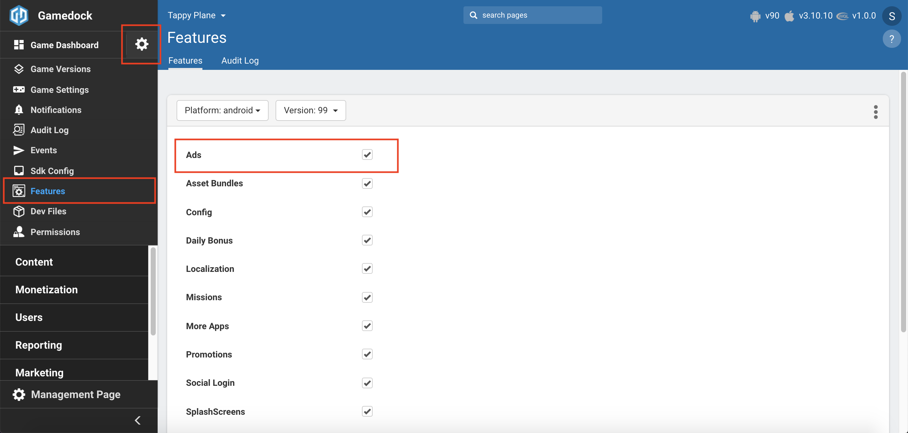
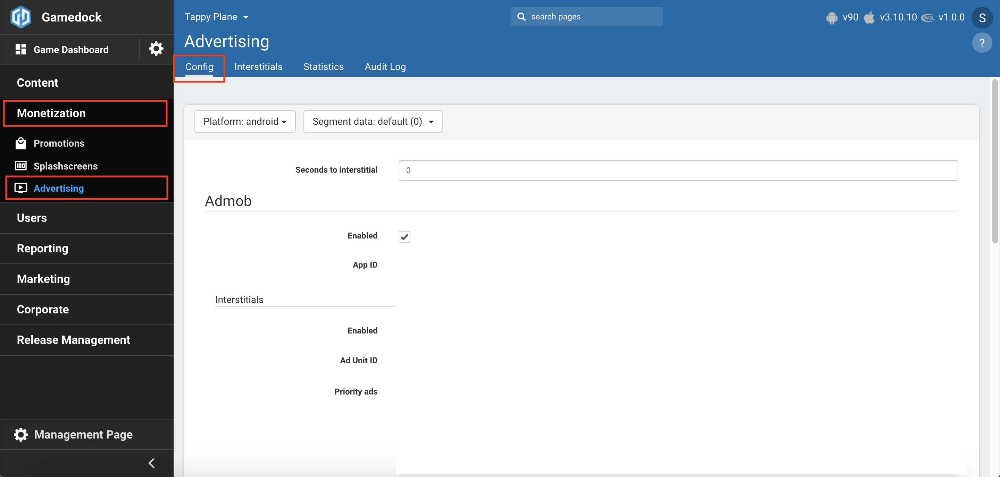
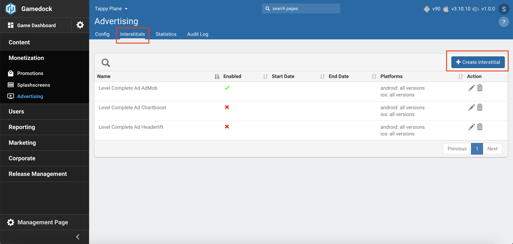
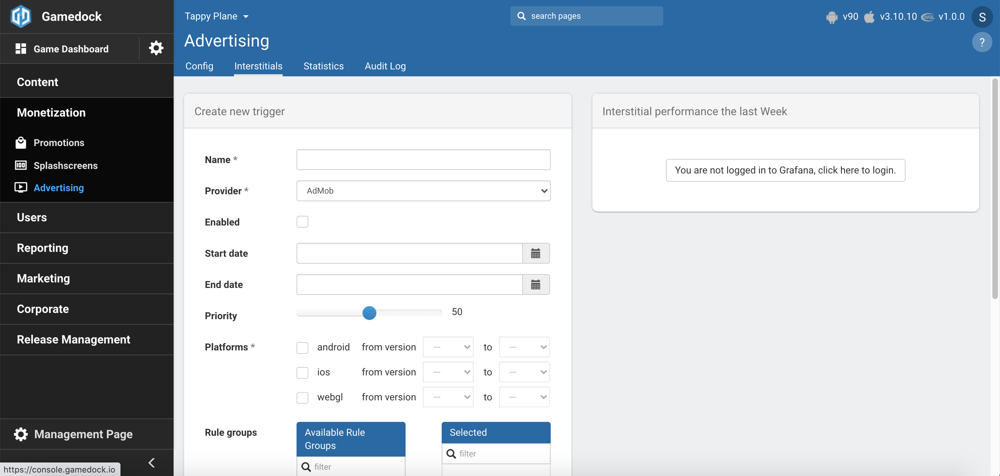
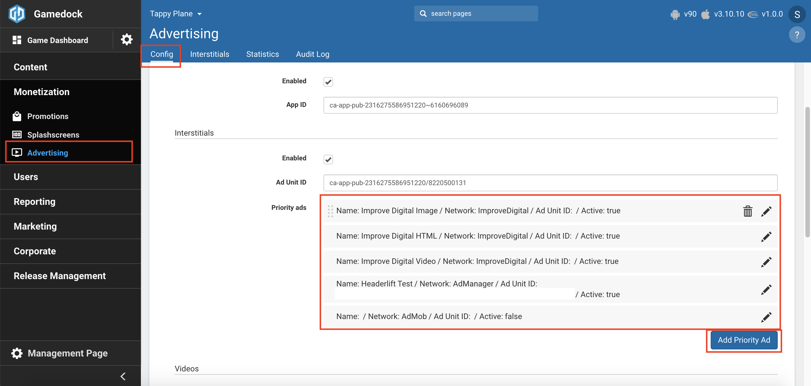
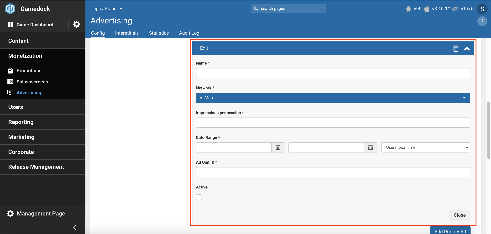

# Advertisement

> [!WARNING]
> Advertisements have been removed from the Gamedock SDK starting v5.0.0 and will be available via the new Upcomming Azerion Ad SDK
> It's still possible to trigger ads via Gamedock events as configured in the console by listening to the event as configured in the snippet below

## Advertisements in v5.2.0

~~~csharp
Gamedock.Instance.OnGamedockAdEvent += OnGamedockResponseAdEventReceived;

 /// 

 /// Method which checks the event that has been received
 /// 

 private void OnGamedockResponseAdEventReceived(GamedockResponse ev)
 {
      Debug.Log("Showing ad based on Gd response");

      ShowInterstitial();
 }
~~~

## Advertisements in v5.0.0

~~~csharp
Gamedock.Instance.OnGamedockEvent += OnGamedockResponseEventReceived;

 /// 

 /// Method which checks the event that has been received
 /// 

 private void OnGamedockResponseEventReceived(GamedockResponse ev)
 {
     if (ev.type != null && ev.type.ToLower().Trim() == "advertisement" && ev.action.Equals("show"))
     {
         Debug.Log("Showing ad based on Gd response");

         ShowInterstitial();
     }
 }
~~~

## Advertisement in 4.2.1

* **[Configuration in Console](#configuration-in-console)**
* **[Advertisement in the SDK](#advertisement-in-the-sdk)**

---
Typically, the monetization of your games comes through advertising. Showing the right ads to the right users at the right time can highly influence the revenues you can earn per ad.

The Gamedock platform supports the following ad types:

* Banners
* Interstitials
* Rewarded Videos

The SDK currently has the following Ad Networks implemented:

#### Android

| Ad Network                        | Version                                        | Type               | Banner    | Interstitial   | Rewarded Video   |
|:----------------------------------|:-----------------------------------------------|:-------------------|:----------|:---------------|:-----------------|
| AdMob                             | 19.8.0                                         | Mediator           | ✓         | ✓              | ✓                |
| AdManager                         | 19.8.0                                         | Mediator           | ✓         | ✓              | ✓                |
| Gamedock Ads                      | 4.2.0                                          | Mediation          | ✓         | ✓              | ✓                |
| AdColony                          | 4.4.1                                          | Mediation          | ✓         | ✓              | ✓                |
| Unity Ads                         | 3.6.2                                          | Mediation          | ✓         | ✓              | ✓                |
| Facebook Audience Network         | 6.3.0                                          | Mediation          | ✓         | ✓              | ✓                |
| Vungle                            | 6.9.1                                          | Mediation          | ✓         | ✓              | ✓                |
| Applovin                          | 9.15.2                                         | Mediation          | ✓         | ✓              | ✓                |
| InMobi                            | 9.1.6                                          | Mediation          | ✓         | ✓              | ✓                |
| Tapjoy                            | 12.7.1                                         | Mediation          | x         | ✓              | ✓                |
| Ironsource                        | 7.1.0.2                                        | Mediation          | x         | ✓              | ✓                |
| MyTarget                          | 5.11.12                                        | Mediation          | ✓         | ✓              | ✓                |
| Fyber                             | 7.8.1                                          | Mediation          | ✓         | ✓              | ✓                |
| Ogury                             | 4.9.0                                          | Mediation          | ✓         | ✓              | ✓                |

#### iOS

| Ad Network                        | Version                                        | Type               | Banner    | Interstitial   | Rewarded Video   | SKAdNetworks   |
|:----------------------------------|:-----------------------------------------------|:-------------------|:----------|:---------------|:-----------------|:---------------|
| AdMob                             | 8.3.0                                          | Mediator           | ✓         | ✓              | ✓                | ✓              |
| AdManager                         | 8.3.0                                          | Mediator           | ✓         | ✓              | ✓                | ✓              |
| Gamedock Ads                      | 4.2.0                                          | Mediation          | ✓         | ✓              | ✓                | x              |
| Unity Ads                         | 3.6.2                                          | Mediation          | ✓         | ✓              | ✓                | x              |
| Facebook Audience Network         | 6.3.1                                          | Mediation          | ✓         | ✓              | ✓                | x              |
| Vungle                            | 6.9.1                                          | Mediation          | ✓         | ✓              | ✓                | ✓              |
| Applovin                          | 10.0.1                                         | Mediation          | ✓         | ✓              | ✓                | x              |
| InMobi                            | 9.1.5                                          | Mediation          | ✓         | ✓              | ✓                | ✓              |
| Tapjoy                            | 12.8.0                                         | Mediation          | x         | ✓              | ✓                | ✓              |
| Ironsource                        | 7.1.4                                          | Mediation          | x         | ✓              | ✓                | ✓              |
| MyTarget                          | 5.10.1                                         | Mediation          | ✓         | ✓              | ✓                | x              |
| Chartboost                        | 8.4.1                                          | Mediation          | ✓         | ✓              | ✓                | ✓              |
| Fyber                             | 7.8.2                                          | Mediation          | ✓         | ✓              | ✓                | x              |
| Ogury                             | 1.3.1                                          | Mediation          | ✓         | ✓              | ✓                | x              |

### Configuration in Console

In order to setup the Advertisement feature in the console go through the following steps:

<!-- panels:start -->

<!-- div:left-panel -->
1. Enable the **Ads** feature in the features list.

<!-- div:right-panel -->

<!-- div:left-panel -->
2. Go to **Monetization->Advertising** to access the feature.
3. Select the platform and configure the following fields:
    * Make sure to toggle Enabled on.
    * Configure your AdMob App Id.
    * Depending on the features, such as banners, interstitials and rewarded videos, configure the specific ad unit id and enable the feature.
    * If you are using Priority Ads, make sure to configure those in the Priority Ads section. Priority Ads will be displayed for each feature before showing the standard AdMob stack.

<!-- div:right-panel -->

<!-- div:left-panel -->
4. If you want to trigger interstitials based on different events triggered in the game (ex.: levelComplete, milestoneAchieved, etc.), access the Interstitials tab and click on the **"Create Interstitial"** button. Once created, you can configure different aspects of the triggering of the interstitial such as the triggers and conditions.

<!-- div:right-panel -->

<!-- panels:end -->

> [!WARNING]
> Make sure to enable the conditional event in the Events->Conditional events section if you plan on triggering interstitials based on that event.

#### Priority Ads Configuration

The Priority Ads feature in the Console and the SDK allows you to prioritize certain Ad providers above the standard AdMob advertisement stack (with its mediations), thus bypassing the way AdMob handles mediations. 

With this feature you can set the amount of impressions you want to have for a specific placement, be it **Banners**, **Interstitials** or **Rewarded Videos**. After those impressions have been fulfilled, the system will either fallback to the next priority configuration in the waterfall or move to displaying the standard AdMob setup.

In order to configure Priority Ads in the Console follow the steps below:

<!-- panels:start -->

<!-- div:left-panel -->
1. Go to your **Advertisement**->**Config** page and click on the button **"Add Priority Ad"** in order to add a Priority Ad configuration. (In the screenshot you can also see already configured priority ads. You can click and drag on the configuration to re-order them in the waterfall.)

<!-- div:right-panel -->

<!-- div:left-panel -->
2. In the configuration window you can setup the following values:
    * **Name**: The name used for the configuration so that it is easily identifiable in the Console.
    * **Network**: The ad provider that should serve this priority ad. The values can be **AdMob**, **AdManager** or **Improve Digital**.
    * **Impressions per session**: The number of impressions that should be served by the SDK **per game session** for this configuration, before the next item in the waterfall is picked up, or it falls back to the standard AdMob stack.
    * **Date Range**: The dates while this configuration will be sent to the SDK.
    * **Ad Unit Id/Placement Id(s)**: The Ad Unit or Placment Ids required by the ad provider. Depending on the placement this field might change.
    * **Active**: Signifies if the configuration is active and if it should be sent to the SDK.

<!-- div:right-panel -->

<!-- panels:end -->

> [!TIP]
> Currently the Priority Ads system supports the following ad providers:
>  * **AdMob** - The ad unit id that will be configured needs to be part of the same application as the standard AdMob application associated with this account
>  
>  * **AdManager** - You can configure any Ad Manager ad unit ids regardless of the AdMob application. For more information on how to get your ad unit id check this documentation: [https://support.google.com/admanager/answer/6026938?hl=en](https://support.google.com/admanager/answer/6026938?hl=en).
>
>  * **Improve Digital** - In order to properly configure Improve Digital, please make sure to contact an Improve Digital representative. In the case of **Interstitials** for this ad provider, two placement ids are required, one for **VAST Video** specific content and one for **WebView** and **Image** content. The SDK will always try to first fetch **VAST Video** content, then fallback to **WebView** and **Image**. Also follow the configuration guidelines for the Improve Console found in this document: [Improve Digital Mobile Setup](https://docs.google.com/document/d/15ww8-Es2_0XuPcmCHDmRxfpp8Snm4z200BNAoimb_74/edit?usp=sharing)

> [!TIP]
> Priority ads support all of the standard placement types: **Banners**, **Interstitials** and **Rewarded Videos**.

> [!TIP]
> If any or all of the priority ad providers do not fill the request with an ad, the system will always fallback to the next ad provider in the waterfall (if present) or to the standard AdMob stack. The goal is to always present an ad to the user.

### Advertisement in the SDK

The Gamedock SDK initializes automatically the advertisement module, if the feature has been enabled and configured correctly in the Gamedock Console, and if the module has been enabled in the SDK. When advertisement is initialized, the following callback will be fired:

<!-- tabs:start -->

#### ** Unity **

~~~csharp
Gamedock.Instance.AdvertisementCallbacks.OnAdsInitialized -= OnAdsInitialized;
Gamedock.Instance.AdvertisementCallbacks.OnAdsInitialized += OnAdsInitialized;

public void OnAdsInitialized()
{
    //Request specific ad types
}
~~~

#### ** AIR **

~~~actionscript

~~~

#### ** Cordova **

~~~javascript
//Callbacks
gamedockSDK.on('AdsInitialized', () => {
    console.log('Advertisement Initialized');
});
~~~

<!-- tabs:end -->

> [!WARNING]
> The game has to wait for this callback before doing any advertisement logic.

#### Handling Banner Ads

Banners are advertisements that can be displayed by the game in specific and designated areas. Currently, the Gamedock SDK supports the displaying of banners on the bottom part of the game. Banner ads can be shown or hidden depending on the situation and screen in which the player is. In order to work with the banners implementation from the Gamedock SDK use the following methods:

<!-- tabs:start -->

#### ** Unity **

~~~csharp
//Request banner ads
//A new request is required if you want to change positon or ad size
Gamedock.Instance.RequestBannerAd(BannerPosition position = BannerPosition.NULL, BannerAdSize adSize = BannerAdSize.NULL);

//Possible values for BannerPosition
//If NULL is passed it will default to BOTTOM
public enum BannerPosition {
    NULL,
    TOP,
    BOTTOM
}

//Possible values for BannerAdSize
/If NULL is passed it will default to SMART_BANNER
//Some sizes might not work for Unity Editor
public enum BannerAdSize {
    NULL,
    BANNER,
    LEADERBOARD,
    FULL_BANNER,
    LARGE_BANNER,
    SMART_BANNER,
    MEDIUM_RECTANGLE
}

//Showing and hiding a banner ad
Gamedock.Instance.ShowBannerAd();
Gamedock.Instance.HideBannerAd();

//Callbacks
Gamedock.Instance.AdvertisementCallbacks.OnAdAvailable -= OnAdAvailable;
Gamedock.Instance.AdvertisementCallbacks.OnAdAvailable += OnAdAvailable;

Gamedock.Instance.AdvertisementCallbacks.OnAdNotAvailable -= OnAdNotAvailable;
Gamedock.Instance.AdvertisementCallbacks.OnAdNotAvailable += OnAdNotAvailable;

void OnAdAvailable(EnumAdType adType) {
        if (adType == EnumAdType.Banner) {
            ...Show Ad Container...
            //Show Banner Ad
            Gamedock.Instance.ShowBannerAd();
        }
}

void OnAdNotAvailable(enumAdType adType) {
        if (adType == EnumAdType.Banner) {
            ...Hide Ad Container...
        }
}

~~~

#### ** AIR **

~~~actionscript
//Request banner ads
//A new request is required if you want to change positon or ad size,
//f.e., one of the following:
Gamedock.GetInstance().RequestBannerAd("BOTTOM", "BANNER");
Gamedock.GetInstance().RequestBannerAd("TOP", "BANNER");
Gamedock.GetInstance().RequestBannerAd("BOTTOM", "LEADERBOARD");
Gamedock.GetInstance().RequestBannerAd("TOP", "LEADERBOARD");
Gamedock.GetInstance().RequestBannerAd("BOTTOM", "FULL_BANNER");
Gamedock.GetInstance().RequestBannerAd("TOP", "FULL_BANNER");
Gamedock.GetInstance().RequestBannerAd("BOTTOM", "LARGE_BANNER");
Gamedock.GetInstance().RequestBannerAd("TOP", "LARGE_BANNER");
Gamedock.GetInstance().RequestBannerAd("BOTTOM", "SMART_BANNER");
Gamedock.GetInstance().RequestBannerAd("TOP", "SMART_BANNER");
Gamedock.GetInstance().RequestBannerAd("BOTTOM", "MEDIUM_RECTANGLE");
Gamedock.GetInstance().RequestBannerAd("TOP", "MEDIUM_RECTANGLE");

//Showing and hiding a banner ad
Gamedock.GetInstance().ShowBannerAd();
Gamedock.GetInstance().HideBannerAd();

//Callbacks
Gamedock.GetInstance().addEventListener(SDKEvents.AD_AVAILABLE, onAdAvailableEvent);
Gamedock.GetInstance().addEventListener(SDKEvents.AD_NOT_AVAILABLE, onAdNotAvailableEvent);

private function onAdAvailableEvent(evt:AdAvailableEvent) : void
{
	trace(evt.toString());
}

private function onAdNotAvailableEvent(evt:AdNotAvailableEvent) : void
{
	trace(evt.toString());
}
~~~

#### ** Cordova **

~~~javascript
//Request banner ads
//A new request is required if you want to change positon or ad size
gamedockSDK.requestBanner(GamedockSDK.AdBannerPosition.BOTTOM, GamedockSDK.AdBannerSize.SMART_BANNER);

//Possible values for BannerPosition
//If null is passed it will default to BOTTOM
AdBannerPosition {
    TOP,
    BOTTOM
}

//Possible values for BannerAdSize
/If null is passed it will default to SMART_BANNER
AdBannerSize {
    BANNER,
    LEADERBOARD,
    FULL_BANNER,
    LARGE_BANNER,
    SMART_BANNER,
    MEDIUM_RECTANGLE
}

//Showing and hiding a banner ad
gamedockSDK.showBanner();
gamedockSDK.hideBanner();

//Callbacks
gamedockSDK.on('AdAvailable', (adType) => {
    console.log('Ad Available: ', adType);
    switch (adType.type) {
        case AdType.Banner:
            //Show banner
    }
});

gamedockSDK.on('AdNotAvailable', (adType) => {
    console.log('Ad Not Available: ', adType);
    switch (adType.type) {
        case AdType.Banner:
            //Cannot show banner
    }
});
~~~

<!-- tabs:end -->

#### Handling Interstitial Ads

Interstitial ads are full-screen ads that cover the interface of their host app. They are typically displayed at natural transition points in the flow of an app, such as between activities or during the pause between levels in a game. By default, the Gamedock SDK shows interstitial ads based on specific event triggers that can be configured in the Gamedock Console.

> [!NOTE]
> The game events that should trigger interstitial ads need to discussed and agreed with your Gamedock Account Manager. You can also manually trigger an interstitial ad using the following functions:

<!-- tabs:start -->

#### ** Unity **

~~~csharp
//Request an interstitial ad
Gamedock.Instance.RequestInterstitial();

//Show an interstitial ad
Gamedock.Instance.PlayInterstitial();

//Callbacks for interstitials are the same as for banners and reward videos except that the "enumAdType" is "interstitial"
~~~

#### ** AIR **

~~~actionscript
//Show an interstitial ad
Gamedock.GetInstance().ShowInterstitial();

//Callbacks for interstitials are the same as for banners and reward videos except that the "adType" is "interstitial"
~~~

#### ** Cordova **

~~~javascript
//Request an interstitial ad
gamedockSDK.requestInterstitial();

//Show an interstitial ad
gamedockSDK.playInterstitial();

//Callbacks
gamedockSDK.on('AdAvailable', (adType) => {
    console.log('Ad Available: ', adType);
    switch (adType.type) {
        case AdType.Interstitial:
            //Show interstitial
    }
});

gamedockSDK.on('AdNotAvailable', (adType) => {
    console.log('Ad Not Available: ', adType);
    switch (adType.type) {
        case AdType.Interstitial:
            //Not interstitial available to be shown
    }
});
~~~

<!-- tabs:end -->

#### Handling Reward Videos

Reward videos are advertisements that users voluntarily watch and, if played to the end, receive some form of in-game reward. The in-game currency the user receives, and how soon afterward they can watch another reward video, are set by parameters within the configuration file. Most advertisement functionality is handled automatically by the Gamedock SDK. However, you will need to specify how the triggering of reward videos and subsequent payout to the player upon completion of the video should be handled. The following shows an example of code that checks if a reward video is available, hides or shows the Watch Video button, and rewards the player if a reward video was successfully played.

<!-- tabs:start -->

#### ** Unity **

~~~csharp
public GameObject rewardVideoButton;

void OnEnable(){
  rewardVideoButton.SetActive (false);
  Gamedock.Instance.AdvertisementCallbacks.OnAdAvailable += OnAdAvailable;
  Gamedock.Instance.AdvertisementCallbacks.OnAdNotAvailable += OnAdNotAvailable;
  Gamedock.Instance.RequestRewardVideo ();
}

void OnDisable(){
  Gamedock.Instance.AdvertisementCallbacks.OnAdAvailable -= OnAdAvailable;
  Gamedock.Instance.AdvertisementCallbacks.OnAdNotAvailable -= OnAdNotAvailable;
}

void OnAdAvailable(GamedockSDK.Unity.Base.SDK.EnumAdType adType){
  if (adType == GamedockSDK.Unity.Base.SDK.EnumAdType.RewardVideo) {
    rewardVideoButton.SetActive (true);
  }
}

void OnAdNotAvailable(GamedockSDK.Unity.Base.SDK.EnumAdType adType){
  if (adType == GamedockSDK.Unity.Base.SDK.EnumAdType.RewardVideo) {
    rewardVideoButton.SetActive (false);
  }
}
~~~

When the user clicks the button, the following code is triggered:

~~~csharp
public void ShowRewardedVideo(){
    Gamedock.Instance.AdvertisementCallbacks.OnAdStarted += AdOpened;
    Gamedock.Instance.AdvertisementCallbacks.OnAdFinished += AdFinished;
    Gamedock.Instance.PlayRewardVideo ();
}

void AdOpened(EnumAdType adType){
    //mute the game and pause if neccessary
    muteAudio = true;
}

void AdFinished(GamedockSDK.Unity.Base.SDK.GamedockAdFinishedResponse response){
    
    game.resume();
    
    if (response.GetTypeAsEnum() == GamedockSDK.Unity.Base.SDK.EnumAdType.RewardVideo){
            if (response.reason.Equals("close") && response.reward != null) {
                playerCoins += response.reward.reward;
            } else if (response.reason.Equals("dismiss")){
                Debug.Log("Video was canceled! No reward will be given.");
            }
    }

}
~~~

#### ** AIR **

~~~actionscript
//Callbacks
Gamedock.GetInstance().addEventListener(SDKEvents.AD_AVAILABLE, onAdAvailableEvent);
Gamedock.GetInstance().addEventListener(SDKEvents.AD_NOT_AVAILABLE, onAdNotAvailableEvent);

private function onAdAvailableEvent(evt:AdAvailableEvent) : void
{
	if (adType == "rewardvideo")
	{
		// Show "play reward video" button.
	}
}

private function onAdNotAvailableEvent(evt:AdNotAvailableEvent) : void
{
	if (adType == "rewardvideo")
	{
		// Hide "play reward video" button.
	}
}
~~~

When the user clicks the button, the following code is triggered:

~~~actionscript
public function ShowRewardedVideo() : void
{
	Gamedock.GetInstance().addEventListener(SDKEvents.AD_AVAILABLE, onAdStartedEvent);
	Gamedock.GetInstance().addEventListener(SDKEvents.AD_NOT_AVAILABLE, onAdFinishedEvent);    
    Gamedock.GetInstance().PlayVideo();
}

private function onAdStartedEvent(evt:AdStartedEvent) : void
{
    // Mute the sound and pause the game if neccessary
}

private function onAdFinishedEvent(evt:AdFinishedEvent) : void
{
	// Unmute the sound and resume the game if necessary.
	
    if (evt.adType == "rewardvideo")
	{
		if (evt.reason == "close" && evt.reward != null)
		{
			// Give the reward
		}
		else if (evt.reason == "dismiss")
		{
			// Video was canceled, don't give reward.
		}
    }
}
~~~

#### ** Cordova **

~~~javascript
//Request a rewarded video ad
gamedockSDK.requestRewardVideo();

//Show a rewarded video ad
gamedockSDK.playRewardVideo();

//Callbacks
gamedockSDK.on('AdAvailable', (adType) => {
    console.log('Ad Available: ', adType);
    switch (adType.type) {
        case AdType.RewardedVideo:
            //Show Button for user to play video
    }
});

gamedockSDK.on('AdNotAvailable', (adType) => {
    console.log('Ad Not Available: ', adType);
    switch (adType.type) {
        case AdType.RewardedVideo:
            //Not rewarded video available to be shown
    }
});

gamedockSDK.on('AdStart', (adType) => {
    console.log('Ad Started');
});

gamedockSDK.on('AdFinished', (adFinished) => {
    console.log('Ad Finished with data: ', JSON.stringify(adFinished));
    switch (adFinished.type) {
        case AdType.RewardedVideo:
            if (adFinished.reason == AdReason.Close) {
                //Give reward to user
            } else if (adFinished.reason == AdReason.Dismiss) {
                //The user will not get his reward
            }
    }
});
~~~

<!-- tabs:end -->

#### Handling More Apps Screens

The More Apps screen needs to be triggered manually. Typically, it shows other games that the user might be interested in playing. The procedure for showing a More Apps screen is very like that to show a reward video. First, check if the feature is available. If so, you can show a button in the game to open the More Apps screen. Use the following code:

<!-- tabs:start -->

#### ** Unity **

~~~csharp
public GameObject moreAppsButton;
 
void OnEnable(){
  Gamedock.Instance.RequestMoreApps ();
}
 
void OnAdAvailable(GamedockSDK.Unity.Base.SDK.EnumAdType adType){
  if (adType == GamedockSDK.Unity.Base.SDK.EnumAdType.MoreApps) {
    moreAppsButton.SetActive (true);
  }
}
 
void OnAdNotAvailable(GamedockSDK.Unity.Base.SDK.EnumAdType adType){
  if (adType == GamedockSDK.Unity.Base.SDK.EnumAdType.MoreApps) {
    moreAppsButton.SetActive (false);
  }
}
 
void MoreAppsButtonOnClick()
{
  Gamedock.Instance.PlayMoreApps();
}
~~~

#### ** AIR **

~~~actionscript
Gamedock.GetInstance().RequestMoreApps();

private function onAdAvailableEvent(evt:AdAvailableEvent) : void
{
	if (evt.adType == "moreapps")
	{
		// Show more apps button.
	}
}

private function onAdNotAvailableEvent(evt:AdNotAvailableEvent) : void
{
	if (evt.adType == "moreapps")
	{
		// Hide more apps button.
	}
}

private function moreAppsButtonOnClick()
{
	Gamedock.GetInstance().PlayMoreApps();
}
~~~

#### ** Cordova **

> This feature is currently not supported on Cordova.

<!-- tabs:end -->

#### Checking if an ad is available

You can also directly check if an ad is available by using the following code:

<!-- tabs:start -->

#### ** Unity **

~~~csharp
bool isBannerAvailable = Gamedock.Instance.IsAdAvailable(EnumAdType.Banner);
bool isInterstitialAvailable = Gamedock.Instance.IsAdAvailable(EnumAdType.Interstitial));
bool isRewardedVideoAvailable = Gamedock.Instance.IsAdAvailable(EnumAdType.RewardVideo));
~~~

#### ** AIR **

~~~actionscript
var isBannerAvailable:Boolean = Gamedock.GetInstance().IsAdAvailable("banner");
var isInterstitialAvailable:Boolean = Gamedock.GetInstance().IsAdAvailable("interstitial"));
var isRewardedVideoAvailable:Boolean = Gamedock.GetInstance().IsAdAvailable("rewardvideo"));
~~~

#### ** Cordova **

~~~javascript
gamedockSDK.isAdAvailable(AdType.Banner);
gamedockSDK.isAdAvailable(AdType.Interstitial);
gamedockSDK.isAdAvailable(AdType.RewardedVideo); 
~~~

<!-- tabs:end -->
