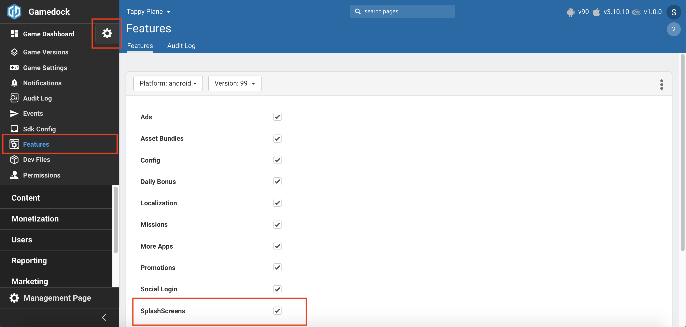
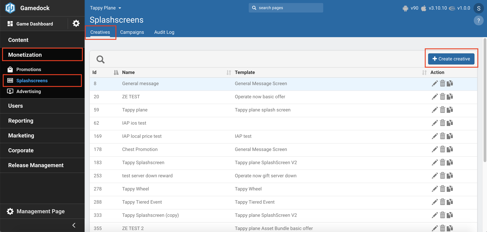
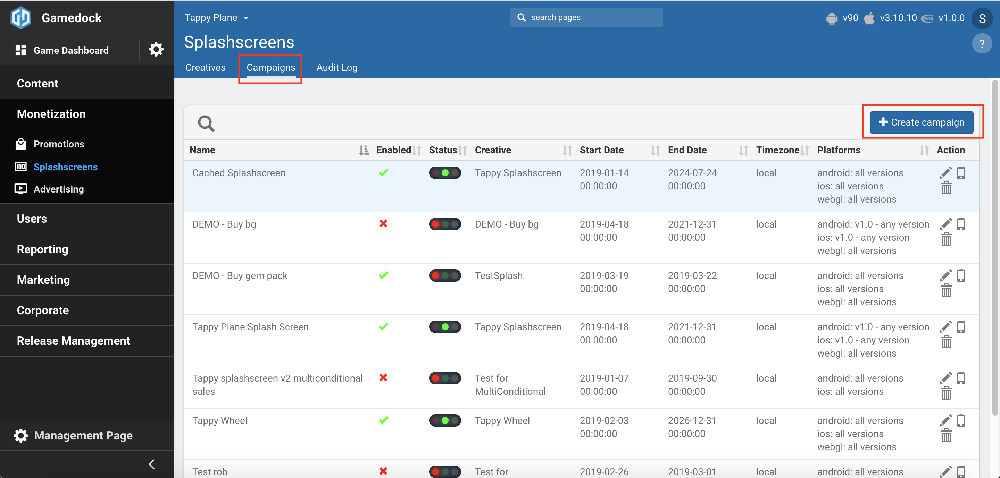
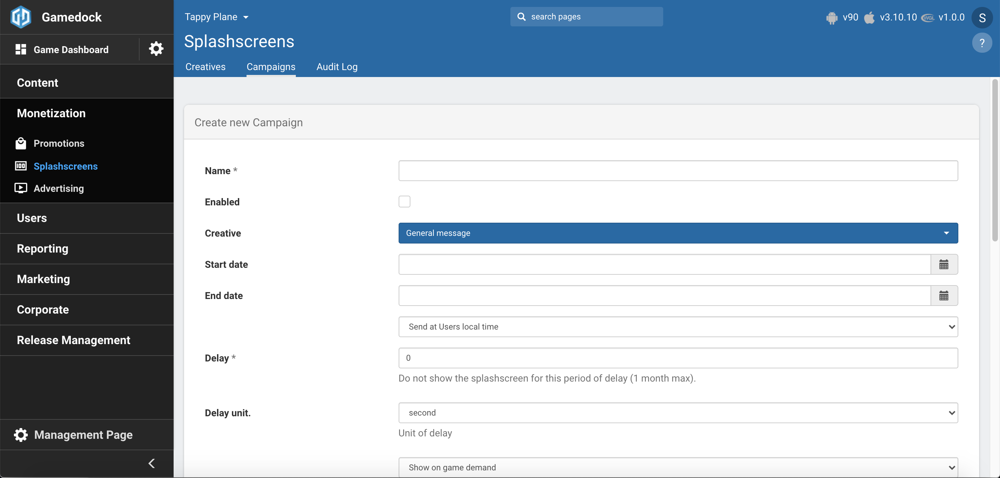
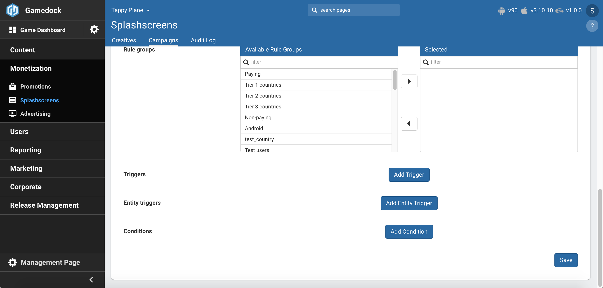

# Splash Screens

* **[Understanding the Splash Screens Strategy](#understanding-the-splash-screens-strategy)**
* **[Configuration in Console](#configuration-in-console)**
* **[Controlling Splash Screens from the SDK](#controlling-splash-screens-from-the-sdk)**

---

The Gamedock framework offers the possibility of supporting both splash and bonus screens. Splash screens appear while a game is loading. They are a very useful means of engaging with the user community and can be used for a variety of reasons, including as an additional form of advertising, to restrict access to content such as pornography or gambling, and to grab the user’s attention through special offers. Typically, daily bonus screens are used to reward users each time they return to the game. Within the Gamedock framework, both screen types are implemented as HTML5 web pages that appear as pop-ups within the game. This has the advantage that changes can be made to them without the need to update the game itself.

### Understanding the Splash Screens Strategy

Within the Gamedock platform, splash and daily bonus screen support are implemented as follows:
1. The Game’s producer defines the splash screens required to be used within the game. This includes the platforms for which each screen is intended, the relevant game version, the event that triggers the screen, its URL, the period within which it is active. The daily bonus screens should also be defined, and include the items or currency the user should receive, and the number of times the user should see the screen. Note that if these screens are to be developed by a third party, Gamedock can provide a template for their creation.
1. Your Gamedock Account Manager will then coordinate with Gamedock LiveOps to ensure that the screens are set up on the Gamedock server.
1. Within the Gamedock SDK, developers can then specify when these screens should appear within the game.

### Configuration in Console

In order to setup the Splash Screens feature in the console go through the following steps:

<!-- panels:start -->

<!-- div:left-panel -->
1. Enable the **Splash Screens** feature in the features list.

<!-- div:right-panel -->

<!-- div:left-panel -->
2. Go to **Monetization->Splashscreens** to access the feature.
3. In order to receive a **Splash Screen** in the game, a creative is needed for the Splash Screen configuration. When generating a new creative, it will require a template. There are available in the Console already a multitude of templates, but if none fit your need, please contact a Gamedock representative in order to create a new template.
4. Once created, you can customise the creative with images, text, font, colors and localization.

<!-- div:right-panel -->

<!-- div:left-panel -->
5. The next step that you need to do is create a campaign for your creative by going to the **Campaigns** page and clicking the **"Create campaign"** button.
6. On the creation page, configure the following attributes for the **Splash Screen** campaign:
    * **Name**: The name of the campaign.
    * **Enabled**: Defines if the campaign will be sent to the game.
    * **Creative**: Select the creative you created in step 3 & 4.
    * **Start & End Date**: Used for determining when a Splash Screen is returned to the game. If none is provide the Splash Screen will always be provided to the game.
    * **Delay & Delay Unit**: Determines the time the Console waits until the Splash Screen is shown again after a successful showing.
    * **Priority**: Determines if the Splash Screen should be shown immediately or it should wait until the game decides to show it. By default Splash Screens are show immediately. The sliders is used for multiple splashscreens that are triggered that can be shown on a time picked by the game before the game shows them. In that case the one with the highest priority will be shown.
    * **Platform**: Refers to the platform that the Splash Screen will be sent to. Here you can also configure the versions of the game that the Splash Screens will be sent.
    * **Rule Groups, Triggers, Entity Triggers & Conditions** affect the cases in which the Splash Screen is show and to which users it will be distributed to. (ex.: Only users from the Netherlands that have over 100 Diamonds and have finished level 10). Here you can also configure if you want to specifically request the Splash Screen from the game (not triggered through a tracking event).

<!-- div:right-panel -->

<!-- panels:end -->

7. With the campaign configured, you can now track/request it in the game and display it.

### Controlling Splash Screens from the SDK

Splash screens can be triggered in one of two ways. They can either be fired automatically as a response to a tracking event (such as level complete), or they can be triggered manually.

Before requesting the splash screen, you should implement the callback listener using the following code:

<!-- tabs:start -->

#### ** Unity **

~~~csharp
Gamedock.Instance.SplashScreenCallbacks.OnSplashScreenOpen -= OnSplashScreenOpen;
Gamedock.Instance.SplashScreenCallbacks.OnSplashScreenOpen += OnSplashScreenOpen;

Gamedock.Instance.SplashScreenCallbacks.OnSplashScreenClosed -= OnSplashScreenClosed;
Gamedock.Instance.SplashScreenCallbacks.OnSplashScreenClosed += OnSplashScreenClosed;

Gamedock.Instance.SplashScreenCallbacks.OnSplashScreenError -= OnSplashScreenError;
Gamedock.Instance.SplashScreenCallbacks.OnSplashScreenError += OnSplashScreenError;

//Used for cached splash screens
Gamedock.Instance.SplashScreenCallbacks.OnSplashScreenAvailable -= OnSplashScreenAvailable;
Gamedock.Instance.SplashScreenCallbacks.OnSplashScreenAvailable += OnSplashScreenAvailable;

Gamedock.Instance.SplashScreenCallbacks.OnSplashScreenNotAvailable -= OnSplashScreenNotAvailable;
Gamedock.Instance.SplashScreenCallbacks.OnSplashScreenNotAvailable += OnSplashScreenNotAvailable;

Gamedock.Instance.SplashScreenCallbacks.OnSplashScreenOpenShop -= OnSplashScreenOpenShop;
Gamedock.Instance.SplashScreenCallbacks.OnSplashScreenOpenShop += OnSplashScreenOpenShop;

Gamedock.Instance.SplashScreenCallbacks.OnSplashScreenData -= OnSplashScreenData;
Gamedock.Instance.SplashScreenCallbacks.OnSplashScreenData += OnSplashScreenData;

Gamedock.Instance.IAPValidationCallbacks.OnIAPRequestPurchase -= OnIAPRequestPurchase;
Gamedock.Instance.IAPValidationCallbacks.OnIAPRequestPurchase += OnIAPRequestPurchase;
~~~

#### ** AIR **

~~~actionscript
Gamedock.GetInstance().addEventListener(SDKEvents.SPLASH_SCREEN_OPEN, onSplashScreenOpenEvent);
Gamedock.GetInstance().addEventListener(SDKEvents.SPLASH_SCREEN_CLOSED, onSplashScreenClosedEvent);
Gamedock.GetInstance().addEventListener(SDKEvents.SPLASH_SCREEN_ERROR, onSplashScreenErrorEvent);
Gamedock.GetInstance().addEventListener(SDKEvents.SPLASH_SCREEN_AVAILABLE, onSplashScreenAvailableEvent);
Gamedock.GetInstance().addEventListener(SDKEvents.SPLASH_SCREEN_NOT_AVAILABLE, onSplashScreenNotAvailableEvent);
Gamedock.GetInstance().addEventListener(SDKEvents.SPLASH_SCREEN_OPEN_SHOP, onSplashScreenOpenShopEvent);
Gamedock.GetInstance().addEventListener(SDKEvents.SPLASH_SCREEN_DATA, onSplashScreenDataEvent);
Gamedock.GetInstance().addEventListener(SDKEvents.IAP_REQUEST_PURCHASE, onIAPRequestPurchaseEvent);
~~~

#### ** Cordova **

~~~javascript
gamedockSDK.on('SplashScreenOpen', () => {
    
    }
});

gamedockSDK.on('SplashScreenClosed', () => {

    }
});

gamedockSDK.on('SplashScreenAvailable', (type) => {

    }
});

gamedockSDK.on('SplashScreenNotAvailable', () => {

    }
});

gamedockSDK.on('SplashScreenOpenShop', () => {

    }
});
~~~

<!-- tabs:end -->

To work with splash screens during game time, use the following code:

<!-- tabs:start -->

#### ** Unity **

~~~csharp
Gamedock.Instance.RequestSplashScreen(string type);

//Should be used when an OnSplashScreenAvailable callback is triggered 
//Can be used immediately or later in the game once the callback is triggered
Gamedock.Instance.ShowSplashScreen();
~~~

#### ** AIR **

~~~actionscript
Gamedock.GetInstance().RequestSplashScreen(type:String);

//Should be used when an OnSplashScreenAvailable callback is triggered 
//Can be used immediately or later in the game once the callback is triggered
Gamedock.GetInstance().ShowSplashScreen();
~~~

#### ** Cordova **

~~~javascript
gamedockSDK.requestSplashScreen(type);

//Should be used when an OnSplashScreenAvailable callback is triggered 
//Can be used immediately or later in the game once the callback is triggered
gamedockSDK.playInterstitial();
~~~

<!-- tabs:end -->