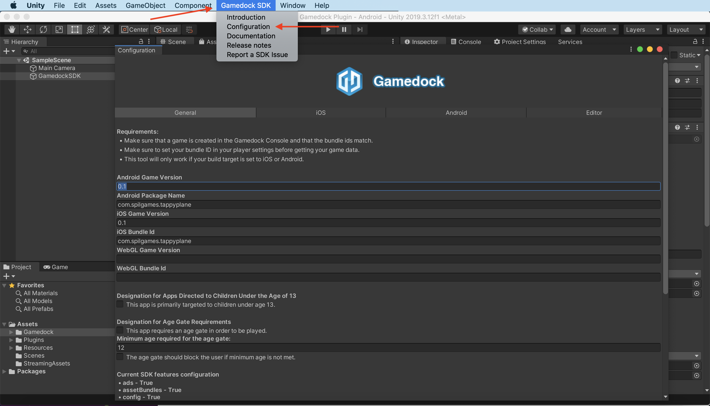
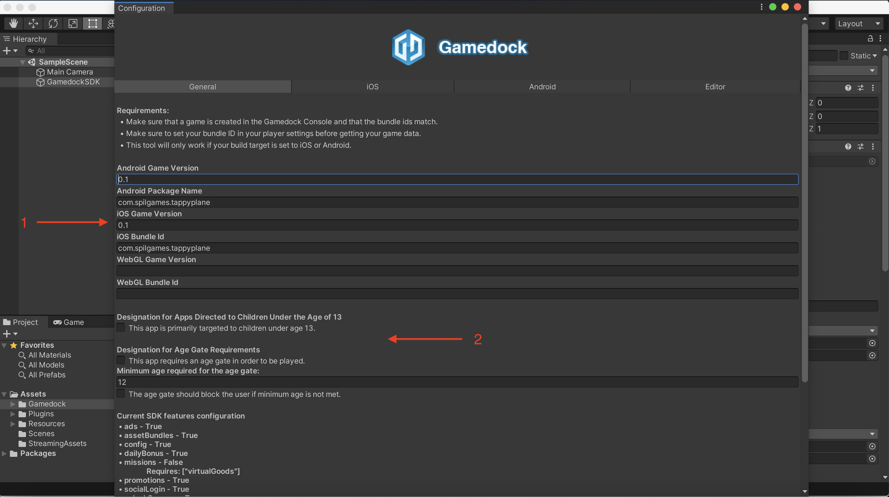
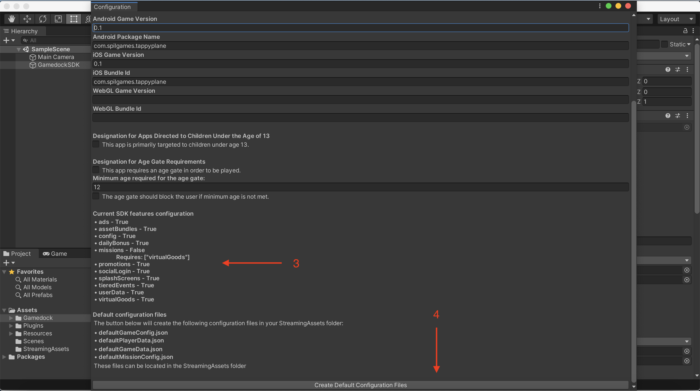
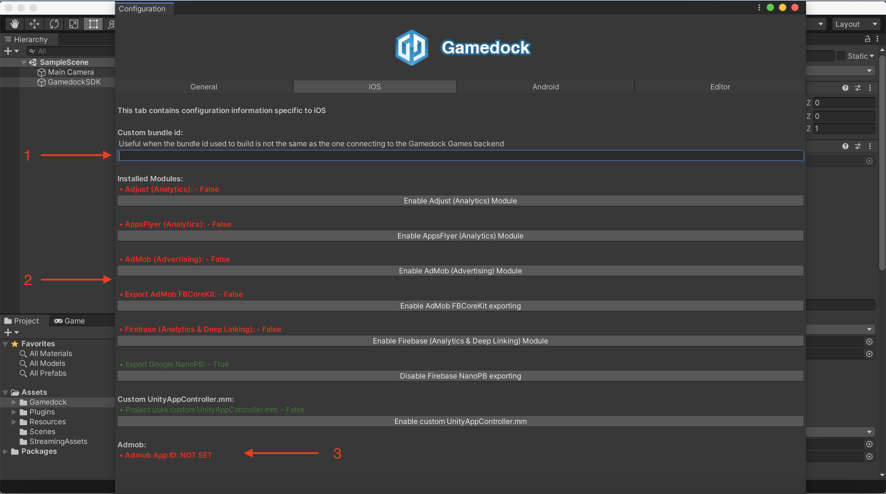
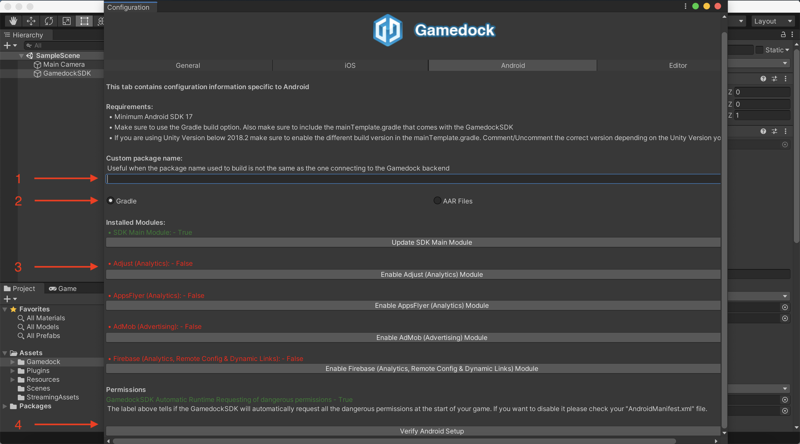
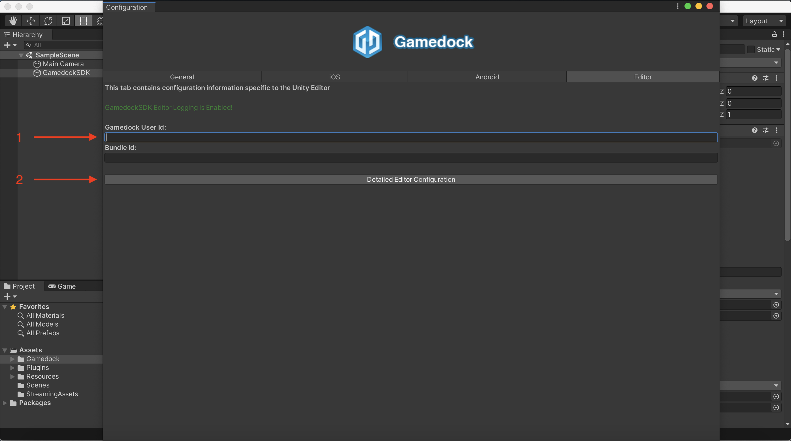
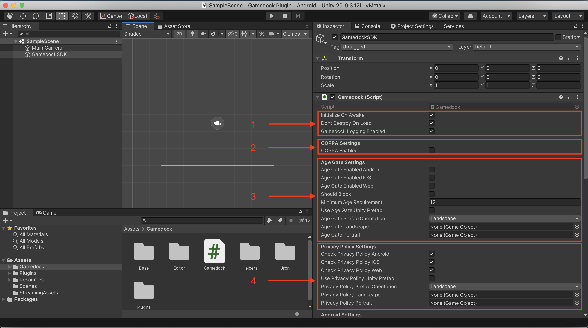
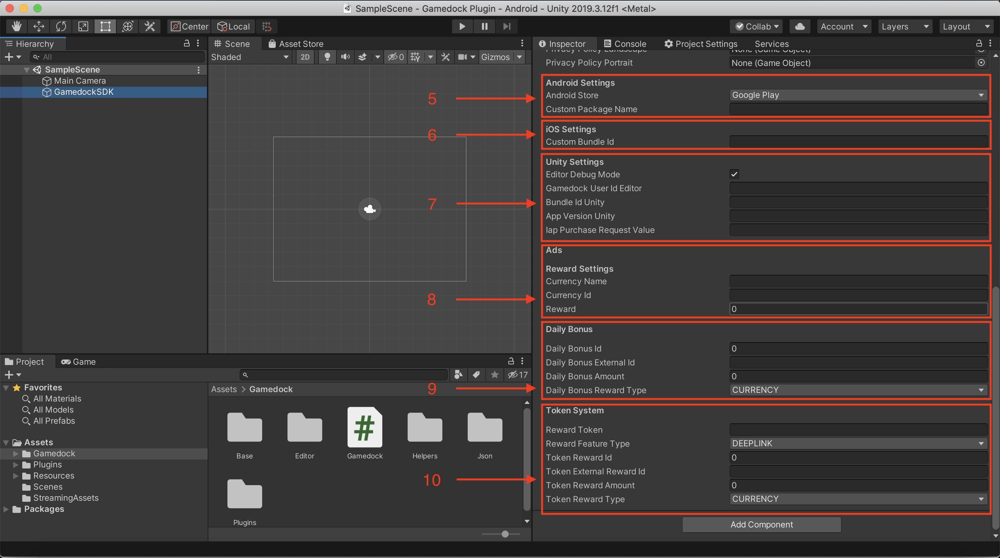

# Unity Editor

> [!NOTE]
> This section is only targeted at the Unity platform.

> [!TIP]
> By default, most of the Gamedock SDK features are also functional from within the Unity editor. This is useful to minimize the amount of platform-specific builds needed to fully test a feature. Some features require a bit different flow or might behave or look a bit different than on an actual device, those cases are discussed in more details in the individual features sections.

The following features are supported within the Unity Editor:

* Age Gate Popup (both a native mock-up and the Unity Prefab version)
* Privacy Policy (GDPR) Popup (both a native mock-up and the Unity Prefab version)
* Game Balancing
* Game Data
* Wallet, Inventory & Shop
* Missions & Containers
* In-Game Packages
* Game States
* Daily Bonus (using a mock-up window)
* Asset Bundles
* Tiered Events (using mock-up windows)
* Advertising (no actual adds are shown, but instead mock-up windows are displayed)
* Promotions
* Splashscreens (using a mock-up window)
* User Identification
* Social Login
* Event Tracking

> [!DANGER]
> The Unity Editor implementation of Gamedock does not support offline functionality (the Android and iOS one do).

## Configuring the Unity Editor

The Gamedock SDK Unity Plugin has two main places where configuration can be done within Unity:

* The "Configuration" window
* The "GamedockSDK" object in the scene

When adding the SDK Plugin for the first time and after each update, you are presented with an "Introduction" window. This can provide important information that you might need to do. The window can also be accessed by going Top Bar->Gamedock SDK->Introduction.

### Configuration Window

In order to access the "Configuration" window do the following:

> [!DANGER]
> Make sure that when you open the "Configuration" window, that you are in the scene where the GamedockSDK object is also present, otherwise details will not be shown.

The "Configuration" window contains 4 tabs:

* **General** - Contains general information about the SDK and the Game as well as the functionality to create the configuration files required by the SDK
* **iOS** - Contains information specific to the iOS platform. Features specific for iOS can be enabled/disabled here.
* **Android** - Contains information specific to the Android platform. Features specific for Android can be enabled/disabled here. The Android can also be verified here.
* **Editor** - Contains information specific to the Editor.

<!-- tabs:start -->

#### ** General **

In the General tab of the "Configuration" you have the following information and functionality:

 

1. This information is automatically filled in based on the configuration from Unity. It contains the Android and iOS package/bundle names and versions. The information here can also be modified (every time you reopen the window) if you want to pull configuration information that might not match the automatic generated values.
2. The settings related to COPPA compliance and to Age Gate. Configuring the information here will set certain settings on the Gamedock SDK object. Here you can enable if the app has to be COPPA compliant (regarding the Gamedock SDK). You can also configure if the SDK should display an Age Gate and the age at which the user is allowed into the game.
3. A list of all the features that are enabled/disabled regarding the SDK. This list can be modified by going into the Gamedock Console, under the "Features" page in your game.
4. The functionality to generate the default configuration files for the SDK. **This is a very important step in properly configuring the SDK.** The "Create Default Configuration Files" button does the following things:
   * Downloads, creates the files "defaultGameConfig.json", "defaultGameData.json", "defaultPlayerData.json", "defaultMissionConfig.json" and stores the files in the "StreamingAssets" folder. The data in these files is related to the bundle/package name and version configured in the "Configuration" window.
   * Downloads information related to Advertisement (if the Advertisement modules are enabled) and configures that information in order for your game to properly deliver ads.
   * Downloads information related to Firebase (if the Firebase modules are enabled) and configures that information for your game.

#### ** iOS **

In the iOS tab of the "Configuration" you have the following information and functionality:

1. In certain rare cases you might want to make a build of your game in which the bundle/package name of the game should not match the bundle/package name passed to the SDK. You can use the field here to configure that functionality.
2. The functionality to enable/disable the different modules for the SDK. Besides the standard modules (Adjust, AppsFlyer, AdMob, Firebase) there are some additional toggles to be explained:
   * AdMob FBCoreKit should be enabled only if your game **doesn't** implement the Facebook SDK separately.
   * Google NanoPB should be enabled/disabled depending on whether the game implements separately the Firebase SDK. Make sure you use the latest versions of the Firebase SDK otherwise issues might occur with AdMob.
   * UnityAppController should be used in most cases, but if your app requires to use a different UnityAppController, disable this and make sure that you properly copy the contents of the GamedockAppController into your own custom one.
3. An indicator letting you know if you have configured correctly the AdMob App Id which is required if you have enabled the AdMob module. If you have enabled the AdMob module and the value is not set, go to the General tab and click on the "Create Default Configuration Files". This should add the correct values for your game. If it still is not populated, it might be that the game doesn't have the correct configuration in the Gamedock Console. In this case, contact a Gamedock Representative.

#### ** Android **

In the Android tab of the "Configuration" you have the following information and functionality:

1. In certain rare cases you might want to make a build of your game in which the bundle/package name of the game should not match the bundle/package name passed to the SDK. You can use the field here to configure that functionality.
2. The option to either import the Gamedock Android SDK from a Gradle file (one is also provided with the package) or through an ".aar" file. The Gradle option is the recommended way. You can examine all the settings configured here in the file "Assets/Plugins/Android/mainTemplate.gradle".
3. The functionality to enable/disable the different modules for the SDK (Adjust, AppsFlyer, AdMob, Firebase).
4. The functionality to check if everything was configured correctly for Android. Make sure to check the Unity Console for any relevant information (including Warnings).

#### ** Editor **

In the Editor tab of the "Configuration" you have the following information and functionality:

1. The Editor configuration for the Gamedock Editor User Id and Bundle Id. For the User Id, if no value is filled in, the SDK will automatically generate one each time the game is run. The Bundle Id value is required in order to run the game with the SDK in the Unity Editor.
2. This button will redirect you to the Gamedock SDK object (granted that the object is present in the current scene).

<!-- tabs:end -->

### GamedockSDK Object

When configuring the GamedockSDK object you have the following information, options and functionality:

 

1. General configuration for how the Gamedock Plugin and GamedockSDK object should behave:
   * Initialize On Awake will make the GamedockSDK object initialize as soon as the Awake method is called. If you want to initialize the SDK at a later stage, disable this option
   * By default the GamedockSDK will be preserved across scenes. If you prefer to destroy the GamedockSDK object and recreate it again, disable this feature. **It is not recommended to recreate mulitple times the GamedockSDK object**.
   * Gamedock Logging can be enabled or disable to provide more information in the Editor and in the native builds about Gamedock Behaviour.
2. The setting related to whether the SDK should be COPPA enabled. This matches the configuration setting found in the Configuration->General window.
3. Settings related to the Age Gate functionality of the SDK. If you are using the Unity Prefab flavor make sure you link the prefabs provided by the SDK in the "Resources/Gamedock/AgeGate". You can still modify these prefabs as long as no elements are removed or script links are changed.
4. Settings related to the Privacy Policy (GDPR) functionality of the SDK. If you are using the Unity Prefab flavor make sure you link the prefabs provided by the SDK in the "Resources/Gamedock/PrivacyPolicy". You can still modify these prefabs as long as no elements are removed or script links are changed.
5. Configurations related to Android regarding if the game will be distributed on the Google Play Store or Amazon. Also here you can observe the same configuration as the one in the Configurations->Android tab.
6. This provides the same information as the one in the Configurations->iOS tab.
7. This section provides more information about Editor specific configurations for the SDK. Make sure you configure your Gamedock Bundle Id in this section.
8. Configuration related to the mock-up ads that are presented in the Editor.
9. Configuration related to the mock-up Daily Bonus functionality in the Editor.
10. Configuration related to the mock-up Token functionality in the Editor.

