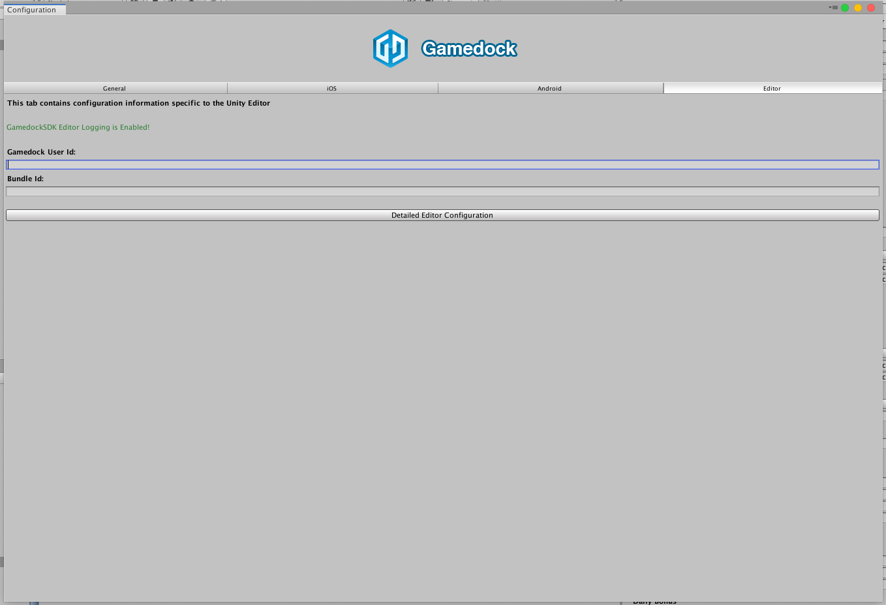
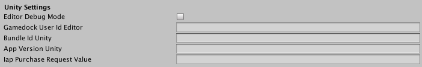
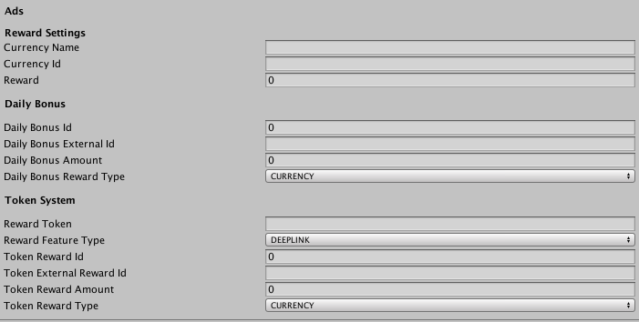

# Unity Editor

> [!NOTE]
> This section is only targeted at the Unity platform.

> [!TIP]
> By default, most of the Gamedock SDK features are also functional from within the Unity editor. This is useful to minimize the amount of platform-specific builds needed to fully test a feature. Some features require a bit different flow or might behave or look a bit different than on an actual device, those cases are discussed in more details in the individual features sections.

## Configuring the Unity Editor

To configure the Editor mode go to the ‘Configuration’ page in the ‘Gamedock SDK’ menu in the Unity top bar, the following screen will appear:

Here the current user id to test with can be set or changed, when left empty a random user id will be generated each time the Unity Play button is pressed.
Also make sure that the Bundle Id is correct, usually it will be the same as your project’s package name for Android or bundle identifier for iOS. The same settings can also be changed from within the Gamedock component attached to a gameobject in your startup scene:

## Feature specific settings

Not every feature has been fully implemented in the Editor mode, some alternative approaches have been taken to simulate some hardware or mobile specific features. Usually the configurations for those features can be found on the Gamedock component, the section looks like this:

A quick overview of the different fields:

* **Iap purchase request value**. Regular IAP purchases will be simulated correctly in the Editor mode, however, if you want to test an IAP triggered from a SplashScreen you have to define the purchase SKU id in this field.
* **Reward Settings – Ads**. The reward you’ll receive when watching a rewarded video. This has to be configured manually because the ad networks we use are using are not initialized in the Unity editor.
* **Reward Settings – Daily Bonus**. The reward you’ll receive when the daily bonus screen is opened. This has to be configured manually because the actual SplashScreen which is loaded on the devices is not compatible with the Unity editor.
* **Reward Settings – Token system**. The reward you’ll receive when receiving a DeepLink, in the future, this same token system will also be used for push notifications. This has to be configured manually because actual DeepLink support is not provided by the Unity editor.

More details can be found in the feature specific sections.