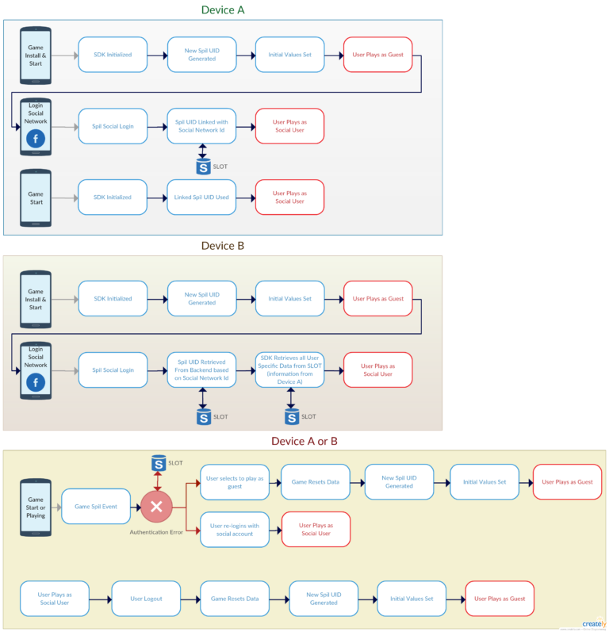
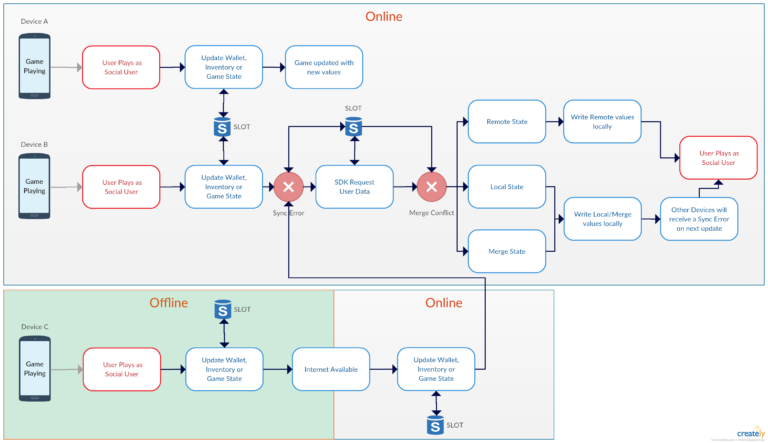

# Working with the Social Login Feature

* **[Implementing the Gamedock SDK Login](#implementing-the-gamedock-sdk-login)**
* **[Implementing Cross-Device Data Synchronization](#implementing-cross-device-data-synchronization)**

---

By default, a user’s data is lost when they remove a game from their device. If they later re-install it, they start again as a new user. The social login feature solves this problem by binding the user’s progress to a specified Facebook account. After re-installing the game on the same or another device via a Facebook login, they can continue from their previous state. In addition, this feature can also be used to enable users to play across multiple devices while preserving their game progress. In this way, the user’s game experience can be enhanced.

### Implementing the Gamedock SDK Login

Use the following method to login the user:

<!-- tabs:start -->

#### ** Unity **

~~~csharp
Gamedock.Instance.UserLogin(string socialId, string socialProvider, string socialToken, Dictionary<string, object> socialValidationData = null);
~~~

where:
* *socialProvider* should be SocialLoginNetworks.GooglePlayGames, SocialLoginNetworks.GameCenter or SocialLoginNetworks.Facebook. Because this parameter is used across multiple methods, it is recommended that you maintain consistency by defining it statically.
* *socialId* should be the Facebook user ID, Google Play Games User Id or Game Center User Id.socialToken should be the Facebook access token retrieved earlier from Facebook, token from Google Play Games or Game Center authentication information (should be passed in the optional parameter). 

#### ** AIR **

~~~actionscript
Gamedock.GetInstance().UserLogin(socialId:String, socialProvider:String, socialToken:String, socialValidationData:Object);
~~~

where:
* *socialProvider* should be SocialLoginNetworks.GooglePlayGames, SocialLoginNetworks.GameCenter or SocialLoginNetworks.Facebook. Because this parameter is used across multiple methods, it is recommended that you maintain consistency by defining it statically.
* *socialId* should be the Facebook user ID, Google Play Games User Id or Game Center User Id.socialToken should be the Facebook access token retrieved earlier from Facebook, token from Google Play Games or Game Center authentication information (should be passed in the optional parameter). 

#### ** Cordova **

> This feature is currently not supported on Cordova.

<!-- tabs:end -->

#### Failure

If the user login failed, the following event is triggered:

<!-- tabs:start -->

#### ** Unity **

~~~csharp
Gamedock.Instance.SocialLoginCallbacks.OnLoginFailed(GamedockErrorMessage errorMessage);
~~~

#### ** AIR **

~~~actionscript
Gamedock.GetInstance().addEventListener(SDKEvents.LOGIN_FAILED, onLoginFailedEvent);
~~~

#### ** Cordova **

> This feature is currently not supported on Cordova.

<!-- tabs:end -->

The *errorMessage* parameter describes what went wrong. The ShowNativeDialog() method call can be used to display a dialog with the error message directly to the user. Within GamedockErrorMessage, the error codes shown in the table below can be returned.

| Code | Description                                                                                    |
|:-----|:-----------------------------------------------------------------------------------------------|
| 32   | Invalid Gamedock token! Please login again.                                                  |
| 33   | Event requires user login.                                                                     |
| 34   | The provided social token could not be verified by the Gamedock backend. Please login again. |
| 35   | The user already has a social provider account. Please first logout.                           |
| 36   | The specified social ID is already linked to another user.                                     |

#### Checking if a user is already logged in

Sometimes it is useful to know whether a user is already logged in. For example, when re-starting the game. The current user login status can be retrieved by calling the following method:

<!-- tabs:start -->

#### ** Unity **

~~~csharp
bool loggedIn = Gamedock.Instance.IsLoggedIn();
~~~

#### ** AIR **

~~~actionscript
var loggedIn:Boolean = Gamedock.GetInstance().IsLoggedIn();
~~~

#### ** Cordova **

> This feature is currently not supported on Cordova.

<!-- tabs:end -->

#### Logging out a user

Use the following method call to log out a user:

<!-- tabs:start -->

#### ** Unity **

~~~csharp
Gamedock.Instance.Logout(bool global);
~~~

#### ** AIR **

~~~actionscript
Gamedock.GetInstance().Logout(global:Boolean);
~~~

#### ** Cordova **

> This feature is currently not supported on Cordova.

<!-- tabs:end -->

*global* specifies whether the user should be globally logged out of all devices they are currently playing on (TRUE), or remained logged in on any other devices (FALSE). One of the following events will be triggered to indicate whether the logout was successful:

<!-- tabs:start -->

#### ** Unity **

~~~csharp
Gamedock.Instance.SocialLoginCallbacks.OnLogoutSuccessful();
Gamedock.Instance.SocialLoginCallbacks.OnLogoutFailed(GamedockErrorMessage errorMessage);
~~~

#### ** AIR **

~~~actionscript
Gamedock.GetInstance().addEventListener(SDKEvents.LOGOUT_SUCCESSFUL, onLogoutSuccessfulEvent);
Gamedock.GetInstance().addEventListener(SDKEvents.LOGOUT_FAILED, onLogoutFailedEvent);
~~~

#### ** Cordova **

> This feature is currently not supported on Cordova.

<!-- tabs:end -->

Note that it is only important to handle the fail event in the case of a global logout. In this case, the *ShowNativeDialog()* call can be used to display a dialog with *errorMessage*.

#### Logout and continue as a guest user

Use the following method to logout the user and let them continue as a guest user:

<!-- tabs:start -->

#### ** Unity **

~~~csharp
Gamedock.Instance.UserPlayAsGuest();
~~~

#### ** AIR **

~~~actionscript
Gamedock.GetInstance().UserPlayAsGuest();
~~~

#### ** Cordova **

> This feature is currently not supported on Cordova.

<!-- tabs:end -->

It will reset the user ID and user data. This method be called after their session token expired (explained in Handling Expired Session Tokens). This method has almost the same functionality as the normal logout call, but performs additional tracking and triggers a different success event to indicate that the user is playing as a guest:

<!-- tabs:start -->

#### ** Unity **

~~~csharp
Gamedock.Instance.SocialLoginCallbacks.LoginSuccessful(false, null, null, true);
~~~

#### ** AIR **

~~~actionscript
Gamedock.GetInstance().addEventListener(SDKEvents.LOGIN_SUCCESSFUL, onLoginSuccessfulEvent);
~~~

#### ** Cordova **

> This feature is currently not supported on Cordova.

<!-- tabs:end -->

#### Handling Expired Session Tokens

The social login feature works by internally assigning a session token to the currently logged in Facebook, Google Play Game or Game Center user. Each gameplay session receives a new token. This token, called “spilToken”, is sent with each request made by the Gamedock SDK to the Gamedock backend. The token is used to validate that the user is still correctly logged in.
It can happen that the session of a logged in user is no longer valid, either because the session token has expired or due to a global logout on a different device. In these cases, an authorization error is triggered, and the user should either re-login or continue as a guest user. The following event will be triggered after an authorization error:

<!-- tabs:start -->

#### ** Unity **

~~~csharp
Gamedock.Instance.SocialLoginCallbacks.OnAuthenticationError(GamedockErrorMessage errorMessage);
~~~

#### ** AIR **

~~~actionscript
Gamedock.GetInstance().addEventListener(SDKEvents.AUTHENTICATION_ERROR, onAuthenticationErrorEvent);
~~~

#### ** Cordova **

> This feature is currently not supported on Cordova.

<!-- tabs:end -->

After an authorization error, a popup is displayed to the user asking whether they want to re-login or continue as a guest user. The Gamedock SDK provides a default popup that can be used to show this error by calling the following method:

<!-- tabs:start -->

#### ** Unity **

~~~csharp
Gamedock.Instance.SocialLoginCallbacks.ShowUnauthorizedDialog(string title, string message, string loginText, string playAsGuestText);
~~~

#### ** AIR **

~~~actionscript
Gamedock.GetInstance().ShowUnauthorizedDialog(title:String, message:String, loginText:String, playAsGuestText:String);
~~~

#### ** Cordova **

> This feature is currently not supported on Cordova.

<!-- tabs:end -->

The default dialog triggers the following event to inform the developer that the user selected the re-login option:

<!-- tabs:start -->

#### ** Unity **

~~~csharp
Gamedock.Instance.SocialLoginCallbacks.OnRequestLogin -= OnRequestLogin();
Gamedock.Instance.SocialLoginCallbacks.OnRequestLogin += OnRequestLogin();
~~~

#### ** AIR **

~~~actionscript
Gamedock.GetInstance().addEventListener(SDKEvents.REQUEST_LOGIN, onRequestLoginEvent);
~~~

#### ** Cordova **

> This feature is currently not supported on Cordova.

<!-- tabs:end -->

The Facebook login process should be re-initiated after this event.

#### Resetting the User Data

The user data (described in Supporting Wallet, Shop and Inventory Control) and game state (described in Working with Game States) can be reset after a logout or a non-guest login by calling the following method:

<!-- tabs:start -->

#### ** Unity **

~~~csharp
Gamedock.Instance.ResetData();
~~~

#### ** AIR **

~~~actionscript
Gamedock.GetInstance().ResetData();
~~~

#### ** Cordova **

> This feature is currently not supported on Cordova.

<!-- tabs:end -->

#### Displaying the Current Device ID

The device ID can be displayed together with the Gamedock user ID in the game. This can be useful for Customer Support when resolving issues. See Implementing Customer Support for more information.

The device ID can be retrieved using the following method:

<!-- tabs:start -->

#### ** Unity **

~~~csharp
string deviceId = Gamedock.Instance.GetDeviceId();
~~~

#### ** AIR **

~~~actionscript
var deviceId:String = Gamedock.GetInstance().GetDeviceId();
~~~

#### ** Cordova **

> This feature is currently not supported on Cordova.

<!-- tabs:end -->

### Implementing Cross-Device Data Synchronization

The user data synchronization feature can be used to enable the synchronizing of user data when a logged in user is playing across multiple devices.

#### Requesting the latest user data

After initializing the Gamedock SDK, it is recommended that you request the latest user data. Normally, this is loaded successfully and is ready to use. However, in some cases merge conflicts can occur which must be resolved. The procedure to do so is described later in this section. The following method can be used to retrieve the user’s data from the Gamedock backend:

<!-- tabs:start -->

#### ** Unity **

~~~csharp
Gamedock.Instance.RequestUserData();
~~~

#### ** AIR **

~~~actionscript
Gamedock.GetInstance().RequestUserData();
~~~

#### ** Cordova **

> This feature is currently not supported on Cordova.

<!-- tabs:end -->

Note that if the data cannot be retrieved from the Gamedock backend, it will be loaded from the data stored locally on the device. The following event is triggered when the data is available for use:

<!-- tabs:start -->

#### ** Unity **

~~~csharp
Gamedock.Instance.SocialLoginCallbacks.OnUserDataAvailable -= OnUserDataAvailable();
Gamedock.Instance.SocialLoginCallbacks.OnUserDataAvailable += OnUserDataAvailable();
~~~

#### ** AIR **

~~~actionscript
Gamedock.GetInstance().addEventListener(SDKEvents.USER_DATA_AVAILABLE, onUserDataAvailableEvent);
~~~

#### ** Cordova **

> This feature is currently not supported on Cordova.

<!-- tabs:end -->

After initialization has been completed, it is possible to use and modify the user data using the methods described in Supporting Wallet, Shop and Inventory Control.

#### Playing on Multiple Devices

When a second device is being used to play the same game using the same Facebook ID, synchronization errors can occur. If this happens, the following event will be triggered:

<!-- tabs:start -->

#### ** Unity **

~~~csharp
Gamedock.Instance.SocialLoginCallbacks.OnUserDataSyncError -= OnUserDataSyncError();
Gamedock.Instance.SocialLoginCallbacks.OnUserDataSyncError += OnUserDataSyncError();
~~~

#### ** AIR **

~~~actionscript
Gamedock.GetInstance().addEventListener(SDKEvents.USER_DATA_SYNC_ERROR, onUserDataSyncErrorEvent);
~~~

#### ** Cordova **

> This feature is currently not supported on Cordova.

<!-- tabs:end -->

Call the *RequestUserData()* method to re-synchronize the locally stored user data. It is recommended that gameplay is suspended at this point, and does not resume until the user data has been successfully synchronized again. There is a utility method available to show a native dialog that handles this case. It is described in Useful Utility Dialog Methods.

#### Resolving Merge Conflicts

When a merge error occurs, the following event will be triggered:

<!-- tabs:start -->

#### ** Unity **

~~~csharp
Gamedock.Instance.SocialLoginCallbacks.OnUserDataMergeConflict(MergeConflictData localData, MergeConflictData remoteData) -= OnUserDataMergeConflict();
Gamedock.Instance.SocialLoginCallbacks.OnUserDataMergeConflict(MergeConflictData localData, MergeConflictData remoteData) += OnUserDataMergeConflict();
~~~

#### ** AIR **

~~~actionscript
Gamedock.GetInstance().addEventListener(SDKEvents.USER_DATA_MERGE_CONFLICT, onUserDataMergeConflictEvent);
~~~

#### ** Cordova **

> This feature is currently not supported on Cordova.

<!-- tabs:end -->

This indicates that the current local user data cannot be merged with the remote user data. This must be resolved by either selecting the current local data, the remote server data, or by creating a merge of both data sources. Both local and remote states are returned to resolve the conflict. The following method should be called whenever a merge conflict was resolved:

<!-- tabs:start -->

#### ** Unity **

~~~csharp
Gamedock.Instance.MergeUserData(string mergeData, string mergeType);
~~~

#### ** AIR **

~~~actionscript
Gamedock.GetInstance().MergeUserData(mergeData:String, mergeType:String);
~~~

#### ** Cordova **

> This feature is currently not supported on Cordova.

<!-- tabs:end -->

where:
* *mergeData* specifies the merged user data.
* *mergeType* specifies the selected merge resolution type (“remote”, “local”, or “merge”).

If the merge was successfully accepted by the Gamedock backend, the following event will be triggered:

<!-- tabs:start -->

#### ** Unity **

~~~csharp
Gamedock.Instance.SocialLoginCallbacks.OnUserDataMergeSuccessful -= OnUserDataMergeSuccessful();
Gamedock.Instance.SocialLoginCallbacks.OnUserDataMergeSuccessful += OnUserDataMergeSuccessful();
~~~

#### ** AIR **

~~~actionscript
Gamedock.GetInstance().addEventListener(SDKEvents.USER_DATA_MERGE_SUCCESSFUL, onUserDataMergeSuccessfulEvent);
~~~

#### ** Cordova **

> This feature is currently not supported on Cordova.

<!-- tabs:end -->

If the merge failed, the following event will be triggered:

<!-- tabs:start -->

#### ** Unity **

~~~csharp
Gamedock.Instance.SocialLoginCallbacks.OnUserDataMergeFailed(string mergeData, string mergeType) -= OnUserDataMergeFailed();
Gamedock.Instance.SocialLoginCallbacks.OnUserDataMergeFailed(string mergeData, string mergeType) += OnUserDataMergeFailed();
~~~

#### ** AIR **

~~~actionscript
Gamedock.GetInstance().addEventListener(SDKEvents.USER_DATA_MERGE_FAILED, onUserDataMergeFailedEvent);
~~~

#### ** Cordova **

> This feature is currently not supported on Cordova.

<!-- tabs:end -->

In this case, you should retry the merge resolution with the MergeUserData method (described above) using the data returned by this event. The default Gamedock.Instance.ShowMergeFailedDialog method can also be used to display a native error dialog box that automatically retries as soon as the user clicks the Retry button.

#### Other Possible Errors

It is not possible for the Gamedock backend to accept user data from two devices at the same time. When the first device sends its changes, a lock is applied to prevent other devices from attempting to send data while the update is in progress. If this happens, the following event will be triggered:

<!-- tabs:start -->

#### ** Unity **

~~~csharp
Gamedock.Instance.SocialLoginCallbacks.OnUserDataLockError -= OnUserDataLockError();
Gamedock.Instance.SocialLoginCallbacks.OnUserDataLockError += OnUserDataLockError();
~~~

#### ** AIR **

~~~actionscript
Gamedock.GetInstance().addEventListener(SDKEvents.USER_DATA_LOCK_ERROR, onUserDataLockErrorEvent);
~~~

#### ** Cordova **

> This feature is currently not supported on Cordova.

<!-- tabs:end -->

It is recommended that the game waits and then tries to resend the changes later. Since Gamedock SDK version 2.7.0 the *OnPlayerDataError()* and *OnGameStateError()* events have been removed. They have been merged into the new OnUserDataError() event. The conditions in which this new event is triggered remain the same as the two replaced events, and the errorMessage payload is also unchanged. The new event has the following format:

<!-- tabs:start -->

#### ** Unity **

~~~csharp
Gamedock.Instance.SocialLoginCallbacks.OnUserDataError(GamedockErrorMessage errorMessage) -= OnUserDataError;
Gamedock.Instance.SocialLoginCallbacks.OnUserDataError(GamedockErrorMessage errorMessage) += OnUserDataError;
~~~

#### ** AIR **

~~~actionscript
Gamedock.GetInstance().addEventListener(SDKEvents.USER_DATA_ERROR, onUserDataErrorEvent);
~~~

#### ** Cordova **

> This feature is currently not supported on Cordova.

<!-- tabs:end -->

A synchronization error can occur when user data is handled through the Gamedock Console. It indicates that the data on the Gamedock backend is different from that on the device. In this case, the same flow is required to resolve the merge conflict.

#### Useful Utility Dialog Methods

The following utility method can be useful during development to display a native dialog box indicating that the user data on the Gamedock backend is different from that on the device:

<!-- tabs:start -->

#### ** Unity **

~~~csharp
Gamedock.Instance.ShowSyncErrorDialog(string title, string message, string startMergeButtonText);
~~~

#### ** AIR **

~~~actionscript
Gamedock.GetInstance().ShowSyncErrorDialog(title:String, message:String, startMergeButtonText:String);
~~~

#### ** Cordova **

> This feature is currently not supported on Cordova.

<!-- tabs:end -->

The following utility method can be used to display a native dialog box asking the user whether to use the remote or local user data:

<!-- tabs:start -->

#### ** Unity **

~~~csharp
Gamedock.Instance.ShowMergeConflictDialog(string title, string message, string localButtonText, string remoteButtonText, string mergeButtonText = null);
~~~

#### ** AIR **

~~~actionscript
Gamedock.GetInstance().ShowMergeFailedDialog(title:String, message:String, localButtonText:String, remoteButtonText:String, mergeButtonText:String);
~~~

#### ** Cordova **

> This feature is currently not supported on Cordova.

<!-- tabs:end -->

Note that there will also be a button in the dialog when a mergeButtonText string is provided. It is recommended that this method is only used during development and that a dialog in the style of the game is created for the final product.

The following event is triggered by the *ShowMergeConflictDialog()* method:

<!-- tabs:start -->

#### ** Unity **

~~~csharp
Gamedock.Instance.SocialLoginCallbacks.OnUserDataHandleMerge(string mergeType);
~~~

#### ** AIR **

~~~actionscript
Gamedock.GetInstance().addEventListener(SDKEvents.USER_DATA_HANDLE_MERGE, onUserDataHandleMergeEvent);
~~~

#### ** Cordova **

> This feature is currently not supported on Cordova.

<!-- tabs:end -->

It specifies the choice made by the user: mergeType can be “remote”, “local”, or “merge”. The following utility method can be used to display a native merge failed dialog box asking the user whether they want to retry merging of the user data:

<!-- tabs:start -->

#### ** Unity **

~~~csharp
Gamedock.Instance.ShowMergeFailedDialog(string title, string message, string retryButtonText, string mergeData, string mergeType);
~~~

#### ** AIR **

~~~actionscript
Gamedock.GetInstance().ShowMergeFailedDialog(title:String, message:String, retryButtonText:String, mergeData:String, mergeType:String);
~~~

#### ** Cordova **

> This feature is currently not supported on Cordova.

<!-- tabs:end -->

It is recommended that this method is only used during development and that a dialog in the style of the game is created for the final product.

The following method is available for displaying login/logout errors:

<!-- tabs:start -->

#### ** Unity **

~~~csharp
Gamedock.Instance.ShowNativeDialog(string title, string message, string buttonText);
~~~

#### ** AIR **

~~~actionscript
Gamedock.GetInstance().ShowNativeDialog(title:String, message:String, buttonText:String);
~~~

#### ** Cordova **

> This feature is currently not supported on Cordova.

<!-- tabs:end -->